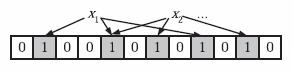

Bloom Filter，中文名字叫做布隆过滤器。是一种空间效率比较高的算法。布隆过滤器可以用于检索一个元素是否在一个集合中。它的优点是空间效率和查询时间都远远超过一般的算法，缺点是有一定的误识别率和删除困难。

bloom filter可以看成是bitmap的扩展。算法的过程如下：

+ 假设初始状态时Bloom Filter是一个m位的bit数组，每一位都置为0。为了表示集合S={x1, x2, ..., xn}这样n个元素的集合，Bloom Filter使用k个独立的哈希函数，它们的作用是将集合S中元素映射到{1,...,m}的范围中。对于任何一个元素x，第i个hash函数的映射位置hi(x)就会被置为1(1<=i<=k)。注意如果一个位置多次被置为1,那么只会有第一次起作用。
+ 在判断y元素是否属于这个集合时，我们对k应用k次hash函数，如果所有位置hi(y)都是1,那么我们就认为y是集合中的元素，否则就认为y不是集合中的元素。**这个过程很自然地会出现问题，从而导致不属于集合S中的元素y被认为是属于集合中，这种现象叫做false positive**

看看下面的例子，这是初始状态的bloom filter，全都被置为0

假设k为3的情况，也就是说要表示一个元素，需要使用hash函数计算3次，置位3个bit的值为1。下面的图表示bloom filter表示了x1，x2之后的情况：

图中可以看出来，bloom filter在表示x1和x2的过程中已经有了重叠的部分。那么假设计算x3不在集合中，但是可能的计算3个hash值对应的bit恰好为1,从而造成了false positive的现象。

##错误率估计
假设hash映射是等可能的，那么hash函数映射到某个位的概率是$\frac{1}{m}$，其中m表示初始bloom filter的位数。那么某个位在一次hash映射过程中不被置为1的概率是$1-\frac{1}{m}$。那么在k个hash函数的作用下，插入n个元素（每个元素需要映射k次），某个位仍然为0的概率是$(1 - \frac{1}{m})^{kn}$。因此插入n个元素之后某个位为1的概率是$1-(1-\frac{1}{m})^{kn}$。

最后估计错误率p，就是映射的k个位置刚好都是1，即$(1-(1-\frac{1}{m})^{kn})^k\approx(1-e^{\frac{-kn}{m}})^k$，这个估计虽然不是很严格，因为将每次每个bit置为1当作是独立的事件，但是实际上能够很好地逼近真实的情况。

在计算近似时利用了极限，
$$
\lim_{x \to +\infty}(1-\frac{1}{x})^x=e
$$

p的估计是有前提条件，Goel和Gupta给出了严格的上界：

##最优hash函数的个数
既然Bloom Filter要靠多个哈希函数将集合映射到位数组中，那么应该选择几个hash函数才能使查询的错误率降到最低？从这两个矛盾中可以得知应该有一个最优值，如果hash函数的个数多，那么对一个不属于集合的元素进行查询时得到0概率就打。另一个方面，如果hash函数数目少，那么数组中0的位置就多。

先看结论，利用上面的错误计算公式，将k当做变量，可以最小化错误p，最小化的结果就是：

然后将k带回p的表达式中，将m用p表示。最后得出m/n（每个元素使用的bit）和k（hash函数数量）与p的关系，

内容来自：

[Bloom filter](https://www.kancloud.cn/kancloud/the-art-of-programming/41619)

[Bloom filter wiki](https://en.wikipedia.org/wiki/Bloom_filter)