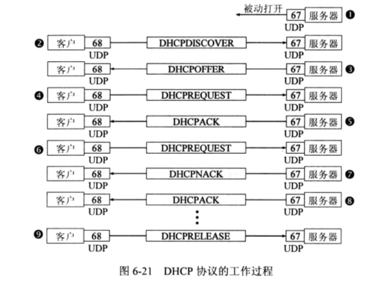
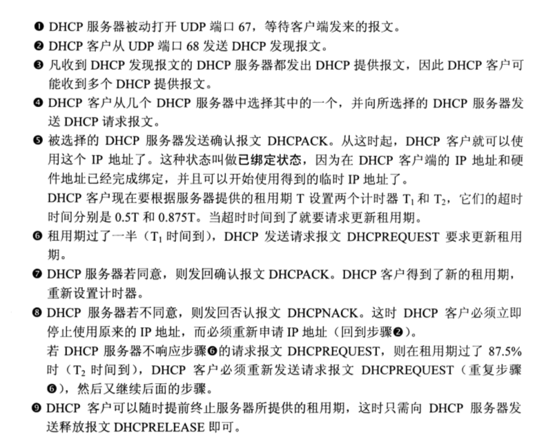

一个网络协议中有很多需要配置的参数，只有配置了正确的参数协议才能正常工作。这个过程叫做协议配置。连接到Internet的计算机一般需要经过下面的几个配置：

1. IP地址
2. 子网掩码
3. 默认路由器的IP地址
4. 域名服务器的IP地址

由于采用人工的配置方式很不方便，而且容易出错。因此应该采用自动协议配置的方式，现在广泛采用的是动态主机配置协议DHCP（Dynamic Host Configuration Protocol），它提供了一种机制，称为即插即用连网。

DHCP使用的是客户-服务器的工作方式。需要IP地址的主机在启动时就向DHCP服务器广播**发现报文（DHCPDISCOVER）**（将目的IP地址置为全1,即255.255.255.255，因为不知道DHCP服务器的位置），这时该主机就成为DHCP的客户。这个主机目前还没有自己的IP地址，因此它将IP数据报的源IP地址设为全0。这样本地网络上所有主机都能收到这个广播报文，但是只有DHCP服务器才能对广播报文进行回答。DHCP服务器在其数据库中查找该计算机的配置信息。如果找到，返回找到的信息。如果没有，从服务器的IP地址池中取出一个地址分配给该计算机。DHCP服务器的回答报文叫做**提供报文（DHCPOFFER）**。

上图是DHCP的工作流程，使用的是UDP的两个熟知端口67, 68。下图是对上图的一个详细说明。

>rarp协议--逆地址解析协议是将MAC地址转换成IP地址，和ARP协议使用相同结构的报头。其因为较限于IP地址的运用以及其他的一些缺点，因此渐为更新的BOOTP或DHCP所取代。rarp的工作流程也是类似，发送主机发送一个本地的RARP广播，在此广播包中，声明自己的MAC地址并且请求任何收到此请求的RARP服务器分配一个IP地址...

内容来自

《计算机网络第6版本-谢希仁》

[逆地址解析协议](https://zh.wikipedia.org/wiki/%E9%80%86%E5%9C%B0%E5%9D%80%E8%A7%A3%E6%9E%90%E5%8D%8F%E8%AE%AE)