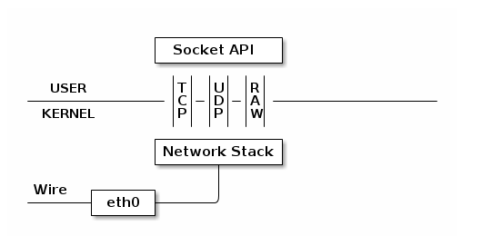
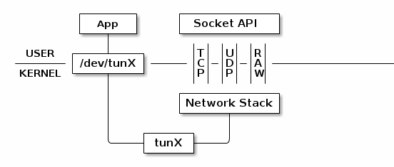
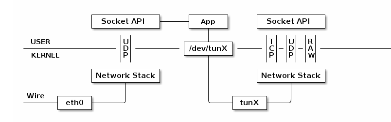
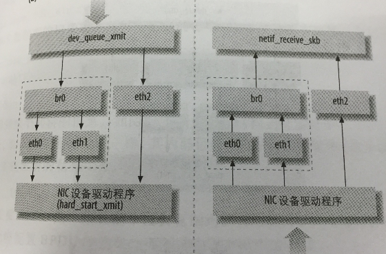

##Linux下Tun/Tap设备通信原理
**来源**
[图片和原理](https://blog.kghost.info/2013/03/27/linux-network-tun/)
[代码](http://blog.chinaunix.net/uid-317451-id-92474.html)
Tun是纯软件实现的三层设备，即能够处理三层即IP包。通过这个设备程序可以模拟网络的行为

上图是正常的进程网络交互的主要流程。物理的网卡通过将收到的数据交给内核的协议栈处理，然后进程通过Socket API获取数据

而这张图表示的是TUN设备的工作流程，普通的网卡通过网线收发数据包，然后TUN设备通过一个文件收发数据包。当图中App对该文件进行写操作时，会通过TUN设备模拟物理网卡的数据来到内核一样，这些数据被注入内核的网络协议栈。然后其他监听套接字的进程将可以从该套接字获取数据。对App来说，读的过程恰好相反

通过这个设备，我们可以实现一个vpn

这里给出一个Linux下的代码

	#include<stdio.h>
	#include<errno.h>
	#include<net/if.h>
	#include<sys/ioctl.h>
	#include<fcntl.h>
	#include<string.h>
	#include<linux/if_tun.h>
	int tun_alloc(char *dev,int flags)
	{
		struct ifreq ifr;
		int fd,err;

		if( (fd = open("/dev/net/tun",O_RDWR)) < 0 )
		{
			printf("open tun error");
			return -1;
		}
		memset(&ifr,0,sizeof(ifr));
		ifr.ifr_flags = flags;
		if( *dev )
			strncpy(ifr.ifr_name,dev,IFNAMSIZ);

		if( (err = ioctl(fd,TUNSETIFF,(void *)&ifr)) < 0 )
		{
			close(fd);
			return err;
		}
		strcpy(dev,ifr.ifr_name);
		return fd;
	}
	int main(int argc,char **argv)
	{
		char dev[IFNAMSIZ];
		int fd,ret,tmp;
		char ip[4],buf[4096];
		memset(dev,0,sizeof(dev));
		fd = tun_alloc(dev,IFF_TUN | IFF_NO_PI);
		printf("tun name %s\n",dev);
		while(1)
		{
			ret = read(fd,buf,sizeof(buf));
			if( ret < 0 )
				break;
			//这里是将ip头的源地址与目的地址交换
			memcpy(ip,buf+12,4);
			memcpy(buf+12,buf+16,4);
			memcpy(buf+16,ip,4);

			memcpy(&tmp,buf+20,4);
			printf("%02X\n",tmp);//这个输出很有意思，因为主机字节序的问题是xxxx0008 xxxx是和icmp报文的checksum，0008就是code和type
			buf[20] = 0;//这个是将icmp的request报文转换成reply报文
			*((unsigned short *)&buf[22]) += 8;//这个处理的应该是报文的checksum值
			printf("read %d bytes\n",ret);
			ret = write(fd,buf,ret);
			printf("write %d bytes\n",ret);
		}
		return 0;
	}
值得注意的是：一次read系统调用，有且只有一个数据包被传送到用户空间，并且当用户空间的缓冲区比较小时，数据包将被截断，剩余部分将永久地消失，write系统调用与read类似，每次只发送一个数据包。所以在编写此类程序的时候，请用足够大的缓冲区，直接调用系统调用read/write，避免采用C语言的带缓存的IO函数

open打开字符设备/dev/net/tun，然后ioctl可以执行指定的命令取得驱动程序对设备的控制，ifreq这个结构体中有两个重要成员，一个是ifr_name和ifr_flags，ifr_name定义了要创建或者是打开的虚拟网络设备的名字，如果它为空或者是此网络设备不存在，内核将新建一个虚拟网络设备，并返回新建的虚拟网络设备的名字，同时文件描述符fd也将和此网络设备建立起关联。如果并没有指定网络设备的名字，内核将根据其类型自动选择tunXX和tapXX作为其名字。ifr_flags用来描述网络设备的一些属性，比如说是点对点设备还是以太网设备。详细的选项解释如下:

    IFF_TUN: 创建一个点对点设备
    IFF_TAP: 创建一个以太网设备
    IFF_NO_PI: 不包含包信息，默认的每个数据包当传到用户空间时，都将包含一个附加的包头来保存包信息
    IFF_ONE_QUEUE: 采用单一队列模式，即当数据包队列满的时候，由虚拟网络设备自已丢弃以后的数据包直到数据包队列再有空闲
    
    
配置的时候，IFF_TUN和IFF_TAP必须择一，其他选项则可任意组合。其中IFF_NO_PI没有开启时所附加的包信息头如下
> 之所以叫包头是因为这个信息是在读取出来的数据的最前面

	struct tun_pi 
	{
	    unsigned short flags;
	    unsigned short proto;
	};

上面给出的代码简单的实现了ICMP包的ECHO包，并回应ECHO REPLY

执行的过程是首先运行这个程序（要在超级用户权限下运行），然后打开另一个窗口执行三条命令

	ifconfig tun0 0.0.0.0 up
	route add 10.10.10.1 dev tun0
	ping 10.10.10.1 -c 1

然后你就能看到首先的窗口有输出产生，而ping命令也有ICMP的报文回应

###bridge
桥接也是实现vpn的一种重要的手段，bridge是虚拟设备，必须要把一个或者几个真是的设备绑定（ensalve）到网桥设备上，否则它就无法接收或者传输任何东西

下面这张图片很形象地描述了数据传输的问题

图中的br0就是一个网桥，网桥其实可以看成交换，它和交换机一样，判断包的类别（广播/单点），查找内部 MAC 端口映射表，定位目标端口号，将数据转发到目标端口或丢弃，自动更新内部 MAC 端口映射表以自我学习，还有就是当网卡被绑定到网桥上的时候网卡的ip地址就失效了，它不会再使用那个IP在第三层接收数据，不过你可以把网卡的ip指定到网桥上。

[tun,tap,bridge三种设备比较](https://community.openvpn.net/openvpn/wiki/BridgingAndRouting)
这是链接中的部分内容
And you want to bridge if:

+ You want your LAN and VPN clients to be in the same broadcast domain
+ You want your LAN DHCP server to provide DHCP addresses to your VPN client
+ You have Windows server(s) you want to access and require network neighbourhood discovery to work via VPN and WINS is not an option to implement. If you have WINS, you don't want bridging. Really. 

It might be a few more reasons, but these are the most typical ones. And as you see, TAP is a requirement for bridging. TUN devices cannot be used for bridges and non-IP traffic.

Bridging looks easier at first glance, but it brings a completely different can of worms. Make no mistake: There are no shortcuts in making networking easier - except learning how to do it properly.

Now lets see benefits and drawbacks of TAP vs TUN.

TAP benefits:

+ behaves like a real network adapter (except it is a virtual network adapter)
+ can transport any network protocols (IPv4, IPv6, Netalk, IPX, etc, etc)
+  Works in layer 2, meaning Ethernet frames are passed over the VPN tunnel
+ Can be used in bridges 

TAP drawbacks

+ causes much more broadcast overhead on the VPN tunnel
+ adds the overhead of Ethernet headers on all packets transported over the VPN tunnel
+ scales poorly
+ can not be used with Android or iOS devices 

TUN benefits:

+ A lower traffic overhead, transports only traffic which is destined for the VPN client
+ Transports only layer 3 IP packets 

TUN drawbacks:

+ Broadcast traffic is not normally transported
+ Can only transport IPv4 (OpenVPN 2.3 adds IPv6)
+ Cannot be used in bridges 

