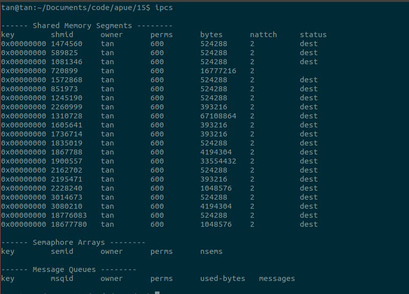
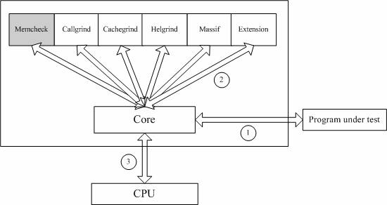
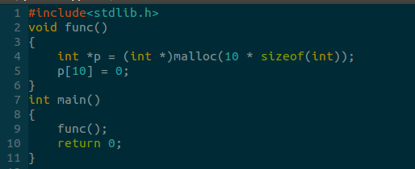

这个名字不太好取，反正这个就是系统资源管理的一些命令，包括进程IPC。


###ipcs命令
输出三种IPC机制（消息队列，信号量，共享存储）资源的分配和使用情况的命令。至于这些字段的信息，看完apue第15章之后就应该很明了。注意输出的内容是根据调用者的读权限产生的，如果调用者没有读权限，将看不到该IPC对象的信息。
使用方式，第一种是输出某种，或者所有ipc对象的信息。第二种是根据某种对象的id输出某个对象的信息。
```
ipcs [-asmq] [-tclup]
ipcs [-smq] -i id
```
常用参数：
+ -m 输出共享内存对象信息
+ -q输出消息队列对象信息
+ -s输出信号量对象信息
+ -a上面三种全都输出，默认的输出模式
+ -t时间信息，一般是修改时间
+ -p进程id，一般是修改进程，创建进程信息
+ -c输出权限信息，包括三种用户的权限位，创建者的有效用户id，有效组id，所有者的有效用户id，有效组id。(就是ipc_perm结构体中数据)

命令比较简单，给出一个样例输出：



###ipcrm命令

通过参数指定的输入删除对应的ipc对象。

使用方法：
```
ipcrm [ -M key | -m id | -Q key | -q id | -S key | -s id ] ...
```

常用参数：
+ -M使用shmkey删除共享存储对象
+ -m使用shmid删除共享存储对象
+ 剩下的4个类似


###valgrind工具

valgrind工具用来发现Linux程序的内存问题。valgrind是由内核（core）和基于内核的其他调试工具组成。内核类似于一个框架，它模拟了一个CPU环境，并提供服务给其他工具。其他工具类似于插件，利用内核提供的服务完成各种特定的内存调试任务。valgrind的架构如下：



Valgrind包括如下一些工具：
1. Memcheck。这是valgrind应用最广泛的工具，一个重量级的内存检查器，能够发现开发中绝大多数内存错误使用情况，比如：使用未初始化的内存，使用已经释放了的内存，内存访问越界等。
2. Callgrind。它主要用来检查程序中函数调用过程中出现的问题。
3. Cachegrind。它主要用来检查程序中缓存使用出现的问题。
4. Helgrind。它主要用来检查多线程程序中出现的竞争问题。
5. Massif。它主要用来检查程序中堆栈使用中出现的问题。
6. Extension。可以利用core提供的功能，自己编写特定的内存调试工具。

命令使用（具体的参数以后再补充）：
```
valgrind [valgrind-options] [your-program] [your-program-options]
```

下面一个sample.c的错误文件


这是valgrind的使用和输出。
```
tan@tan:~/Desktop/code$ gcc -g sample.c -osample
tan@tan:~/Desktop/code$ valgrind ./sample
==1243== Memcheck, a memory error detector
==1243== Copyright (C) 2002-2013, and GNU GPL'd, by Julian Seward et al.
==1243== Using Valgrind-3.10.0.SVN and LibVEX; rerun with -h for copyright info
==1243== Command: ./sample
==1243== 
==1243== Invalid write of size 4
==1243==    at 0x40054B: func (sample.c:5)
==1243==    by 0x400560: main (sample.c:9)
==1243==  Address 0x51fc068 is 0 bytes after a block of size 40 alloc'd
==1243==    at 0x4C2AB80: malloc (in /usr/lib/valgrind/vgpreload_memcheck-amd64-linux.so)
==1243==    by 0x40053E: func (sample.c:4)
==1243==    by 0x400560: main (sample.c:9)
==1243== 
==1243== 
==1243== HEAP SUMMARY:
==1243==     in use at exit: 40 bytes in 1 blocks
==1243==   total heap usage: 1 allocs, 0 frees, 40 bytes allocated
==1243== 
==1243== LEAK SUMMARY:
==1243==    definitely lost: 40 bytes in 1 blocks
==1243==    indirectly lost: 0 bytes in 0 blocks
==1243==      possibly lost: 0 bytes in 0 blocks
==1243==    still reachable: 0 bytes in 0 blocks
==1243==         suppressed: 0 bytes in 0 blocks
==1243== Rerun with --leak-check=full to see details of leaked memory
==1243== 
==1243== For counts of detected and suppressed errors, rerun with: -v
==1243== ERROR SUMMARY: 1 errors from 1 contexts (suppressed: 0 from 0)
```

分析一下输出的结果：
+ "==1243=="是pid
+ 第一部分是valgrind的信息和被执行的程序。
+ 第二个部分Invalid wirte of size 4，表示非法写入四个字节。下面的提示打印出了函数栈的调用情况，在sample.c的第5行发生了非法地址的写入。
+ 最后是LEAK SUMMARY。这里有5种情况的lost，每种含义下面介绍。

+ definitely lost。表示程序存在内存泄漏，需要更正
+ indirectly lost。表示你的程序在基于指针的数据结构上造成内存泄漏（例如，如果二叉树的根节点是definitely lost，那么其他节点就是indirectly lost）。如果你能够更正definityely lost，那么indirectly lost将消失。
+ possibly lost。表示指针指向的不是分配内存的开始部位，可能造成内存泄漏。
+ still reachable
+ suppressed


内容来自

[应用 Valgrind 发现 Linux 程序的内存问题](https://www.ibm.com/developerworks/cn/linux/l-cn-valgrind/)