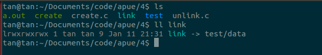
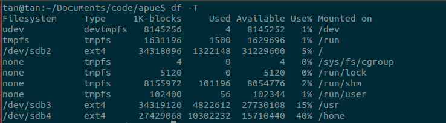
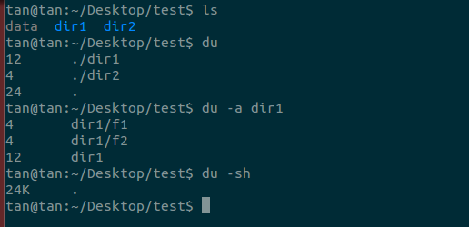

### which
which的作用就是在path指定的路径中搜索某个系统命令的位置并且返回地一个结果
eg：

```
tan@ttt:~/Documents/git_dir/others$ which passwd
/usr/bin/passwd
```
### help
对于Linux中的命令，分为两种。一种是shell内置的命令，像cd，trap，type，help等。还有一种是外部命令，这个就有很多了gcc，ls，mv等等。一般来谁shell内置的命令是没有man文档的，如果需要查看文档那么怎么办呢？

help命令能够解决这个问题，它给shell内置命令提供了一个文档。

```
help [-dms] [pattern ...]
```

e.g.
```
help 查看所有内置命令
help help查看help命令的帮助文档
```

### man
关于man这个命令大家肯定不陌生，经常看man文档的人就知道，为什么man文档是xxx(1)的形式呢？这个数字是什么意思，反正我是用到现在才知道，真是惭愧

原来man文档将文档分成8种大类：

1. Executable programs or shell commands
2. System calls (functions provided by the kernel)
3. Library calls (functions within program libraries)
4. Special files (usually found in /dev)
5. File formats and conventions eg /etc/passwd
6. Games
7. Miscellaneous (including macro packages and conventions), e.g. man(7), groff(7)
8. System administration commands (usually only for root)
9. Kernel routines [Non standard]


如果要准确的访问某个内容可以`man [number] xxx`

关于man文档还有很多经常见到，但是被忽视的地方。举个例子chrt（改变或者这只进程优先级命令的输出）：


介绍命令的使用时，出现了[options], `<pid>`, {}, |等，在man文档中都有其固定的含义

+ [options]。表示options中的内容是可选的，也就是使用的时候可以包含也可以不含该部分
+ `<pid>`。尖括号表示的是必选内容，所以使用时必须包括pid。不过在man文档中这个使用比较少见，必须出现的字段一般都是什么修饰符号都没有
+ |。表示二选一
+ {}。表示分组，即括号里面的内容可以出现一次或者多次。


###ln命令
ln命令的作用是对文件或者是文件夹创建链接，一般情况下对链接的读写可以看成是对原来文件或者是文件夹的读写。通过这样的方式节约存储，同时更新文件时不需要更新多个拷贝。创建的链接分为两种，一种是硬链接（hard link），另外一种是符号链接或者叫软链接（symbolic links）。

硬链接：
1. 硬链接是文件的多个名字，它们都指向同一个inode结点（可以通过`ls -i`查看inode结点号）
2. 硬链接通常要求链接和文件位于同一文件系统中
3. 在底层文件系统支持的情况下只有超级用户才能创建指向目录的硬链接（可能在文件系统中形成循环）
4. 硬链接，以文件副本的形式存在，但是不占用实际空间，删除被链接的文件对链接没有影响。


软链接：
1. 软链接是一个新的文件，有自己的inode结点，文件的实际内容包含的是软链接指向文件的名字

2. 可以创建一个指向目录的软链接
3. 软链接被链接文件删除之后软链接失去作用。

命令的使用方式：
```
ln [OPTION]... [-T] TARGET LINK_NAME   (1st form)
ln [OPTION]... TARGET                  (2nd form)
ln [OPTION]... TARGET... DIRECTORY     (3rd form)
ln [OPTION]... -t DIRECTORY TARGET...  (4th form)
```
四种方式中TARGET表示被链接的文件或者是文件夹。第一种方式中LINK_NAME表示新创建链接文件的名字。第二种方式在当前目录创建TARGET的链接，名字就是默认的TARGET的名字。第三那种和第四种方式都是在指定的DIRECTORY中创建链接。

常用参数：
+ -s表示创建符号链接
+ -d允许管理员创建目录的硬链接（需要文件系统的支持）


###df命令
df命令用于报告文件系统磁盘空间的使用。df命令能够输出包含每个文件名的文件系统的磁盘空间使用情况。如果文件名没有给出，那么将显示现在所有挂载的文件系统的使用情况。默认的情况是显示1K的块的个数，如果环境变量POSIXLY_CORRECT设置了，那么显示的是512B的块。

常用参数：
+ -i显示inode的信息而不是磁盘的使用
+ -T打印文件系统的类型
+ -h输出时控制输出格式，更适合人阅读

使用格式：
```
df [OPTION]... [FILE]...
```

输出样例：



第一列的Filesystem一般是表示硬盘分区。第二列Type是指定-T参数才有的输出，表示文件系统的类型。1K-blocks表示1K大小的块个数，Used和Avaiable表示前面块的使用和剩余情况。Mounted on表示挂载点。


###du命令
du命令用来估计文件占用的存储空间。该命令的功能是逐级进入指定目录的每一个子目录并显示该目录占用文件系统数据块的个数（如果设置了POSIXLY_CORRECT那是512B的块，如果没有默认是1024B的块）。若没有给出指定目录，则对当前目录进行统计。

使用格式：
```
du [OPTION]... [FILE]...
du [OPTION]... --files0-from=F
```
FILE可以是文件或者目录。--files0-from=后面可以接多个文件名F（他们之间用null分割，这个字符我不知道在shell里面怎么敲出来。


常用参数：
+ -a显示所有文件不仅仅是目录的统计
+ -s只显示每个FILE占用数据块数的总计
+ -h适合人阅读的方式
+ -B指定每个块的大小，可指定的单位有K, M, G, T, P, E, Z, Y（相邻的之间为1024）
+ -L计算软链接
+ -l计算硬链接
+ -t指定一个文件大小的阈值threshold，如果threshold是正值表示小于这个大小的文件不在统计范围内。threshold是负值表示不统计比|threshold|大的文件

下面是一个样例的使用。du输出的23表示总共



>apue上面第四章的问题4.8问在执行unlink的那个函数之后问什么用df而不用du来检查空闲的磁盘空间。原因是执行unlink之后文件名已经在目录中删除，然而由于进程还打开这个文件，实际的空间还没有释放。因此如果使用du命令，它是通过统计文件名的方式进行空间的计算，故统计不了这种未被释放的空间。

###find命令
find命令是一个功能非常强大的命令，可以说是找到任何你想要的文件。同时这个命令也是一个很复杂的命令，它的复杂就是因为它和普通的命令在使用的方式上存在较大的差异。

find命令的使用格式：
```
find [-H] [-L] [-P] [-D debugopts] [-Olevel] [path...] [expression]
```

find命令的选项不多，HLP三个选项都是与如何对待符号链接有关。D选项是命令的调试功能，在find命令的结果不符合你的预期时可以打开进行调试。O选项是find的优化级别，find能够在不影响最终结果的情况下对expression里面的测试（test）的顺序进行调整，提高find的查找速度。path参数可以指定一个或者多个文件的路径，路径可以是相对路径也可以是绝对路径。expression下面再介绍。

+ -P。默认的选项。不跟随符号链接，将符号链接当成普通文件。
+ -L。跟随符号链接。
+ -H。不跟随符号链接。但是如果符号链接是在命令行参数给出的，仅这一次跟随符号链接。


**expression是find命令的关键，expression由options（影响整个操作，而不是处理某个特定的文件，总是返回true），tests（返回true或者false），actions的一个或者多个构成，它们通过operators分隔，如果没有提供，默认是-and**。这个options和前面的选项两者是有区别的，一个是命令的选项，一个是表达式里面的选项。

>find命令运行的过程其实很简单。通过expression的返回值和expression之间的operator判断执行了某个expression之后其他的expression是否有必要执行。例如test1 -and action1，这里有两个expression。如果test1返回false，那么action1被短路不能执行。

#####常见的option

+ -daystart。将测量时间改成当天的开始时间而不是从当前时间开始计算，对命令行中后面的-amin, -atime, -cmin, -ctime, -mmin, -mtime等test有影响。e.g. 现在可能是6.1日8:00，那么在开始时间是6.1日0:00。
+ -depth。先访问目录中的内容再访问目录本身。默认的顺序是反过来的。
+ -maxdepth levels。对命令行参数进行最大层数为levels的查找。如果-maxdepth为0，那么只对命令行指定的文件执行tests和actions
+ -mindepth levels。对命令行参数进行至少层数为levels的查找。如果-mindepth为1，那么处理除了命令行参数以外的所有文件。
+ -noleaf。不要使用一个目录的链接数目小于等于2就认为该目录没有子目录的优化。因为在一个UNIX-like的文件系统中，一个目录至少有两个硬链接，一个是目录名字，另外一个是`.`，而对有子目录的目录而言，子目录会有一个链接`..`指向父目录，因此一个拥有子目录的目录链接数目要大于2。这个优化会减少stat调用次数，明显提高搜索速度。但是在MS，AFS等文件系统中不成立，需要被禁止。
+ regextype type。设置tests：-regex和-iregex使用的正则表达式为type类型。目前支持的type有：emacs (默认), posix-awk, posix-basic, posix-egrep and posix-extended
+ xdev。不对其他文件系统的目录进行搜索

#####常见的tests

test是用于检查当前的文件是否满足指定的测试，返回true或者false。

测试中出现数字n的地方一般都可以指定为 -n、n 或 +n。

+ -n 返回项小于 n
+ +n 返回项大于 n
+ n 返回项正好与n相等

**时间测试**

find 命令有几个用于根据您系统的时间戳搜索文件的选项。这些时间戳包括

+ -mtime。文件内容上次修改时间
+ -atime。文件被读取或访问的时间
+ -ctime。文件状态变化时间
+ -mmin。文件内容上次修改时间，单位是分钟
+ -amin。...，单位分钟
+ -cmin。...，单位分钟
+ -newer file。文件比file修改修改时间新


mtime 和 atime 的含义都是很容易理解的，而 ctime 则需要更多的解释。由于 inode 维护着每个文件上的元数据，因此，如果与文件有关的元数据发生变化，则 inode 数据也将变化，**ctime就是i结点被修改的时间**。这可能是由一系列操作引起的，包括创建到文件的符号链接、更改文件权限或移动了文件等。由于在这些情况下，文件内容不会被读取或修改，因此 mtime 和 atime 不会改变，但 ctime 将发生变化。

这些时间选项都需要与一个值 n 结合使用。前面已经介绍过n的使用方法。


>由于舍入的原因，时间并不精确。例如atime 1。表示的是访问时间等于1*24=24h的文件。如果一个文件的访问时间为30h前，那么也可以通过该测试，因为30 / 24 = 1，小数部分被舍去。

**权限测试**

+ -perm mode。文件权限等于mode。
+ -perm -mode。文件权限包括mode权限中的所有权限。e.g. -664表示文件至少包含所有者的读写，同组用户的读写，其他用户读权限。-000表示匹配所有文件权限
+ -perm /mode。文件权限包括mode权限中的任意权限。e.g. /600表示文件拥有所有者的读权限或者写权限中任意一个即可。/777表示所有文件都能匹配。
+ -wriable。当前用户对文件写权限。
+ -readable。当前用户对文件读权限。
+ -executable。当前用户对文件执行权限。

>mode的表示方式是4位8进制数，或者是字符。


**其他测试**

+ -size n[cwbkMG]。文件的大小。n后面修饰符是大小的单位。c 字节，w 两个字节，b 512字节的块。k 1024字节。M MB。G GB。
+ -type c。文件类型。c是一种特殊类型的取值，可以是b 块设备，c 字符设备，d 目录，p 管道，f 普通文件，l 符号链接， s套接字。
+ -name pattern。文件名字去掉路径对模式pattern进行匹配。pattern用单引号包围防止shell进行文件名扩展。
+ -iname pattern。忽略大小写同上。
+ -path pattern。文件名字加上路径对模式pattern进行匹配。e.g. `find . -path "./sr*sc"`能够找到`./src/misc`这样的文件。
+ -ipath pattern。忽略大小写同上。
+ -empty。空文件或者目录。

#####常见的actions
+ -delete。删除文件
+ ` -exec command ;`。执行命令command。结尾的分号表示命令的终止。一般需要使用反斜线转义分号，使用单引号包围花括号防止shell解释。`{}`能够代表当前处理文件的名字传递给command。根据命令是否成功代表-exec是否成功
+ `-exec command {} +`。执行命令command。但是花括号只能出现一次，可能多个匹配的文件才会执行一次command
+ -prune。如果文件是个目录就不进入它。
+ -quit。立即退出。
+ -print。向标准输出输出文件全名，末尾加入一个回车。
+ -print0.向标准输出输出文件全名，末尾加入一个NULL字符。

#####常见的operators

含义很简单，从高优先级到低优先级：

+ `( expr )`。
+ ! expr。
+ -not expr。
+ expr1 expr2。
+ expr1 -a expr2。
+ expr1 -and expr2
+ expr1 -o expr2。
+ expr1 -or expr2。
+ expr1 , expr2。

> 注意find命令中有些位置需要使用合适的空格，不然会产生语法错误

例子：

删除/tmp目录下名字为core的普通文件
```
find /tmp -name core -type f -print | xargs /bin/rm -f
```

删除/tmp目录下名字为core的普通文件，相比前面更加可靠，因为上面一种方式如果文件名字中包含回车，单引号，双引号，空格等特殊字符将不能正常工作。
```
find /tmp -name core -type f -print0 | xargs -0 /bin/rm -f
```

在当前目录中对找到的所有普通文件执行file命令。单引号防止shell对花括号进行解释。
```
 find . -type f -exec file '{}' \;
```

在根目录下查找具有setuid（设置用户id）的文件和目录，并将名字写入/root/suid.txt中。同时将大小超过100M的文件写入/root/big.txt中。末尾反斜线转义回车，表示命令没有完成输入。括号前转义括号，防止shell解释成子命令执行。这个find命令中出现了两个expression。他们使用括号
```
 find / \
 \( -perm -4000 -fprintf /root/suid.txt %#m %u %p\n \) , \
 \( -size +100M -fprintf /root/big.txt %-10s %p\n \)
```

在$HOME目录中找在24小时内编辑过的文件。
```
find $HOME -mtime 0
```

在/sbin和/usr/sbin中找到可执行但是不可读的文件输出。
```
find /sbin /usr/sbin -executable \! -readable -print
```

在当前目录中找文件权限位刚好是664的文件。
```
find . -perm 664
```

在当前目录中找文件权限至少是664的文件，可以是664，665,666，...
```
find . -perm -664
```

下面三条find命令的功能相同。都是在当前目录中找到所有者具有写权限或者同组用户具有写权限的文件
```
find . -perm /220
find . -perm /u+w,g+w
find . -perm /u=w,g=w
```

下面两条命令的功能相同，在当前目录中找到三类用户都有读，至少有一个可写，但是都不能执行的文件
```
find . -perm -444 -perm /222 ! -perm /111
find . -perm -a+r -perm /a+w ! -perm /a+x
```

这条命令的理解可能有点困难，两条命令是等价的。find的输出是当前目录下除去.snapshot文件（目录）或者文件名（目录名）中以~结尾的所有文件（目录）。因为-prune动作的返回的结果是true。而默认的operators是and，所以-prune后面必须使用-o才能保证后面的表达式能够执行。
```
find . -name .snapshot -prune -o \( \! -name *~ -print0 \)
find \( -name .snapshot -prune \) -o \( \! -name *~ -print0 \)
```

对于下面的命令，假设有如下的目录结构。这条find命令的作用就是在repo目录下找到所有有版本控制目录的工作目录输出。末尾的-prune是在找到一个这样的目录时就停止对这个层次的目录进行搜索，例如下面的repo/gnu/project3/.svn找到就是，project3目录就会停止搜索，提高检索效率。
```
find repo/ -exec test -d {}/.svn -o -d {}/.git -o -d {}/CVS ; \
-print -prune

repo/project1/CVS
repo/gnu/project2/.svn
repo/gnu/project3/.svn
repo/gnu/project3/src/.svn
repo/project4/.git
```


内容来自

Linux man find

[Linux Find 命令精通指南](http://www.oracle.com/technetwork/cn/topics/calish-find-096463-zhs.html)


