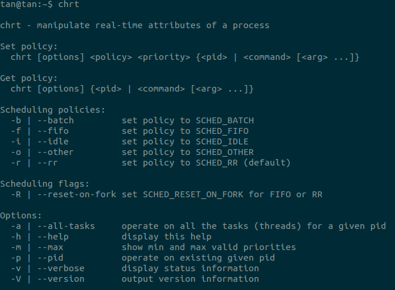

##Linux文件命令
### which
which的作用就是在path指定的路径中搜索某个系统命令的位置并且返回地一个结果
eg：

```
tan@ttt:~/Documents/git_dir/others$ which passwd
/usr/bin/passwd
```
### help
对于Linux中的命令，分为两种。一种是shell内置的命令，像cd，trap，type，help等。还有一种是外部命令，这个就有很多了gcc，ls，mv等等。一般来谁shell内置的命令是没有man文档的，如果需要查看文档那么怎么办呢？

help命令能够解决这个问题，它给shell内置命令提供了一个文档。

```
help [-dms] [pattern ...]
```

e.g.
```
help 查看所有内置命令
help help查看help命令的帮助文档
```

### man
关于man这个命令大家肯定不陌生，经常看man文档的人就知道，为什么man文档是xxx(1)的形式呢？这个数字是什么意思，反正我是用到现在才知道，真是惭愧

原来man文档将文档分成8种大类：

1. Executable programs or shell commands
2. System calls (functions provided by the kernel)
3. Library calls (functions within program libraries)
4. Special files (usually found in /dev)
5. File formats and conventions eg /etc/passwd
6. Games
7. Miscellaneous (including macro packages and conventions), e.g. man(7), groff(7)
8. System administration commands (usually only for root)
9. Kernel routines [Non standard]


如果要准确的访问某个内容可以`man [number] xxx`

关于man文档还有很多经常见到，但是被忽视的地方。举个例子chrt（改变或者这只进程优先级命令的输出）：



介绍命令的使用时，出现了[options], `<pid>`, {}, |等，在man文档中都有其固定的含义

+ [options]。表示options中的内容是可选的，也就是使用的时候可以包含也可以不含该部分
+ `<pid>`。尖括号表示的是必选内容，所以使用时必须包括pid。不过在man文档中这个使用比较少见，必须出现的字段一般都是什么修饰符号都没有
+ |。表示二选一
+ {}。表示分组，即括号里面的内容可以出现一次或者多次。


###ln命令
ln命令的作用是对文件或者是文件夹创建链接，一般情况下对链接的读写可以看成是对原来文件或者是文件夹的读写。通过这样的方式节约存储，同时更新文件时不需要更新多个拷贝。创建的链接分为两种，一种是硬链接（hard link），另外一种是符号链接或者叫软链接（symbolic links）。

硬链接：
1. 硬链接是文件的多个名字，它们都指向同一个inode结点（可以通过`ls -i`查看inode结点号）
2. 硬链接通常要求链接和文件位于同一文件系统中
3. 在底层文件系统支持的情况下只有超级用户才能创建指向目录的硬链接（可能在文件系统中形成循环）
4. 硬链接，以文件副本的形式存在，但是不占用实际空间，删除被链接的文件对链接没有影响。


软链接：
1. 软链接是一个新的文件，有自己的inode结点，文件的实际内容包含的是软链接指向文件的名字

2. 可以创建一个指向目录的软链接
3. 软链接被链接文件删除之后软链接失去作用。

命令的使用方式：
```
ln [OPTION]... [-T] TARGET LINK_NAME   (1st form)
ln [OPTION]... TARGET                  (2nd form)
ln [OPTION]... TARGET... DIRECTORY     (3rd form)
ln [OPTION]... -t DIRECTORY TARGET...  (4th form)
```
四种方式中TARGET表示被链接的文件或者是文件夹。第一种方式中LINK_NAME表示新创建链接文件的名字。第二种方式在当前目录创建TARGET的链接，名字就是默认的TARGET的名字。第三那种和第四种方式都是在指定的DIRECTORY中创建链接。

常用参数：
+ -s表示创建符号链接
+ -d允许管理员创建目录的硬链接（需要文件系统的支持）


###df命令
df命令用于报告文件系统磁盘空间的使用。df命令能够输出包含每个文件名的文件系统的磁盘空间使用情况。如果文件名没有给出，那么将显示现在所有挂载的文件系统的使用情况。默认的情况是显示1K的块的个数，如果环境变量POSIXLY_CORRECT设置了，那么显示的是512B的块。

常用参数：
+ -i显示inode的信息而不是磁盘的使用
+ -T打印文件系统的类型
+ -h输出时控制输出格式，更适合人阅读

使用格式：
```
df [OPTION]... [FILE]...
```

输出样例：


第一列的Filesystem一般是表示硬盘分区。第二列Type是指定-T参数才有的输出，表示文件系统的类型。1K-blocks表示1K大小的块个数，Used和Avaiable表示前面块的使用和剩余情况。Mounted on表示挂载点。


###du命令
du命令用来估计文件占用的存储空间。该命令的功能是逐级进入指定目录的每一个子目录并显示该目录占用文件系统数据块的个数（如果设置了POSIXLY_CORRECT那是512B的块，如果没有默认是1024B的块）。若没有给出指定目录，则对当前目录进行统计。

使用格式：
```
du [OPTION]... [FILE]...
du [OPTION]... --files0-from=F
```
FILE可以是文件或者目录。--files0-from=后面可以接多个文件名F（他们之间用null分割，这个字符我不知道在shell里面怎么敲出来。


常用参数：
+ -a显示所有文件不仅仅是目录的统计
+ -s只显示每个FILE占用数据块数的总计
+ -h适合人阅读的方式
+ -B指定每个块的大小，可指定的单位有K, M, G, T, P, E, Z, Y（相邻的之间为1024）
+ -L计算软链接
+ -l计算硬链接
+ -t指定一个文件大小的阈值threshold，如果threshold是正值表示小于这个大小的文件不在统计范围内。threshold是负值表示不统计比|threshold|大的文件

下面是一个样例的使用。du输出的23表示总共


>apue上面第四章的问题4.8问在执行unlink的那个函数之后问什么用df而不用du来检查空闲的磁盘空间。原因是执行unlink之后文件名已经在目录中删除，然而由于进程还打开这个文件，实际的空间还没有释放。因此如果使用du命令，它是通过统计文件名的方式进行空间的计算，故统计不了这种未被释放的空间。