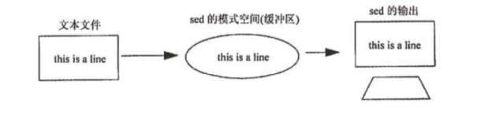
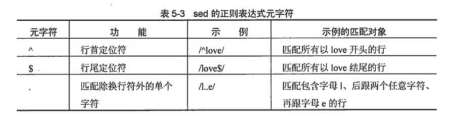
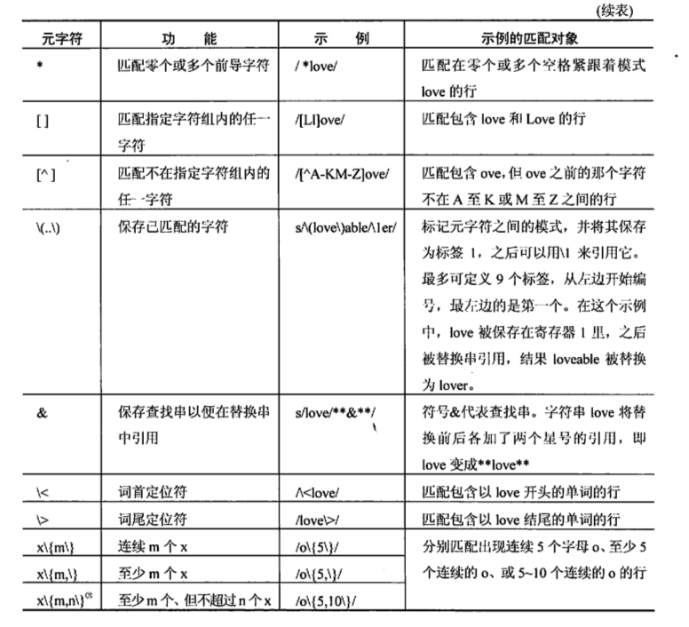
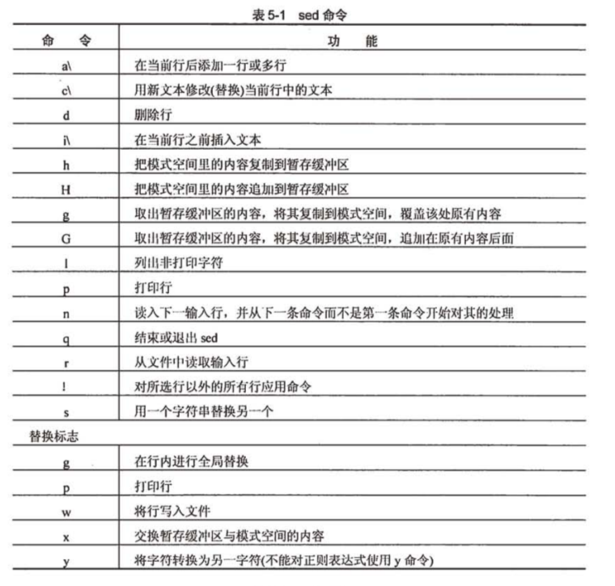
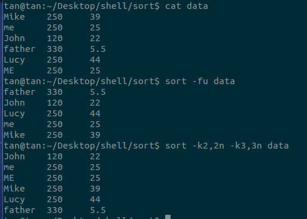

### diff
`diff [option] files` 
常用参数

    -c 上下文模式
    -u 合并模式

##### diff输出格式(默认) 
n1 a n3,n4 表示在文件1的n1行后面添加n3到n4行 
n1,n2 d n3 表示在文件1 n1到n2行之间删除 变成文件2的n3行 
n1,n2 c n3,n4 表示把n1,n2行用n3,n4行替换掉 
字母a：表示附加（add） 
字符c：表示修改（change） 
字符d：表示删除（delete） 
字母前的是源文件，字母后是目标文件。Nx表示行号 
以"<"打头的行属于第一个文件，以”>”打头的行属于第二个文件

##### 上下文模式
这种方式在开头两行作了比较文件的说明，这里有三中特殊字符：
+ “+” 比较的文件的后者比前着多一行
+ “-” 比较的文件的后者比前着少一行
+ “!” 比较的文件两者有差别的行

```
tan@ttt:~/Desktop$ cat a
h
b
c
d
tan@ttt:~/Desktop$ cat b
a
b
tan@ttt:~/Desktop$ diff a b
1c1
< h
---
> a
3,4d2
< c
< d

tan@ttt:~/Desktop$ diff -c a b
*** a	2017-03-07 16:05:52.312919199 +0800
--- b	2017-03-07 16:07:08.248921611 +0800
***************
*** 1,4 ****
! h
  b
- c
- d
--- 1,2 ----
! a
  b
```
 这里的1，4和1，2就是文件的指定范围发生了改变
#####合并模式
```
tan@ttt:~/Desktop$ diff -u a b 
--- a	2017-03-07 16:05:52.312919199 +0800
+++ b	2017-03-07 16:07:08.248921611 +0800
@@ -1,4 +1,2 @@
-h
+a
 b
-c
-d
```
这里的1，4和1，2都是从第1行开始4行和连续2行的意思，和上下文模式不同

###bc命令
bc是支持任意精度的数字和交互执行语句的语言。语法和C语言类似。bc按照文件在命令行被列出的顺序执行，在所有的文件被读取完成之后，bc从标准输入读入。所有的语句都在它被读入时执行。（如果在文件中包含一个命令暂停了解释器，bc就不会从标准输入读取了）

**语法**

```
bc [ -hlwsqv ] [long-options] [  file ... ]
```

>file是用bc语言定义的语句

**选项**

+ -i。强制使用交互模式
+ -l。定义标注的数学库
+ -s。只处理POSIX标准定义的bc语言
+ -q。不打印GNU的bc欢迎语句

在bc中，有几个很重要的概念。

**数（Numbers）**
数是bc里面最基本的元素。这里面数是任意精度的。这里的精度包括整数部分和小数部分。所有的数都是以10进制表示并且是10进制计算的。（这个版本在除法和乘法操作过程中产生截断误差）。数有两个属性，length和scale。length是一个数中所有的有意义的数字的位数。scale是小数点后数字的位数。例如：.000001的length是6,scale是6。1935.000的length是7，scale是3。

**变量（Variables）**
数字存储在两种类型的变量中，简单变量和数组。变量的命名规则是以字母开头，后面接任何的字母，数字，下划线。所有的字母都应该是小写的（在POSIX标准的bc中，变量名字是一个小写字母）。通过变量名字后边有中括号（`[]`）能够判断是数组变量。

除了自定义的变量外，bc中定义了4个特殊的变量。

+ scale。定义某些操作中怎么样使用小数点后的数字。合法值是0～c语言定义的最大的int
+ ibase。定义输入中数的进制。默认是10，合法值是2～16.
+ obase。定义输出中数的进制。默认是10
+ last。（扩展，POSIX标准没有）。存储最后打印输出的变量的值。

**注释（comments）**
使用类似于C语言的形式的多行注释：`/* comment content */`

单行注释使用井号`#`开头，这是一个扩展，POSIX标准不支持。

>以后说扩展，就是说POSIX标准的bc是不支持的。

**表达式（Experssions）**
数在表达式和语句中被使用。bc语言是解释执行的，没有main函数。

最简单的表达式就是一个常数。bc将输入常数q使用ibase定义的进制转换成内部使用的10进制。输入的数字包括0-9和A-F。（A-F必须大写，小写是变量名）。 Single digit numbers always have the value of the digit regardless of the value of ibase. (i.e. A = 10.)   For multi-digit numbers, bc changes all input digits greater or equal to ibase to the value of ibase-1.  This makes the number FFF always be the largest 3  digit  number  of  the input base.

复杂的表达式和其他高级语言的组成类似。下面是一个表达式的表格和每个表达式对应的含义。expr表示一个表达式。var表示一个简单变量（name）或者数组变量（name[expr]）。每个表达式都有scale，这个scale可能是数的scale中继承的，或者是运算中获得的，或者是scale变量指示的。除非特别说明，整个表达式的scale是表达式中最大的sacle。

> 这里举例子说明scale的问题，在bc中，假设scale变量为默认值0。那么1.5 + 2.222的值为3.722。很好理解，取常数1.5与2.222的scale中最大的scale。而表达式1.5 / 2.222为0。这是因为特别指定了除法运算的scale是scale变量定义的值0，那么所有小数部分全都被抹去，结果为0。因此为了避免这种问题，可以将scale设定成一个满意的精度

| 表达式 | 含义 |
| ------ |---- |
|- expr | 相反数 |
| ++ var | 前置自增1，表达式的值就是自增之后的值 |
| -\- var | 前置自减1，表达式的值是自减之后的值 |
| var ++ | 后置自增1，表达式的值是var的值，var自增 |
| var -\- | 后置自减1，表达式的值是var的值，var自减 |
| expr + expr | 加 |
| expr - expr | 减 |
| expr * expr | 乘 |
| expr / expr | 除， scale为scale变量定义的值 |
| expr % expr | 取余，如果scale为0，并且两个表达式就是整数，那么和普通的取余运算一样。a % b的计算过程为，首先计算a / b使用scale变量指定的位数进行截断，然后利用这个结果计算a - (a / b) * b，这个就是a % b的结果，要进行截断，截断精度是max(scale + scale(b), scale(a))。其中(a / b)就是第一步计算的值 |
| expr ^ expr | 指数，要求第二个expr是整数。如果expr是负数，那么表达式的scale就是变量scale定义的值，否则是scale(a^b) = min(scale(a)*b, max( scale, scale(a))) |
| (expr) | 括号表达式，先计算expr |
| var = expr | 赋值表达式 |
| var <op>= expr | 等价于 var = var <op> expr |

除了上面的表达式外还有关系运算表达式，他们的值不是0就是1，0代表false，1代表true。这些表达式可能出现在前面的表达式中（POSIX标准要求只能出现在if，while，for等语句中）

```
#关系表达式
expr1 < expr2
expr1 <= expr2
expr1 > expr2
expr1 >= expr2
expr1 == expr2
expr1 != expr2
#bool运算，值为0，1。POSIX标注不支持
!expr
expr && expr
expr || expr
```

运算符的优先级可以看man文档，和C语言的基本一样，但是有一个要特别注意的地方就是赋值运算的优先级提高了。导致`a = 3 < 5`的表达式不是先比较3和5,而是先赋值。

bc还提供了能够直接调用的函数。包括length(expression)，read()，scale(expression)，sqrt(expression)等。


**语句（statements）**
语句包括方括号的内容是可选的：

+ expression。如果表达式是以变量后接着等号开始，那么表达式被认为是赋值语句。如果不是赋值语句，那么表达式的值将会被计算输出。e.g. a = 1是赋值语句不输出任何结果，(a = 1)不是赋值语句输出表达式的值1。

+ string。用双引号引用，直接原样输出。输出时字符串后面不加回车。
+ print list。print是一个扩展，提供了另外一种输出的方式。list是字符串和表达式构成的，他们之间使用逗号分割。字符串可以使用某些转义字符。e.g. print 2.2 * 3, "\n"
+ { statement_list }。语句块。
+ if ( expression ) statement1 [else statement2]。else是扩展。
+ while ( expression ) statement。
+ for ( [expression1] ; [expression2] ; [expression3] ) statement。for里面可选是扩展，POSIX要求三个必须填上
+ break。
+ continue。扩展。
+ halt。停止执行，退出bc。扩展。
+ return [ (expression) ]。从函数返回表达式的值。没有方括号里面的是返回0。也可以不使用()，但是属于扩展，POSIX标准要求。

**pseudo statements**

主要有limits（扩展，输出bc版本限制），quit（无条件退出），warranty（开源权限信息）

**函数（functions）**
定义函数的方法：
```
define name ( parameters ) { newline
                  auto_list   statement_list }
```

name是函数的名字，parameters是变量名，可以定义数组变量和普通变量，使用逗号分隔。auto_list是一个可选的自定义变量列表，使用`auto name, ... ;`的形式定义。statement_list是上面出现的所有合法的语句。关于参数和auto变量需要注意的是bc中函数定义的参数和auto变量在其他函数中是可见的，例如函数A调用函数B，在函数中定义了auto a，那么在B中能够访问a的值。如果B中重新定义了a，那么对a的操作就是B中的a，原来的a被压栈。然后当函数B调用返回时，a弹栈，此时a的值又是A函数定义的auto a了。

函数的返回值由return语句确定，默认的返回值是0。

在函数中的所有常数会根据函数调用时的ibase值进行转换，转换成内部使用的10进制。

函数定义的格式在POSIX标准中左括号必须和define关键字在一行，但是这个版本没有这个要求。除此之外，函数可以定义为void类型，只要在define关键字后面加上void关键字，表示函数没有返回值，意味着函数做外单独一行调用时不会产生输出。

**数学库（math library）**
使用-l参数能够加载bc的函数库，函数库默认的scale是20。数学函数会根据他们被调用时的scale变量的值设置他们的结果。函数库的函数有：

+ s(x)。sin(x)
+ c(x)。cos(x)
+ a(x)。arctan(x)
+ l(x)。ln(x)
+ e(x)。e^x
+ j(n, x)。Bessel function。


###sed
sed（stream editor）是一个非交互式的文本编辑器，sed编辑器没有破坏性，除非使用shell的重定向保存输出结果，默认的情况下，所有的输出都被打印到屏幕上。

######sed的工作流程
sed编辑器逐行处理文件（或输入），并将输出发送到屏幕。sed将正在处理的行保存在一个临时缓冲区中，这个缓冲区称为模式空间或者临时缓冲。sed处理完模式空间中的行后（在该行执行完sed命令后），就把该行发送到屏幕上（除非有删除命令或者取消打印的选项），然后将该行删除，继续处理下一行。因为在模式空间中的数据是文件中的副本，这样的修改不会破坏原文件





######常见选项

+ -n。取消默认输出模式空间的内容。经常和p命令一起使用。
+ -f script-file。指定script-file为sed脚本
+ -e script。明确指定-e选项后面的是sed脚本。经常使用在命令行中有多处sed脚本时，e.g. `sed -e '1s/a/t/g' -e 's/one/another/' filename`。使用-e选项指定两条sed命令。这两个命令对filename文件的每行都执行，所以指定的顺序可能会对最后的结果产生影响（前一次的替换会影响后一次）。
+ -r。使用扩展正则表达式模式，这个模式元字符不需要使用反斜线转义。

######sed正则表达式

sed在文件中查找模式时要使用正则表达式（RE）和各种元字符。正则表达式是包含在（斜线是默认分隔符号）间的模式，用于查找和替换。e.g.

```
sed -n '/RE/p' filename
sed -n '\cREcp' filename
```

上面两个正则表达式的例子中'RE'就是正则表达式的模式。和第一个命令含义相同，都是找出包含RE的行输出在屏幕上。不同的是使用反斜线转义c字符，让它成为正则表达式的分隔符，这里可以使用任意字符代替c，只要注意如果在模式中需要使用分隔符时需要加反斜线转义。

正则表达式的核心就是特殊的元字符用来表达不同的含义，下面是sed支持的元字符列表：




> 可能词首定位符和词尾定位符容易造成困惑。举个例子就能明白和行首定位符行尾定位符的区别了。例如有一行文本time,sucks,age。使用正则表达式`/\<su/`能够定位sucks的前两个字符，这个就是sucks这个单词的开始。至于什么是单词的定义这个我也不是太确定，可能和vim的w有关


除了上面的元字符以外，在Linux系统下还支持一些扩展的元字符


+ `\+`。匹配一个或者多个前导字符。`/I\+/`，匹配一个或者多个字符I
+ `\?`。匹配0个或者1个前导字符。`/I\?/`，匹配0个或者1个字符I
+ `\|`。表示可选择的匹配。`/REGEXP1 \| REGEXP2/`，匹配满足正则表达式REGEXP1或者REGEXP2的字符串。

e.g.：

1. `\\$`。第一个反斜线转义\字符，$表示匹配结尾的位置。所以就是匹配以反斜线结尾的字符串。
2. `\$`。使用反斜线转义匹配单个美元字符。
3. `[a-zA-Z0-9]`。匹配任何一个ASCII字母和数字。
4. `[^ tab]\+`。这里的tab表示tab字符，前面还有一个空格字符。这个模式匹配一个或者多个不是空格或者是tab的字符，tab最好不要使用`\t`代替，因为在很多sed的实现中代表字符t，而不是tab字符。
5. `^ *$`。匹配空行或者空格行。这块的理解我还有点问题。

其实关于正则表达式还有一个需要注意的地方，一般的正则表达式都是贪婪匹配的原则，就是最大匹配，它会在满足条件的情况下匹配尽量多的字符，如果需要可以改变匹配模式。但是在sed中是不支持非贪婪模式的。


>如果在shell脚本中使用sed，sed和grep的区别是sed只要没有语法错误执行就返回成功值0，而grep在没有找到模式字符串时返回值也不为0.

######地址
地址决定对哪些行执行sed的命令。地址可以是数字，正则表达式（又称为上下文地址）或者两者的结合。如果没有指定地址，sed命令将处理输入文件中的所有行。输入的数字代表行号，美元符号可以用来指代输入文件的最后一行。e.g.

```
1  sed '1,3d' filename
2  sed -n '[Jj]ohn/p' filename
```
1.语句表示删除文件的1~3行，并输出剩下的行。
2.只打印文件中与模式John或john匹配的行。

######sed中的命令
sed的命令告诉sed如何处理由地址指定的输入行。如果没有指定地址，sed就会处理输入的所有行。**注意sed脚本是由命令组成的序列，而命令可以使用地址，也可以不使用地址。而同一个地址也可以由多条命令执行操作**。e.g.

>如果要使用多条命令，则每行只写一条命令或者使用分号分隔同一行中的多条命令。如果需要在某个地址范围内嵌套多条命令，必须使用花括号将这些命令括起来

```
1 sed -n '1p' filename
2 sed -n '1!p' filename (sh, ksh, bash中有效，在csh,tcsh中需要使用\转义！)
3 sed -n '1{s/foo/foolish/;p}' filename
```
说明：
1. 打印filename文件的第一行
2. 第二条命令的输出是除了第一行以外的所有行。**命令前面的感叹号是否定命令，表示不执行命令操作**，其实这块会有误解。否定命令的执行过程是命令指定地址行上执行否定命令，命令未指定的地址行上执行命令。
3. 将第一行中第一次出现的foo字符串替换成foolish，然后输出该行。这就是一个地址里面嵌套多条命令的例子


sed中支持的命令有：



**打印：p命令**
命令p是打印命令，用于显示模式空间的内容。在默认情况下，sed把输入行打印在屏幕上，选项-n用于取消默认打印操作。当选项-n和命令p同时出现时，sed可打印选定的内容。

e.g.
```
sed '/apple/p' filename
```
sed会默认将所有的输出行打印在标准输出上。如果匹配到apple模式的行会将这行再次打印一遍。

**删除：d命令**
命令d用于删除输入行。sed将输入行从从文件复制到模式缓冲区，命令d将会从模式空间删除输入行。

e.g.
```
sed '3，$d' filename
```
删除从第3行到最后一行。美元符号代表最后一行。默认情况下，其余行都被打印到屏幕上。

**替换：s命令**
命令s是替换命令。可以用于替换文件中的文本。s的使用格式是`s/pattern/str/flag`。pattern是正则表达式，用于定位模式的查找字符串。str是替换字符换，flag可以是g表示如果在同一行内匹配多个可进行多次替换，如果没有flag标记的默认情况只会进行一次替换。

>紧跟在s命令后的字符就是查找串和替换串之间的分隔符。默认的分隔符是斜线，但是可以改变。无论什么字符（换行符、反斜线除外），只要紧跟着s命令，就成了新的串分隔符号。这个方法在查找路径名或者生日时很有用。

e.g.
```
1 sed 's#3#88#g' filename
2 sed -n 's/\(app\)/\1s/p' filename
```
说明：
1. 对文件中所有的3替换成88。修改默认分隔符为#
2. 取消默认输出，将包含app的那行输出，并且将第一个app替换成apps。使用了`\1`指代第一个捕获组app的内容。

**指定行的范围：逗号**
地址可以是使用逗号分隔的，表示从一个地址到另外一个地址。

e.g.

```
1 sed -n '/west/,/east/p' filename
2 sed '1,3s/$/==ROW==/' filename
```
说明：
1. 输出第一个包含模式west的行开始，到第一个包含east的行之间的所有行。如果没有east，或者east在west之前出现，那么地址就到最后一行。
2. 对1～3行行尾加上字符串==ROW==。1,3指定s命令操作的范围，$表示行尾匹配。

**读文件：r命令**
r命令是读命令。该命令将一个文本文件的内容加到当前文件的特定位置上。

e.g.
```
sed '/app/r newfile' filename
```
说明：
如果在filename文件某一行匹配到模式app，就在该行后读入newfile文件的内容。filename中出现app的不止一行，则在出现app的每行后面都读入newfile文件的内容。

**写文件：w命令**
w命令是写命令，sed使用该命令将当前文件中的一些行写到另一个文件中。

e.g.
```
sed -n '/north/w newfile' filename
```

filename中所有包含模式north的行都被写到文件newfile中

**追加：a命令**
a命令是追加命令，追加命令将添加新文本到文件中当前行的后面。a命令比较特殊，不管在命令行中，还是在sed脚本中，a命令都要紧挨着一个反斜线。

e.g.
```
sed '/^north /a\
====ADD TEST====' filename
```
说明：
字符串====ADD TEST====被加在以north开头，north后跟一个空格的各行之后

>如果追加的内容超过一行，则除最后一行外，其他各行必须以反斜线结尾。在C/TC shell中范例中应该改为`a\\`，第二个斜线用于转义换行符，保证引号在一行出现。Boune shell和Korn shell不需要。

**插入：i命令**
i命令和a命令几乎完全一样，但是i命令是在当前行前面插入文本。

e.g.
```
sed '/^north/i\==INSERT==' filename
```
说明：
在filename中找到以north开头的各行，在这样的行前面插入`==INSERT==`字符串

**修改：c命令**
c命令是修改命令。sed使用该命令将已有文本修改成新的文本，旧文本被覆盖。

e.g.
```
sed '/^north/c\==REPLACE==' filename
```
在filename中找到以north开头的各行，将这样的行替换成==REPLACE==。

**获取下一行：n命令**
n命令表示下一条命令。sed使用该命令获取输入文件的下一行，并将其读入模式缓冲区中，任何sed命令都将应用到匹配行紧接着的下一行上。

e.g.
```
sed '/north/{n; s/AM/Ar/; }' filename
```
说明：
sed将匹配到filename文件包含north的行，然后n命令用下一行替换当前行，然后用AM替换该行中的Ar，然后默认打印该行，继续处理。

**转换：y命令**
y命令表示转换。该命令与UNIX/Linux中的tr命令类似，字符按照一对一的方式从左到右进行转换。

e.g.
```
sed '1,3y/abc/ABC' filename
```
解释：
y命令吧filename文件中所有的a转换成A，小写的b转换成B，小写的c转换成C。

**退出：q命令**
q命令表示退出命令。该命令将导致sed程序退出，不再进行其他处理

e.g.
```
sed '5q' filename
```
说明
打印完第5行之后，q命令让sed程序退出。

**暂存和取用：h命令和g命令**
h命令表示暂存，g命令表示取用。除了sed处理的模式缓冲区外，sed为h命令提供了一个暂存缓冲区，如果执行h命令，会将模式缓冲区的内容发送到暂存缓冲区，随后可以通过g命令或者G命令获取。g命令表示从暂存缓冲区复制到模式空间，覆盖模式空间的内容。G命令表示从暂存缓冲区复制到模式空间，追加在原有内容后面。

e.g.
```
sed -e '/north/h' -e '$G' filename
```
说明
该命令从filename中找到匹配north的行，然后将该行复制到暂存缓冲区。`$G`表示如果处理到最后一行，将暂存缓冲区的内容复制到模式空间，追加到当前行，也就是最后一行的后面。

**互换：x命令**
x命令表示互换。x命令将暂存缓冲区的内容和模式空间内当前行交换。

e.g.
```
sed -e '/north/h' -e '/west/x' filename
```
说明
在filename文件中读到north模式的行会被复制到暂存缓冲区，遇到包含west的行从当前的暂存缓冲区中内容与west行交换。就是包含west行会被包含north的行替换，这和G命令有些类似，但是不同的最后在暂存缓冲区的内容不一样。

######sed脚本编程
sed脚本就是卸载文件中的sed命令。使用-f参数就能执行文件中的sed命令。sed要求文件的末尾不能有任何多余的空格或文本。如果命令不能独占一行，就必须以分号结尾。执行脚本时，sed先将输入文件中第一行复制到模式缓冲区，然后对其执行脚本中的所有命令。在命令行中的sed脚本要用单引号保证不会被shell解释，在脚本文件中没有这个问题。

e.g
```
#sed script
1 /west/, /south/{
	/^ *$/d
    /time/{h; d;}
  }
2 /Anna/g
```
说明
1. 对从west到south之间的各行执行以下操作：删除空行，将匹配time的行从模式空间复制到暂存缓冲区，然后从模式缓冲区删除。
2. 当模式匹配Anna时，g命令从暂存缓冲区复制到模式缓冲区里，从而覆盖模式缓冲区中当前的内容

内容来自：
1. 《UNIX.shell范例精解》
2. info sed

###sort
sort是一个很常用的排序命令，功能很强大并不是看上去的那么简单。sort默认的排序方式是按照字典序列排序（字典序列：`[0-9]<[aA]<[bB]...<[zZ]`并且`a<A`）。sort命令比较两行的过程是：先按照判断有没有使用-k参数，如果有命令行指定的字段顺序和字段关联的选项比较每个字段，直到没有字段剩余。如果没有将整个输入行作为一个字段。

常用选项：
+ -f。将小写字母变成大写字母，也就是忽略大小写。
+ -g。根据普通的数字值排序。数字比较的过程会转换成double类型的浮点数进行比较，因此可以使用科学计数法（2.2e2），带正负号的数字串进行比较。会有舍入误差。
+ -n。根据数字值排序。能够对整数
+ -i。忽略不可打印字符。
+ -M。根据unknown < 'JAN' < ... < 'DEC'的月份进行比较
+ -r。逆序排列。
+ -c。检查输入文件是否已经排好序，如果已经排好序列就产生一个错误。使用-cu可以检查文件中是否有两个不行同的行。
+ -s。使用稳定排序。
+ -t。确定字段分隔符符号（默认的分隔符符号是空格和tab键），字段是用来排序的键。如果在想使用tab类似的转义符号可以使用`sort -t$'\t' datafile`
+ -u。如果没有-c选项，重复的行只输出一次。
+ -k KEYDEF。指定排序的字段。KEYDEF的形式为`F[.C][OPTS][,F[.C][OPTS]]`。F是字段的序号，C是字段中字符偏移。使用逗号隔开的是排序结束的字段。F和C的默认值都是1，默认的停止位置是行末尾。OPTS是一个或者多个字母的排序标志，用于这个字段的排序，包括[bdfgiMhnRrV]。这些表示覆盖全局指定的标志。选项k可以指定多次，按照指定的顺序进行比较。例如指定了两个k，先比较第一个k，如果第一个k相同，再按照第二个k选项指定的key大小进行排序。**如果没有指定key，默认整行当作输入**

测试输入文件data，文件的分隔符是tab键：



命令：`sort -fu data`结果的解释
-f参数在比较过程中指定将小写变成大写，因此me和ME开头的两行是完全相同的，所以ME的那行没有输出

命令`sort -k2,2n -k3,3n data`结果的解释：
-k首先指定了第二个字段为排序主键，然后第三个字段为次键，都是按照数值进行排序。最后结果就是按照第二个字段升序排列，如果第二个字段值相同，则按照第三字段升序排列。注意按照数值进行排序时不要使用-k的start,end的形式，往往有不可预计的结果。

ps：这里有个输出一直没有弄明白，data文件的内容如下，s表示空格键。
```
s
2
12s34
12234
```
然后执行sort -s data之后的输出：
```
s
12234
12s34
2
```
我们分析一下结果就会发现输出很诡异。因为没有指定-k选项，那么整个输入行作为排序的key。由s（空格键）在2前面可以得出s在2前面。然后看12234和12s34明显是12s34应该在12234前面的，结果输出结果居然相反。
