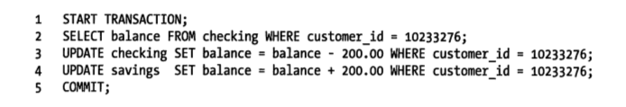

这篇文章主要介绍MySQL数据库相关的特性。
###事务
事务就是一组SQL查询。如果数据库引擎能够成功地对数据库应用该组查询的全部语句，那么就执行该组查询。如果其中有任何一条语句因为崩溃或者其他原因无法执行，那么所有的语句都不会执行。

举个经典的例子。假设银行的数据库有两张表：支票(checking)表和储蓄(savings)表。现在要从Jane的支票帐号转移200美元到她的储蓄账户，那么需要至少三个步骤：

1. 检查支票账户的余额高于200美元。
2. 从支票账户余额中减去200美元。
3. 从储蓄账户余额中增加200美元。

执行的SQL


####事务的ACID特征

+ 原子性（atomicity）
事务必须视为不可分割的最小工作单元，真个事务中的所有操作要么全部提交成功，要么全部失败回滚，对于一个事务，不可能执行其中的一部分操作，这就是事务的原子性。
+ 一致性（consistency）
数据库总是从一个一致的状态转换到另外一个一致的状态。
+ 隔离性（isolation）
通常说，一个事务的修改在最终提交以前，对其他事务是不可见的。
+ 持久性（durability）
一旦事务提交，则其所做的修改就会永久保存到数据库中。

事务的ACID特性可以确保银行不会弄丢你的钱。

####隔离级别

+ READ UNCOMMITTED（未提交读）
在未提交读的级别中，事务中的修改，即使没有提交，对其他事务也是可见的。事务可以读取到未提交的数据，被称为脏读（Dirty Read）。这个时候带来很多问题。例如A事务插入一条数据，B事务读取这条数据，然后A事务回滚，这个时候B就使用了A产生的没有用的数据。
+ READ COMMITTED（提交读）
大多数数据系统的默认隔离级别都是READ COMMITTED（但MySQL不是（。READ COMMITTED满足前面提到的隔离性的简单定义：一个事务开始时，只能看见已经提交的事务所做的修改。这个级别有时候也叫不可重复读（nonrepeatable read），因为执行两次同样的查询，可能会得到不一样的结果。
+ REPEATABLE READ（可重复读）
REPEATABLE READ解决了脏读的问题。该级别保证了在同一个事务中多次读取同样记录的结果是一致的。但是可重复读隔离级别还是无法解决另外一个幻读（Phantom Read）的问题。所谓幻读，指的是当某个事务在读取某个范围内的记录时，另外一个事务又在该范围内插入了新的记录，当之前的事务再次读取该范围的记录时，会产生幻行（Phantom Row）。这个是MySQL默认事务隔离级别。
+ SERIALIZABLE（可串行化）
SERIALIZABLE是最高的隔离级别。它通过强制事务的串行执行，避免了前面说的幻读问题。简单来说，SERIALIZABLE会在读取的每一行数据上都加锁，所以可能导致大量的超时和锁争用的问题。


###锁
锁是MySQL中使用较多，但是也较为复杂的一块。

怎样才能加锁？
InnoDB采用的是两阶段锁定协议（two-phase locking protocol）。在事务执行的过程中，随时都可以执行锁定，锁只有在执行commit或者是rollback时候才能释放，并且所有的锁是在同一时刻释放的。锁定的方式有两种：隐式锁定和显示锁定。在隐式锁定中，InnoDB会根据隔离级别在需要的时候自动加锁（后面三条sql都是可能自动加锁的）。也可以通过特定的语句显示锁定，例如下面的select的两种锁定方式。
```
select ... lock in share mode;
select ... for update;

insert into table values (…);
update table set ? where ?;
delete from table where ?;
```


锁和事务的关系？
锁只有在事务中才有作用。数据库事务有不同的隔离级别，不同的隔离级别对锁的使用是不同的，锁的应用最终导致不同事务的隔离级别。

####共享锁(shared lock)，排他锁(exclusive lock)
又叫做读锁（S）和写锁（X）。这是InnoDB实现的两种标准的行锁。X锁只有在对象没有S和X锁的情况上才能获取，S锁是在没有X锁的情况下才能获取（S与S之间互不影响）。

####意向锁
意向锁是表级别的锁，表明事务在表中的数据行上添加了什么类型的锁。因此意向锁有两种，一种是意向共享锁（intention shared lock）和意向排他锁（intention exclusive lock）。意向锁是在添加行锁之前添加。试着考虑一下下面的场景：

一个表的某行已经添加了X锁，这个时候向表申请X锁，这种请求应该被拒绝，因为表锁获得之后可以更改每个数据行，这个和行的X锁冲突。

+ 如果没有意向锁，需要遍历整个表，判断有没有行锁，以免发生冲突
+ 如果有意向锁，只需判断意向锁和即将添加的表锁是否兼容即可。因为意向锁的存在表示有行级别或者即将有行级别的锁存在。无需遍历整个表，即可获取结果。

####记录锁
记录锁是在索引记录上的锁。不清楚是否和行锁是一样的。

####间隙锁（Gap Lock）
当我们使用范围条件，而不是相等条件请求共享或者是排他锁时，InnoDB会给符合条件的已有的数据记录的索引项加锁。对于键值在条件范围内但并不存在的记录，叫做“间隙（GAP)”，InnoDB也会对这个“间隙”加锁，这种锁机制就是所谓的间隙锁。举个例子

假设emp表中有empid为1，90，110三条记录，使用下面的方式：
```
select * from emp where empid > 95 for update
```
这条SQL不仅会对empid=110记录加锁，还会对(90, 110) 和 (110, inf)这个区间加锁。这个就是间隙锁。使用间隙锁可以有效地防止幻读现象（因为能够防止其他事务在这个范围内插入）。

####悲观锁，乐观锁
悲观锁，顾名思义，就是很悲观（常见的进程同步使用的锁属于悲观），每次去拿数据的时候都认为别人会修改，所以每次在拿数据的时候都会上锁，这样别人想拿这个数据就会block直到它拿到锁。假定会发生并发冲突，屏蔽一切可能违反数据完整性的操作。

乐观锁，顾名思义，就是很乐观（MySQL的MVCC机制就是乐观锁），每次去拿数据的时候都认为别人不会修改，所以不会上锁，但是在提交更新的时候会判断一下在此期间别人有没有去更新这个数据。乐观锁适用于读多写少的应用场景，这样可以提高吞吐量。假设不会发生并发冲突，只在提交操作时检查是否违反数据完整性。

内容来自：

《高性能MySQL》

[数据库事务原子性、一致性是怎样实现的？](https://www.zhihu.com/question/30272728)

[innodb的意向锁有什么作用？](https://www.zhihu.com/question/51513268)

[MySQL中的锁（表锁、行锁，共享锁，排它锁，间隙锁）](http://blog.csdn.net/soonfly/article/details/70238902)