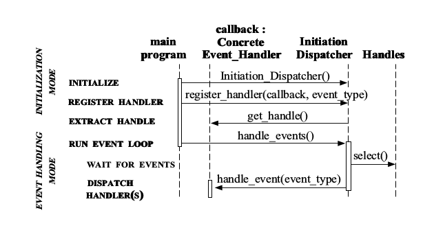

Reactor设计模式详细的介绍可以看这篇论文-《An Object Behavioral Pattern for Demultiplexing and Dispatching Handles for Synchronous Events》，作者写得很详细，下面的这篇文章是对上文中关键的部分进行记录。

###目的(intent)
Reactor模式是为了处理客户端并发地向服务器发送请求。相对于传统的多线程模型，Reactor模式的优点就是高效(没有线程上下文切换的开销)，编程简单。

###结构(Structure)
Reactor模式中出现的几种关键的结构：
+ Handle：表示操作系统提供的资源，包括网络连接，打开文件，定时器，同步对象等

+ Synchronous Event Demultiplexer(同步事件分离器)：阻塞，等待Handle集合上有事件发生，当它返回时表示在对应的Handle上进行操作不会被阻塞。一个典型的例子就是UNIX系统上的I/O复用函数select

+ Initiation Dispatcher:用于注册，删除，分发Event Handler。Synchronous Event Demultiplexer负责等待新事件发生，事件发生时通知Initiation Dispatcher，然后Initiation Dispatcher调用event handler处理事件。

+ Event Handler(事件处理器)：定义了一个接口，包括一个钩子函数。这个接口必须要被具体的Event Handler类实现

+ Concrete Event Handler(具体事件处理器)：实现Event Handler接口的具体的类，应用程序使用Initiation Dispatcher注册Concrete Event Handler

下图就是各个结构的类图

每个结构之间的合作关系是：

1. 应用程序使用Initiation Dispatcher注册Concrete Event Handler
2. Initiation Dispatcher要求每个Concrete Event Handler返回其绑定的Handle
3. Initiation Dispatcher调用handle_events开始事件处理循环。在这里，Initiation Dispatcher会将步骤2获取的所有Handle都收集起来，使用Synchronous Event Demultiplexer来等待这些Handle的事件发生。
4. 当handle上有事件发生时，Synchronous Event Demultiplexer通知Initiation Dispatcher。
5. Initiation Dispatcher根据发生事件的Handle找出所对应的Concrete Event Handler，然后调用handle event钩子函数处理对应的事件。

下图是reactor模式的交互图

**内容来自**
[An Object Behavioral Pattern for Demultiplexing and Dispatching Handles for Synchronous Events](http://www.cs.wustl.edu/~schmidt/PDF/reactor-siemens.pdf)

[Redis与Reactor模式](http://www.dengshenyu.com/%E5%90%8E%E7%AB%AF%E6%8A%80%E6%9C%AF/2016/01/09/redis-reactor-pattern.html)