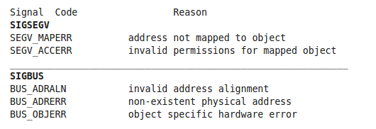

SIGBUS信号和SIGSEGV信号都是由于错误的内存地址产生的信号，但是两个信号还是有区别的。

两者的区别在下面的表格中已经个很清楚了：



第一列Signal Code中两个signal下面还有两个或者三个附加信息对应，这是内核对产生这个信号原因进行解释。

+ SEGV_MAPERR。访问地址不属于进程地址空间，没有页框进行映射。
+ SEGV_ACCERR。访问的地址空间是进程地址空间，但是访问的权限不合法。
+ BUS_ADRALN。非法地址对齐访问。e.g. `int *p = &val; p = (int *)((char *)p + 1); *p`
+ BUS_ADRERR。访问一个不存在的物理地址。e.g. 使用内存映射I/O访问设备，然后撤销与设备的内存映射，如果再次访问映射区的地址时就会产生这个错误。
+ BUS_OBJERR。特定硬件错误。


Linux系统下产生SIGBUS错误的一个代码，asm的汇编指令是禁止访问未对齐地址的，x86架构默认是可以访问的。

```
#include<stdio.h>
#include <stdlib.h>
int main(int argc, char **argv) 
{
	int *iptr;
	char *cptr;
#if defined(__GNUC__)
# if defined(__i386__)
	/* Enable Alignment Checking on x86 */
	__asm__("pushf\norl $0x40000,(%esp)\npopf");
# elif defined(__x86_64__) 
	/* Enable Alignment Checking on x86_64 */
	__asm__("pushf\norl $0x40000,(%rsp)\npopf");
# endif
#endif

	/* malloc() always provides aligned memory */
	cptr = malloc(sizeof(int) + 1);
	/* Increment the pointer by one, making it misaligned */
	iptr = (int *) ++cptr;
	/* Dereference it as an int pointer, causing an unaligned access */
	*iptr = 42;
	return 0;
}
```


内容参考：

[SIGBUS Vs SIGSEGV](http://cquestion.blogspot.com/2008/03/sigbus-vs-sigsegv.html)

[Linux编程遇到的SIGBUS信号](http://www.linuxdiyf.com/linux/30303.html)