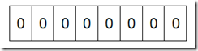
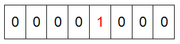
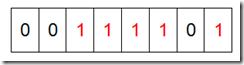

bitmap就是使用1个bit位来标记某个元素对应的value，key就是该元素。因为是采用bit为单位存储数据，在存储空间方面，可以大大节省。

举个具体的例子：假设我们要对0-7内的5个元素（4,7,2,5,3）排序（假设这些元素没有重复），那么首先申请一个8bit的bitmap

初始情况的bitmap：



然后添加第一个元素4之后，将bitmap从左侧开始第5位置为1。



添加完所有元素之后，bitmap如下图所示：



然后排序的过程就是从左侧开始，遇到一个bit为1的位置，将该位置对应的索引号输出即可

例子1：**在2.5亿个整数中找出不重复的整数**。
分析：使用2bit表示一个整数的状态，00表示没有在整数中出现过，01表示出现过1次，10表示出现过两次或者两次以上，11空闲。需要使用内存2^32*2bit=1GB,内存使用方面还是可以接受的。遍历数据集合的过程中，将对应的bit进行设置，00变成01,01变成10。最后输出01对应的数。

例子2：**给40亿个不重复的unsigned int的整数，没排过序的，然后再给一个数，如何快速判断这个数是否在那40亿个数当中？**
分析，申请一个bitmap，根据unsigned int数据长度，bitmap的大小为512M。然后根据输入数据设置bitmap对应的位。查询是否在集合中只需要判断bitmap对应的位是否为1。

在c++中，对应的实现类就是bitset。可以看看下面的样例代码：

```
#include <iostream>
#include <bitset>
using namespace std;

int main()
{
    //bitset 使用整数初始化bitset
    bitset<8> bs(064);//064表示8进制数，110 100，
    //输出bs各个位的值，填充的过程是从低有效位（右侧）开始，bitset也从0位开始填充按照001, 011的顺序，没有被填充的bitset的高位为0
    cout<<"bs[0] is "<<bs[0]<<endl;
    cout<<"bs[1] is "<<bs[1]<<endl;
    cout<<"bs[2] is "<<bs[2]<<endl;
    cout<<"bs[3] is "<<bs[3]<<endl;
    cout<<"bs[4] is "<<bs[4]<<endl;
    cout<<"bs[5] is "<<bs[5]<<endl;
    cout<<"bs[6] is "<<bs[6]<<endl;
    cout<<"bs[7] is "<<bs[7]<<endl;
    cout<<"======================"<<endl;

    //使用字符串初始化bitset
    //注意：使用string初始化时从右向左处理，如下初始化的各个位的值将是110，而非011
    string strVal("011");
    bitset<3> bs1(strVal);
    //输出各位
    cout<<"bs1[0] is "<<bs1[0]<<endl;
    cout<<"bs1[1] is "<<bs1[1]<<endl;
    cout<<"bs1[2] is "<<bs1[2]<<endl;
    //cout输出时也是从右边向左边输出
    cout<<bs1<<endl;

    cout<<"======================"<<endl;

    //bitset的方法
    //any()方法如果有一位为1，则返回1
    cout<<"bs1.any() = "<<bs1.any()<<endl;

    //none()方法，如果有一个为1, none则返回0，如果全为0则返回1
    bitset<3> bsNone;
    cout<<"bsNone.none() = " <<bsNone.none()<<endl;

    //count()返回几个位为1
    cout<<"bs1.count() = "<<bs1.count()<<endl;

    //size()返回位数
    cout<<"bs1.size() = "<<bs1.size()<<endl;

    //test()返回某一位是否为1
    //flip()诸位取反
    bitset<3> bsFlip = bs1.flip();
    cout<<"bsFlip = "<<bsFlip<<endl;

    //to_ulong
    unsigned long val = bs1.to_ulong();
    cout<<val<<endl;
    
    return 0;
}

```
上面代码的运行结果：
```
bs[0] is 0
bs[1] is 0
bs[2] is 1
bs[3] is 0
bs[4] is 1
bs[5] is 1
bs[6] is 0
bs[7] is 0
======================
bs1[0] is 1
bs1[1] is 1
bs1[2] is 0
011
======================
bs1.any() = 1
bsNone.none() = 1
bs1.count() = 2
bs1.size() = 3
bsFlip = 100
4

```

内容来自：

[Bitmap](https://www.kancloud.cn/kancloud/the-art-of-programming/41618)

[c++ bitset类用法](https://blog.csdn.net/qll125596718/article/details/6901935)