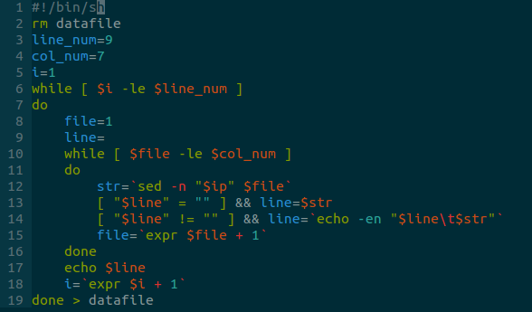
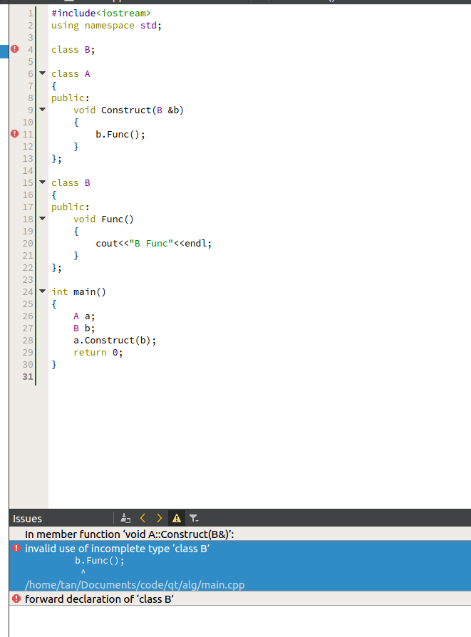

###uint32_t 转换成uint8_t的血案

之前一直以为指针的强制转换只要注意点应该是不会有坑的，今天写了个发现被坑大发了。
```
	uint16_t src[] = {0x4500,0x003c,0x6cf2,0x0000,0x0111,0x0392,0x6442,0x03ef,
0xe000,0x00fc,0xe58b,0x14eb,0x0028,0x8111,0x7ffb,0x0000,
0x0001,0x0000,0x0000,0x0000,0x0e44,0x7574,0x7068,0x6f6e,
0x656c,0x6162,0x2d70,0x6300,0x001c,0x0001};//这是一个ip header(20)+upd header(8)+data(22)的报文，是tcpdump截取之后用sed，awk处理了才的出来的。这就是原始的内存中存放的数据
	uint8_t *data = (uint8_t *)src;

```
其他部分的代码就不贴出来了不是关键的部分，按照常理觉得前两个字节是0x4500,那么转换之后data的第一个字节应该是0x45，第二个字节是0x00。很不巧，在ubuntu的系统下结果恰好是相反的，因为linux的系统是小端的字节序，所谓小端字节序列大家应该很清楚，就是高地址位置存放的是MSB(most significant bit),所以`data[0] = 0x00 data[1] = 0x45`,而tcp/ip的字节序是大端的所以结果恰好相反


就是一个这么简单的问题，呵呵运行结果错得离谱


### inet_ntoa函数的血案
今天写了个类似于这个样子的
```
#include<stdio.h>
#include<netinet/in.h>
#include<arpa/inet.h>
int main(int argc,char **argv)
{
	struct in_addr addr,mask;
	char *s1,*s2;
	addr.s_addr = 1;
	mask.s_addr = 2;
	printf("s1:%s s2:%s\n",inet_ntoa(addr),inet_ntoa(mask));

	return 0;
}

```
运行结果是这样的
```
tan@ttt:~/Desktop$ ./a.out 
s1:1.0.0.0 s2:1.0.0.0
```
为什么不是一个是1.0.0.0，一个是2.0.0.0呢，没看inet_ntoa的代码实现，估计是函数静态分配的一个缓冲区域，所以每次函数调用返回值是指向同一个缓冲区，而调用printf的时候，参数从右边向左入栈，入栈的过程中发现函数调用，调用函数后在栈内存储相应的结果

真是迷指错误

### c++的vector

今天写代码使用了一下vector，结果在使用vector的size函数的时候发现了一个问题——size函数返回值是unsigned int类型的，是一个无符号的整数，与整数进行减法运算的时候千万要注意溢出的问题。出错的地方像下面一样，大概是这个样子的。解决方法要么就进行转换，要么就是移项减法变成加法。

```
#include<iostream>
#include<vector>
using namespace std;
int main()
{
	vector<int> v(2,0);
	unsigned char t = 2;
	cout<<t - 3<<endl;//这个没有溢出是因为常量是int型，t被直接转换成int了
	cout<<v.size() - 3<<endl;
	return 0;
}
```
运行结果是

```
tan@tan:~/Documents/git_dir/leetcode$ ./a.out 
-1
18446744073709551615
```

### 溢出与相反数

先看一段代码

```
#include<stdio.h>
int main()
{
	int a = 1 << 31;
	long long b = a;
	a = -a;
	b = -b;
	printf("a:%d\n", a);
	printf("b:%lld\n", b);
	return 0;
}
```
```
tan@tan:~/Documents/git_dir/leetcode$ ./a.out 
a:-2147483648
b:2147483648
```
上面的代码很简单，就是大家常用的求相反数的过程，运行的结果却是很让人吃惊。其实问题就在溢出这块，a乘上-1之后的值由于补码的原因不能表示，溢出了。因此常见的等式是INT_MIN = -INT_MAX - 1这个不光是int类型，其他类型也一样。


### Linux终端下后台运行的程序被stopped

今天写一个使用I/O复用的tcp服务器时碰到了一个很有意思的问题。tcp服务器完成之后，使用nc命令测试连接情况，该命令是`nc localhost 8888 &`。第一个次执行没有问题，第二次执行之后terminal提示之前的命令已经stopped，第三次执行告诉你第二次执行的命令被stopped。然后我就很奇怪，以为是代码问题，找了好久，也没有找到错误，然后在网上找资料，**才发现在《Unix 环境高级编程》第9.8节作业控制中讲到，“如果后台程序试图读取终端，这并不是一个错误，但是终端驱动程序将检测这种情况，并向后台作业发送一个特定信号SIGTTIN，该信号会停止此后台程序，并向用户发送通知”。**


为了验证上面的理论我写了一个很简单的代码

```
#include<stdio.h>
#include<stdlib.h>
#include<signal.h>
void handler(int signo)
{
	printf("catch SIGTTIN\n");
	exit(1);
}
int main()
{
	char c;
	struct sigaction act;

	act.sa_handler = handler;
	act.sa_flags = 0;
	sigemptyset(&act.sa_mask);

	sigaction(SIGTTIN, &act, 0);

	while(1)
	{
		scanf("%c", &c);
		if(c == 'q') break;
	}
	return 0;
}

```
下面是上面代码的输出

```
tan@tan:~/Documents/code/net$ ./a.out &
[1] 20288
tan@tan:~/Documents/code/net$ catch SIGTTIN
```
面对这种情况，解决方案也很简单

+ 在程序中去除读终端的相关代码；
+ 将标准输入重定向
+ 使用nohup，nohup将忽略该程序的输入，并将输出追加到nohup.out。

结论是APUE真的是一本神书啊，平时遇到的好多问题都能在上面找到结果。


### Linux执行程序报找不到指定的共享库
在编译libevent的sample代码时，执行编译命令

```
 gcc -I/usr/local/include -o time-test time-test.c -L/usr/local/lib -levent
```

在当前目录就会生成一个time-test的二进制文件，然后执行`./time-test`，
```
./time-test: error while loading shared libraries: libevent-1.4.so.2: cannot open shared object file: No such file or directory
```
但是这个文件是在/usr/local/lib中
解决方法:
1. 在~/.bashrc里面加入`export LD_LIBRARY_PATH=/lib:/usr/lib:/usr/local/lib`，然后执行`souce ~/.bashrc`

2. 修改/etc/ld.so.conf文件，在文件中加入动态库所在的目录（这块我就有疑问 ，ubuntu系统的这个文件是一个include /etc/ld.so.conf.d/*.conf，它是将这个目录下的所有conf文件都包括了，而打开这个目录的conf，发现libc.conf已经包括了我需要添加的目录------/usr/local/lib），修改之后重新执行ldconfig

###sys/*.h的头文件

之前一直没有注意过，如果按照正常路径的话`#include<sys/sem.h>`这个头文件对应的目录应该是在`/usr/include/sys/sem.h`，我去查看系统的这个路径时没有找到这个文件。这就奇怪了。然后Google之后才发现这个文件是在`/usr/include/x86_64-linux-gnu/sys`下面。然后我就有些疑问了，在`/usr/include/linux/sem.h`有一个同样的文件。不止是这样，两个文件夹下还有很多相同文件。

一个解释是`/usr/include/linux`和`/usr/include/asm*`是和内核一起发布的，`/usr/include/sys/*.h`和`/usr/include/bits/*.h`是和c语言库一起发布的(glibc)。后面的就没则么看懂。[Difference between /usr/include/sys and /usr/include/linux?](https://unix.stackexchange.com/questions/7928/difference-between-usr-include-sys-and-usr-include-linux)

###shell中echo和缺少大括号造成的bug
最近看了好几天的shell，今天想自己动手写一些，结果写脚本没有花太多的时间，倒是改bug花了很久。

这个shell的功能是有7个文件，想将文件中的每行拼接在一起，去成一个新的文件。



其实使用sh -x的命令将shell执行过程中的变量替换输出很快能够定位bug。主要的bug有两个：

+ 12行的`$ip`，这块没有使用大括号，将i分割出来，导致访问的是ip这个变量，所以sh -x显示sed的脚本块为空。其实要注意单引号和双引号的区别，单引号不会进行变量替换，所以sed这里不能使用单引号。
+ 14行的echo。因为echo这个命令在很多shell里面都是内置的命令，有不同的标准。Linux的bash是能够识别echo -e参数的，也就是说对line变量的赋值在命令行执行是没有问题的（因为默认登录的shell是bash，使用echo $SHELL就能看到）。但是执行这个脚本时，使用的解释器是/bin/sh，调用的echo是没有-e参数的（可以在命令行启动Bourne sh，命令是sh，然后执行echo -e "test\ttab"就会发现输出有问题）。为了可移植性应该使用printf命令

改正之后的shell
```
#!/bin/sh
# 将文件的每行拼接在一起，组成一个datafile的文件，分隔符号是tab
rm datafile
# 定义每个文件的行数
line_num=9
#定义文件的个数
col_num=7
i=1
while [ $i -le $line_num ]
do
	file=1
	line=
	while [ $file -le $col_num ]
	do
		str=`sed -n "${i}p" $file`
		[ "$line" != "" ] && line=`printf "$line\t$str"`
		[ "$line" = "" ] && line=$str
		file=`expr $file + 1`
	done
	printf "$line\n"
	i=`expr $i + 1`
done > datafile

```

###c++向前声明与成员函数

今天写设计模式的demo时，有个报错看了好一会，最后使用Google搜索的第一条stackoverflow上就有结果。

下面是报错的代码和错误：



解决办法很简单，就是将B类的定义放到A类前面（或者将声明放入.h文件），因为虽然有B的向前声明（可以用来引用或者指向B类对象），但是没有说明B类有什么成员，所以在完全声明前都是incomplete type

参考[I'm getting an error "invalid use of incomplete type 'class map'](https://stackoverflow.com/questions/20013901/im-getting-an-error-invalid-use-of-incomplete-type-class-map)