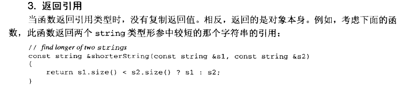
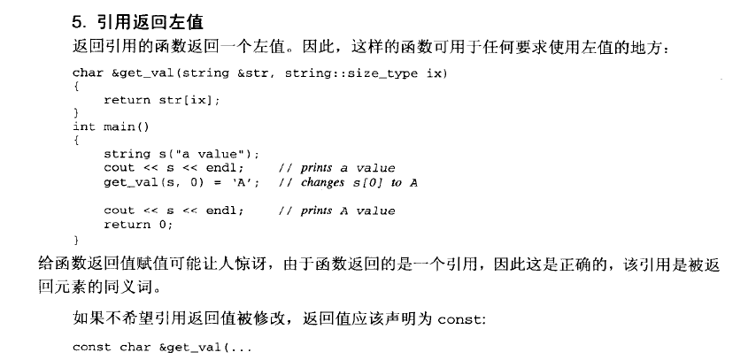

本文的主要内容是有关c++的语法上面的知识

###XXX will be initialized after
写了一点c++代码，发现编译器提示XXX will be initialized after这样的警告。出现警告的代码类似于下面的情况。

```
#include<iostream>
using namespace std;

class Test
{
private:
    int a;
    int b;
public:
    Test() : b(1), a(2) {}
};

int main()
{
    Test t;
    return 0;
}
```

从c++ premier上可以找到这个问题的答案。类的构造过程按照下面顺序执行。

1）初始化阶段
2）普通的计算阶段

不管类成员是否在构造函数的初始化列表显示初始化，类类型的数据成员总是在初始化阶段初始化（没有显示的会调用默认的构造函数）。计算阶段就是执行构造函数函数体。

初始化列表中初始化的顺序是按照成员的定义顺序初始化的。

```
class X
{
	int i;
    int j;
public:
    X(int val): j(val), i(j) {}
}
```

对于上面的情况i是被j用未初始化的值初始化，但是初始化列表看起来不是这样，为了防止这种误导的情况，编译器才智能地给出了警告。


###隐式类类型转换
可以用单个实参来调用的构造函数定义了从形参到该类类型的一个隐式转换。

举个例子
```
#include<iostream>
using namespace std;
class Book
{
private:
    string isbn;
    double price;
public:
    Book(const string &ib = "", double pr = 1.25):isbn(ib), price(pr)
    {
    }
    int same_book(const Book &b)
    {
        return isbn.compare(b.isbn) == 0 ? 1 : 0;
    }

};
int main()
{
    Book b1("123"), b2("456");
    string isbn = "123";
    cout<<b1.same_book(b2)<<endl;
    cout<<b1.same_book(isbn)<<endl;
    return 0;
}
```

重点看main函数对same_book的调用。第一个参数匹配。第二个isbn是一个string类型，不匹配。但是由于Book的构造函数可以使用一个实参调用，因此这行调用实际上是一个b1.same_book(Book(isbn))自动转换的过程。因为const Book &b，需要const是因为这个引用指向一个临时变量。

为了禁止上面的转换，将构造函数改成（explicit关键字只能用于类内部构造函数的声明上，类的定义体外部所做的定义不用重复）:
```
explicit Book(const string &ib = "", double pr = 1.25):isbn(ib), price(pr)
{
}
```


###引用

引用是一种复合类型，通过在变量名前添加`&`来定义。符合类型是指用其他类型定义的类型。不能定义引用的引用，但可以定义任何其他类型的引用。引用是别名。

####const引用
const引用是指向const对象的引用

```
const int ival = 1024
const int &refval = ival; //ok both reference and object are const
int &ref2 = ival; // error nonconst reference to a const object
```

const引用可以初始化为不同类型的对象或者初始化为右值，如字面常量：
```
int i = 42;
//legal for const references only
const int &r = 42;
const int &r2 = r + i;
```
同样的初始化对于非const引用却是不合法的，且会导致编译错误。理由如下：

```
double dval = 3.14;
const int &ri = dval;
```
上面的代码实际上会变成
```
int temp = dval; //创建int类型的临时变量，将double转换成int
const int &ri = temp;  //将引用ri绑定到那个临时变量上
```

如果ri不是const，那么ri将能够改变temp的值，而temp的改变不会影响dval，这就会导致引用的语义发生歧义。

####引用作为返回值






###父类，子类，组合成员的构造

昨天做了一道网易的笔试题目，c++的基础的构造过程，居然那不会，20分就这么没了，这次笔试权当交学费。题目的内容是这样的

```
#include<iostream>
using namespace std;
class A
{
public:
    A()
    {
        cout<<"A"<<endl;
    }
    ~A()
    {
        cout<<"~A"<<endl;
    }
};
class B:public A
{
private:
    A _a;
public:
    B(const A &a):_a(a)
    {
        cout<<"B"<<endl;
    }
    ~B()
    {
        cout<<"~B"<<endl;
    }
};

int main()
{
    A a;
    B b(a);
    return 0;
}
```
请问程序的输出结果是什么？

其实只要清楚：**在构造的过程中，先执行父类的构造，再执行成员变量（按照定义的顺序构造）的构造，最后执行本类的构造函数。析构的执行过程完全相反**

对B b(a)这行构造加以说明。构造b对象时，先执行B的父类A的构造，A没有父类，没有成员，只有构造函数，故执行构造函数，**输出A**。然后b对象构造成员_a，调用的是A类的默认构造函数，**输出A**。最后执行B的构造函数，先执行初始化类表，初始化_a，使用的是A的拷贝构造函数，A只有默认的拷贝构造，不产生任何输出。最后执行B的构造函数体，**输出B**

最后的输出结果：

```
A
A
B
~B
~A
~A
~A
```

