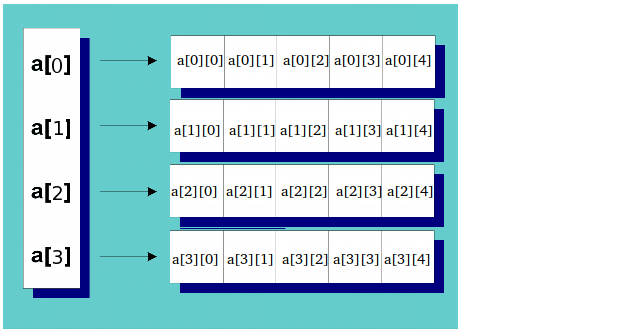
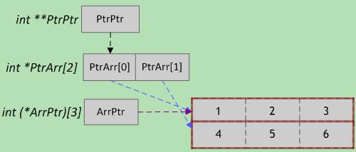
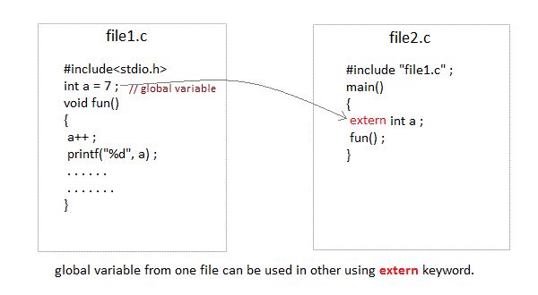

### 函数指针
下面是函数指针及其使用的例子

	#include<stdio.h>
    void show(int param)
    {
    	printf("show:%d\n",param);
    }
    int main(int argc,char **argv)
    {
    	void (* fp1)(int);
        typedef void FP2(int);
        typedef void (* FP3)(int);
        fp1 = show;
        fp1(10);
        fp1 = &show;
        (* fp1)(20);
        
        FP2 *fp2 = show;
        fp2(30);
        fp2 = &show;
        (* fp2)(40);
        
        FP3 fp3 = show;
        fp3(50);
        fp3 = &show;
        (* fp3)(60);
        
        return 0;
    }
    
### static和extern
例如在a.c

	#include<stdio.h>
	int t = 10;
在b.c中
	
	#include<stdio.h>
	int main(int argc,char **argv)
	{
	    extern int t;
	    printf("%d\n",t);
	    return 0;
	}

result：10
在a.c中定义了一个全局变量t，然后在b.c中用extern声明了这个变量，并且引用了这变量 果是在main函数中进行声明的，则只能在main函数中调用，在其它函数中不能调用。其实要调用其它文件中的函数和变量，只需把该文件用#include包含进来即可


static的可以修饰变量，函数。static修饰变量和函数时表示这个变量和函数是该文件可见的，就是出了文件其他文件是访问不到的
### _()函数
_是一个gettext库中的函数用来国际化的。这个函数的作用是根据系统语言来替换给定的字符串

	fprintf(stderr, _("Usage: route [-nNvee] [-FC] [<AF>]           List kernel routing tables\n"));


### 预编译指令
预处理是编译器进行编译的第一步工作，主要是扫描源代码和对程序进行初步的转换
然后常用的指令这里介绍一下

**#include**
作用是包含源文件

	#include<xxx>
	#include"xxx" 

两者的区别就是第一个只会在系统默认的路径和括号指定的路径内寻找，第二个是在源文件的目录，没找到就去系统目录找

**#define**
定义宏

	#define PI 3.14 
	#define MAX(a,b) (((a) > (b)) ? (a) : (b)) //这里的参数之所以要加上括号是因为宏的展开是简单的替换，如果a，b里面含有其他操作符就会因为优先级等其他原因而引起意想不到的结果
	#define APPEND(x) "abc"#x 
	#define JOIN(a,b) a##b //#和##是特殊的宏，连接字符串用的
**#if #elif #else #endif**
这个就是条件编译指令，用来有条件的选择性编译,注意条件的选项必须是常量或者是已经定义过的标志符

	#define OPTION 2
	#if OPTION == 1
	printf("option is 1\n");
	#elif OPTION == 2
	printf("option is 2\n");
	#else
	printf("other option\n");
	#endif

**#ifdef #ifndef #endif**
这几个也是条件编译的语句，常常用来做头文件的guard word。为什么要这个guard word呢，是因为为了防止头文件被重复引用，头文件被重复引用指的是同一个.c文件中两次include同一个头文件,如果两次引用了那么就会引起变量或者函数多次定义的语法错误，注意是定义不是生命，多次声明是没有语法错误的。虽然不太推荐在头文件中定义函数和变量的
例如有a.h,b.h,c.h三个文件

	a.h
	int a = 10;
	
	b.h
	#include"a.h"
	int b = 10;
	
	c.c
	#include"a.h"
	#include"b.h"
就是出现redefinition of a的错误了

用底下条件编译语句就能解决问题了(也叫做头文件保护符，header guard)，这种方式能够防止一个头文件在同一个文件中的多次拷贝。
    #ifndef A_H
      
    #define A_H
    

    #endif
    
但是头文件保护符不能够防止下面的情况发生

square.h文件
```
#ifndef SQUARE_H
#define SQUARE_H
 
int getSquareSides()
{
    return 4;
}
 
int getSquarePerimeter(int sideLength); // getSquarePerimeter的前置声明

#endif
```
square.cpp文件
```
#include "square.h"  // square.h在这里被include一次
 
int getSquarePerimeter(int sideLength)
{
    return sideLength * getSquareSides();
}
```
main.cpp文件
```
#include "square.h" // square.h 在这里也被include一次
#include<iostream>
int main()
{
    std::cout << "a square has " << getSquareSides() << " sides" << std::endl;
    std::cout << "a square of length 5 has perimeter length " << getSquarePerimeter(5) << std::endl;
 
    return 0;
}
```
这样编译square.cpp和main.cpp文件虽然不会报错，但是在连接时会报multiple definition of `getSquareSides'。预处理器在处理square.cpp文件时会包含getSquareSides函数，此时SQUARE_H宏有定义。但是处理完成square.cpp之后，处理main.cpp是这个宏是没有定义的，因此在main.cpp中getSquareSides函数又会被包含一次。所以最后会产生错误。可以将square.h文件中定义的函数放在cpp文件中定义。

内容参考

[1.10a头文件保护符](http://blog.csdn.net/sinat_32582203/article/details/52870265)

### 头文件的作用
先总结第一点c语言中函数假如写了一个通用的add函数，其他文件想要调用这个函数有两种方式，在调用前声明，这样假如调用比较多，然就要维护很多生命，然后如果把声明写入头文件中，只要用#include一次就够了，避免函数出现改动的时候要改动很多地方


### void *指针转换
intptr_t （无符号版本写成 uintptr_t）这个类型可以被安全的在 void * 和 整数间转换，对于写跨 64 位平台的程序非常重要。也就是说，当你需要把指针作为一个整数来运算时，转换成 intptr_t 才是安全的，可以在运算完毕安全的转回指针类型。
```
#include<stdio.h>
#include<stdint.h>
int main(int argc,char **argv)
{
    void *s = (void *)5;
    int p = (intptr_t)s;
    int d = (long)s;
    s = (void *)(intptr_t)p;
    printf("%d\n",p);
    printf("%d\n",d);
    return 0;
}

```

### union关键字
union的用法和struct类似，但是它不是为每个成员单独地分配空间，而是union中所有的成员共用一个空间，同一时间只能存储其中的一个成员，所有的成员共享相同的起始地址。下面的例子是查看机器字节序的一个代码，这个代码很好的使用了union关键字。

```
#include<stdio.h>
int main()
{
	union 
	{
		short s;
		char c[2];
	}un;
	un.s = 0x0102;
	if(sizeof(short) == 2)
	{
		if(un.c[0] == 1 && un.c[1] == 2)
			printf("big-endian\n");//大端是内存的低字节存高有效位(高有效位是对多字节数据的高位，就是0x0102这个数的01字节)
		else if(un.c[0] == 2 && un.c[1] == 1)
			printf("little-endian\n");//小端正好相反
		else
			printf("unknown\n");
	}
	else
		printf("sizeof(short) = %d\n",sizeof(short));
	printf("address:%p, %p, %p\n",&un.s,&un.c,un.c);
	return 0;
}

```
程序的输出是

```
tan@tan:~/Desktop$ ./a.out 
little-endian
address:0x7fff04b63dd0, 0x7fff04b63dd0, 0x7fff04b63dd0

```


### 位域(bit field)

“ 位域 “ 或 “ 位段 “(Bit field)为一种数据结构，可以把数据以位的形式紧凑的储存，并允许程序员对此结构的位进行操作。这种数据结构的一个好处是它可以使数据单元节省储存空间，当程序需要成千上万个数据单元时，这种方法就显得尤为重要。第二个好处是位段可以很方便的访问一个整数值的部分内容从而可以简化程序源代码。而这种数据结构的缺点在于，位段实现依赖于具体的机器和系统，在不同的平台可能有不同的结果，这导致了位段在本质上是不可移植的。


下面是一个简单的例子。对于位域的存储，c语言并没有明确的规定，位域技术的一个目的就是节省空间，虽然不同的编译器有不同的实现方式，但是它们都会尽量的压缩空间。

```
#include<stdio.h>
typedef enum 
{
    NORTH = 0,
    EAST = 1,
    SOUTH = 2,
    WEST = 3
} directionValues;

struct 
{
    unsigned int alice_dir : 2;//2表示位段的长度，在对其进行赋值时候不能超过它的长度
    unsigned int bob_dir : 2;
} directions;
int main()
{
	directions.bob_dir = SOUTH;
	printf("bob_dir:%d\n",directions.bob_dir);
	printf("sizeof directions:%d\n",(int)sizeof(directions));
	return 0;
}

```
运行结果是：

```
tan@tan:~/Desktop$ ./a.out 
bob_dir:2
sizeof directions:4
```

### 动态分配二维数组

今天在动态创建二维数组的时感觉有些地方不太清楚，遂查了一下资料。发现这个其中并不是这么简单。google了一下，发现好几篇文章都写得很好。这里再来总结一下（ps：我c大法的水是真的深）



+ 第一种创建的方式，也是最常见的方式。先分配一个指针数组，然后每个指针初始化为动态分配的列。
+ 第二种创建的方式，由于第一种方式行之间的地址不是连续的，有时候会有要求行之间地址连续的需求。所以第二种创建方式是先创建一个指针数组，然后再分配一个row*cols的连续空间，再为这个指针数组的每个元素初始化。感觉第二种方式应该是比较友好的方式，除了扩展起来就比较费劲以外。

以上两种方式都可以通过p[i][j]的方式进行访问。

当然在stackoverflow上大神提出来，前面两种方式虽然直观，但是既浪费空间，运行速度还慢。大神的理由如下：

+ 对比于第一种方式，数组的每行都是单独动态分配的。进行堆分配的操作是很耗费时间和空间的。操作系统需要花费时间进行分配，有时候甚至要O(n)的算法进行分配工作。操作系统为了bookkeeping（这应该是记录堆的使用情况）和字节对齐需要对你分配的每行空间进行填充。并且回收这些空间需要的代价也不小。
+ 由于行之间不是连续的地址，导致你在遍历数组的时候cpu cache的命中率下降，降低了数组的访问速度。

所以大神推荐的方式是使用一维数组代替`int *p = malloc(rows * cols); ` 访问的方式就是`p[i*cols+j]`

```
#include<stdio.h>
#include<stdlib.h>

int ** d1(int rows,int cols)
{
	int i;
	int **p = malloc(rows * sizeof(int *));
	for(i = 0; i < rows; ++i)
		p[i] = malloc(cols * sizeof(int));
	return p;
}
int ** d2(int rows,int cols)
{
	int i;
	int **p = malloc(rows * sizeof(int *));
	p[0] = malloc(rows * cols *sizeof(int));
	for(i = 0; i < rows; ++i)
		p[i] = p[0] + i * cols;
	return p;
}
int main()
{
	int **p = d2(3,4);
	p[2][3] = 250;
	printf("%d\n",p[2][3]);
	return 0;
}

```


**参考**
[我该如何动态分配数组](http://c-faq-chn.sourceforge.net/ccfaq/node88.html)

[How do I declare a 2d array in C++ using new?](https://stackoverflow.com/questions/936687/how-do-i-declare-a-2d-array-in-c-using-new)


[How do I work with dynamic multi-dimensional arrays in C?](https://stackoverflow.com/questions/917783/how-do-i-work-with-dynamic-multi-dimensional-arrays-in-c)


### 各种指针的理解

**二级指针**
这块东西迷糊了好久都没有搞明白。其实只要弄清楚二级指针肯定也是一个指针，二级指针变量里面存的肯定是一个地址，只不过这个地址指向的变量它还是一个指针而已。也就是说和普通指针最大的区别是能两次使用*符号按照地址进行访问。

举个很简单的例子
```
//在这个例子中指针变量b的值是变量a的地址。而二级指针变量的值是指针b的地址。
int a = 4;
int *b = &a;
int **c = &b;
//这个例子中，二级指针变量中存储的是malloc返回的一块连续内存的地址，所以p[i]操作就是*(p+i)操作，p是int *类型的，跳过的字节数应该是i * sizeof(int *)
int **p = malloc(rows * sizeof(int *));
for(i = 0; i < rows; ++i)
		p[i] = malloc(cols * sizeof(int));
```

**数组指针**

数组指针也称指向一维数组的指针，也叫行指针（对于二维数组）。看看下面的例子就明白了

```

int a[3][5];

int (*p)[5];//指向包含5个元素的一维数组

p = a;  //将该二维数组的首地址赋给p，也就是a[0]或&a[0][0]

p++;  //执行该句后，p跨过5个整型数据的长度(即行a[0][])，指向行a[1][]
```


**二维数组**

关于二维数组以及相关指针只要弄清楚两点。第一点，二维数组的名字其实是一个数组指针，它是指向第一行的地址。像Arr[0]这样的行地址和&Arr[0][0]的地址其实是一样的，只是指针类型不同而已。

可以看看下面的代码和输出结果
```
#include<stdio.h>
int main()
{
	int a[3][4];
	int *p1 = (int *)a, *p2 = a[0];
	printf("p1=%p,p2=%p\n", p1, p2);
	return 0;
}

```
输出结果
```
tan@tan:~/Desktop$ ./a.out 
p1=0x7ffd528a52a0,p2=0x7ffd528a52a0
```

这个是一个数组赋值的例子
```
int Arr[2][3] = {{1,2,3}, {4,5,6}};

int *PtrArr[2] = {Arr[0], Arr[1]};

int (*ArrPtr)[3] = Arr;

int **PtrPtr = PtrArr;
```

这张图就是上面例子的一个很好的图例



**普通指针转数组指针**

语法很简单，用得比较少，用google换成英文搜索才搜索出来。在这里记录一下

```
#include<stdio.h>
int main()
{
	int a[3] = {0, 1, 2};
	int (*p) = a;
	int (*b)[3] = (int (*)[3])p;
	//还可以使用typedef的方法进行化简
	typedef int array_point[3];
	array_point *c = (array_point *)p;
	return 0;
}
```
**为什么不能将二维数组的名字给二级指针**
今天在leetcode上刷题，看见了一个函数的参数觉得很有意思，就发现了一个问题，这个函数是这个样子的
```
void rotate(int** matrix, int matrixRowSize, int matrixColSize) {
    
}
```
这里matrix明显是个二维数组，那么我就很好奇这个参数是怎么传递的呢？

第一个很直接的想法就是
```
int a[2][3] = {{1, 2, 3}, {4, 5, 6}};
int **matrix = (int **)a;
```
第二个是
```
int **matrix = (int **)&a;
```
结果不好意思两个都是错的。
第一个错的原因很明白，二维数组名字是个数组指针，它是指向第一行的行首元素。你这么强制转换**matrix第一个访问符号*matrix返回的是一个元素的值x，再进行*解引用操作附的过程，就会访问*matrix的值x代表的地址，这个当然是非法访问了。
第二个错误的原因是因为对数组名字取地址的行为是个未定义的行为c语言没有进行规定，不同的编译器可能会有不同的结果。而在gcc编译器中对数组名字取地址返回的还是原来的地址(想看详细的内容可以参考数组名和数组名取地址的区别)，所以错误同上

**参考**

[二维数组与高级指针](http://www.cnblogs.com/clover-toeic/p/3737093.html)
[数组名和数组名取地址的区别](http://blog.csdn.net/daniel_ice/article/details/6857019)


### printf的格式化字符串
printf()格式转换的一般形式`%(flags)(width)(. prec)type`

c99标准的格式化字符串

格式化字符串 |  含义
----------------|-------
%c　　　　|一个字符　
%d　　　|　有符号十进制整数　
%e　　　　|浮点数、e-记数法
%E　　　|　浮点数、Ｅ-记数法
%f　　　　|浮点数、十进制记数法　　
%g　　　|根据数值不同自动选择％f或％e．
%G　　　　|根据数值不同自动选择％f或％e.
%i            |   有符号十进制数（与％d相同）
%o　　　　|无符号八进制整数
%p　　　　|指针　　　　
%s　　　　|字符串
%u　　　　|无符号十进制整数
%x　　　　|使用十六进制数字0f的无符号十六进制整数　
%X　　　|　使用十六进制数字0F的无符号十六进制整数
%%　　|　　打印一个百分号

flags 有下列几种情况

+ \+  一般在打印负数时，printf ()会加印一个负号，整数则不加任何负号，此旗标会使得在打印正数前多一个正号 (+)。
+ \#  此旗标会根据其后转换字符的不同而有不同含义。当在类型为o 之前 (如%#o)，则会在打印八进制数值前多印一个o。而在类型为x 之前 (%#x)则会在打印十六进制数前多印'0x'，在型态为e、E、f、g 或G 之前则会强迫数值打印小数点。在类型为g 或G 之前时则同时保留小数点及小数位数末尾的零。
+ 0  当有指定参数时，无数字的参数将补上0。默认是关闭此旗标，所以一般会打印出空白字符。

prec 有几种情况：
+ 正整数的最小位数
+ 在浮点型数中代表小数位数
+ 格式代表有效位数的最大值
+ 在%s 格式代表字符串的最大长度
+ 若为×符号则代表下个参数值为最大长度

### 移位

c的位操作是很高效关键的操作。c的左移是逻辑/算术左移(两者完全相同),右移是算术右移,会保持符号位不变。下面这个例子很好地说明了问题


```
#include<stdio.h>
int main()
{
	int a;
	if(sizeof(int) != 4)
		return 0;

	a = 0x80000000;
	printf("%08x\n", a << 1);
	printf("%08x\n", a >> 1);
	return 0;
}
```


### do{...}while(0)在宏定义中的作用

最近在看代码，发现好多宏的定义中都出现了出现了类似的形式，以前没有见过，就google搜了一下，对这个用法进行总结
```
#define	CIRCLEQ_INIT(head) do {						\
	(head)->cqh_first = CIRCLEQ_END(head);				\
	(head)->cqh_last = CIRCLEQ_END(head);				\
} while (0)
```
Google的Robert Love（先前从事Linux内核开发）给我们解答如下：

> do{...}while(0)在C中是唯一的构造程序，让你定义的宏总是以相同的方式工作，这样不管怎么使用宏（尤其在没有用大括号包围调用宏的语句），宏后面的分号也是相同的效果。

举个例子，如果有个类似下面定义的宏
```
#define f1(x) f2(x);f3(x)

//在正常的情况下你会这么使用
f1(x);
//那么上面语句就会被扩展成，这么一看没什么问题
f2(x);f3(x);

//但是如果你的使用方式是
if(x > 0)
    f1(x);
//那么上面的函数会被扩展成，就完全偏离初始的目的了
if(x > 0)
    f2(x);
f3(x);

//有人可能会说怎么不用{}将宏定义包围起来
#define f1(x) {f2(x); f3(x);}
//那么在调用f1(x)时只能这么使用
f1(x)
//不能用的正常写法
f1(x);
//而定一个do... while结构的宏就能完美解决上面的所有问题
#define f1(x) do {f2(x);f3(x);}while(0)
```
因此，在宏中定多个执行的语句甚至还有分支的情况为了保证代码逻辑的正确，必须使用宏函数

**内容来自**
[do {...} while (0) 在宏定义中的作用](http://www.cnblogs.com/lanxuezaipiao/p/3535626.html)


###宏定义

c语言的宏用法比较多，很灵活，也有很多陷阱。下面简要的介绍一下。如果感兴趣可以参考[宏定义黑魔法-从入门到奇技淫巧 (1)](http://feng.zone/2017/05/17/%E5%AE%8F%E5%AE%9A%E4%B9%89%E9%BB%91%E9%AD%94%E6%B3%95-%E4%BB%8E%E5%85%A5%E9%97%A8%E5%88%B0%E5%A5%87%E6%8A%80%E6%B7%AB%E5%B7%A7-1/)

宏有两种，一种是object-like的宏，后一种叫做function-like的宏。一个标准的宏定义如下：
```
//obj-like
#define 宏名 替换列表 换行符

//func-like
#define 宏名 ([标志符列表]) 替换列表 换行符
```

其中替换列表和标志符列表都是将字符串token化以后的列表。两者的去表在于一个使用`,`另外一个使用` `(空格)作为不同参数之间的分割符。


###C的存储类型(Storage classes)

在C语言中，每个变量都有一个存储类型用来控制变量的下面几个方面：

+ 作用范围（scope）：在一个程序中这个变量的值在哪里可以访问
+ 默认初始值（default initial value）：如果不明确地初始化这个变量，那这个变量的默认初始值是什么
+ 生命周期（lifetime）：这个变量的存在时间

下面四种存储类型是在C语言程序中最经常使用的：

1. Automatic variables（自动变量）
2. External variables（外部变量或者是全局变量）
3. Static variables（静态变量）
4. Register variables（寄存器变量）

####自动变量：auto

+ 作用范围：使用auto修饰的自动变量的作用范围是被定义的函数块内
+ 默认初始值：任何随机的值
+ 生命周期：变量被定义的函数调用完成之后销毁

一个变量定义在函数内，没有任何存储类型修饰那么默认就是自动变量。他们在函数被调用时创建，函数执行完成之后自动销毁。自动变量也被称为局部变量。默认的情况下他们被编译器赋予垃圾值（garbage value）

```
#include<stdio.h>

void main()
{
    int detail;
    // or
    auto int details;    //Both are same
}
```
####外部或者全局变量

+ 作用范围：全局，就是不被绑定在任何一个函数内，在程序中随处可以访问
+ 默认初始值：零
+ 生命周期：只要程序没有执行完成，你就能访问全局变量

声明在函数外的变量就是全局变量。全局变量是程序执行过程中都存在，他们的值能被程序中的任何函数改变

```
#include<stdio.h>

int number;     // global variable

void main()
{
    number = 10;
    printf("I am in main function. My value is %d\n", number);
    fun1();     //function calling, discussed in next topic
    fun2();     //function calling, discussed in next topic
}

/* This is function 1 */
fun1()
{
    number = 20;
    printf("I am in function fun1. My value is %d", number);
}
/* This is function 1 */
fun2()
{
    printf("\nI am in function fun2. My value is %d", number);
}
```
输出
```
I am in function main. My value is 10
I am in function fun1. My value is 20
I am in function fun2. My value is 20
```

**extern关键字**

extern关键字用来通知编译器这个变量已经在某个地方定义过了。extern用来声明变量不会为变量分配存储空间。




####静态变量

+ 作用范围：在变量定义的局部生效
+ 默认初始值：零
+ 生命周期：整个程序执行期间

定义一个静态变量意味着告诉编译器保存变量直到程序结束。静态变量只会初始化一次直到程序结束，而不是每次进入，离开作用范围都创建和销毁。静态变量可以是局部和全局的。如果是静态全局变量就只在定义的文件中才能访问，如果是静态局部变量就只能在定义的函数中访问。

```
#include<stdio.h>

void test();    //Function declaration (discussed in next topic)
 
int main()
{
    test();
    test();
    test();
}

void test()
{
    static int a = 0;       //a static variable
    a = a + 1;
    printf("%d\t",a);
}
```

输出：
```
1 2 3
```

####寄存器变量

+ 作用范围：在定义的函数局部有效
+ 默认初始值：随机值
+ 生命周期：变量被定义的函数调用完成之后销毁

寄存器变量用来通知编译器将变量存储在CPU寄存器中而不是内存中。寄存器变量的访问速度要比正常变量快。一般来说频繁访问的变量放在寄存器中，但是寄存器的数目有限，而寄存器需要执行其他很重要的工作，所以即使声明为寄存器变量，也不能保证一定存储在寄存器中。在这种情况下就和auto修饰的变量效果相同。

**注意不能取寄存器变量的地址**

语法：
```
register int number;
```


内容来自：

[Storage classes in C](https://www.studytonight.com/c/storage-classes-in-c.php)