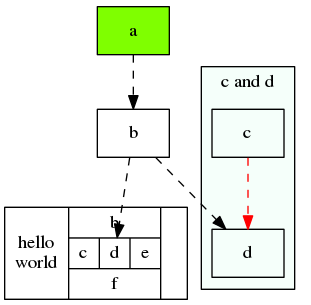

### graphviz组件
这个画图的组建工具可以帮忙画一些流程图，状态转换图，数据结构图，类图等一系列的图，它是采用一个输入脚本，定义基本的节点和关系，然后采用布局的工具输出对应的目标文件，输出文件的格式有很多，可以是png，pdf等。

graphviz的布局器有：

+ dot默认的布局方式
+ neato 基于spring-model算法
+ twopi 径向布局
+ circo 圆环布局
+ fdp 无向图

使用的流程也很简单：

1. 定义一个图，包括定义图的节点和边
2. 定义节点和边的样式
3. 使用布局器进行绘制

```
digraph abc//digraph关键字指定有向图，也可以用graph然后在表示边的时候可以用--表示无向图
{
  node [shape="record"];//节点的默认属性
  edge [style="dashed"];//边的默认属性
   
  a [style="filled", color="black", fillcolor="chartreuse"];//定义节点，和一些特别的属性
  b;
  e[shape=record,label="hello\nworld |{ b |{c|<here> d|e}| f}| g"];//这个是shape为record的时候label里面可以指定的标签，表示边可以指向这块区域，或者从这个区域引出。|表示横向的字段分割，{}表示嵌套
 
    subgraph cluster_cd{//subgraph关键字指定一个子图
      label="c and d";
      bgcolor="mintcream";
      c;
      d;
    }
 
  a -> b;//定义图中的边，这里也可以用属性来修饰边
  b -> d;
  b -> e:here;
  c -> d [color="red"];
}

```



小技巧：
 
 + label里面可以使用特殊字符\n等