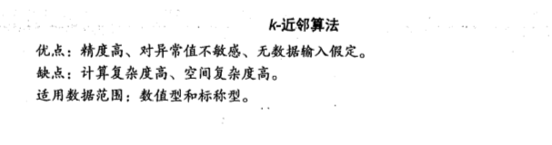
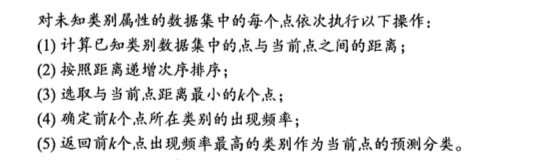
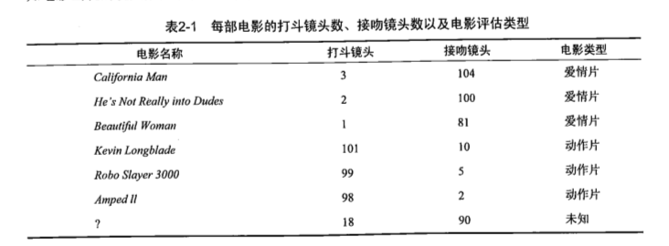
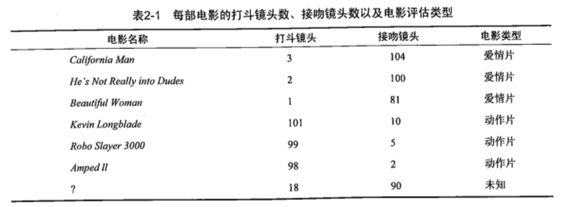

**k-近邻算法**工作的原理是：存在一个样本数据集合，也称作训练样本集，并且样本集合中的每个数据都存在标签，即我们知道样本集中每一条数据与所属分类的对应关系。输入没有标签的新数据后，将新数据的每个特征和样本数据集中数据对应特征进行比较，然后算法提取样本集中特征最相似数据（最近邻）的分类标签。一般只选样本数据集中前k个最相似的数据，这就是k-近邻算法的k出处，通常k是不大于20的整数。最后，选择k个最相似数据中出现次数最多的分类，作为新数据的分类。

算法优缺点：

算法流程：

下面这个例子是一个对电影分类的例子。分类的依据是一个电影中打斗镜头的出现次数越多越有可能是动作片，接吻镜头越多越有可能是爱情片。表格中最后一行的问号表示的是需要分类的电影。

上面的例子中按照某种方法计算的距离：

