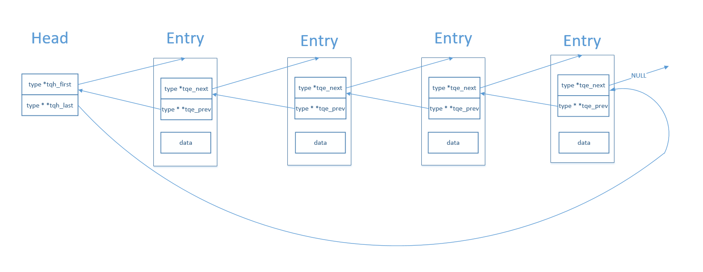

在Linux系统中sys/queue.h文件中定义了三种类型的queue(我觉得可以叫链表)，list，tail queue，circle queue。系统使用宏的方式提供这三种类型的定义，只需要在目标结构体(type)中添加一个字段(list是LIST_ENTRY(type)，tail queue是TAILQ_ENTRY(type)...)，在通过头文件中提供的操作函数进行操作，就能让目标结构体连接成为对应的数据结构。

关于这个最为详细的描述肯定是man文档，有需要的直接查看，下面是我关于这些结构的一个笔记。
### tail queue
看了这个代码之后很震撼，原来宏定义能够这么使用，这样的代码写出来都有一种模板的感觉。这个tail queue应该就是一个双向链表。


先看两个相关的数据结构，TAILQ_HEAD，TAILQ_ENTRY。head是一个虚拟的头节点，不包括任何数据，entry是内嵌到其他structure的字段，用于保存节点之间前趋和后继关系的字段。

从TAILQ_HEAD_INITIALIZER(head)中可以看到，初始没有一个节点的情况下，tph_first是指向第一个元素的，所以它指向空。tqh_last是二级指针，指向的是最后一个元素的tqe_next。下面这张图很形象地描述了tail queue




有了上面的图都好理解，关键是这两个宏TAILQ_LAST和TAILQ_PERV，以TAILQ_LAST为例，(head)->tqh_last这个表示最后节点的tqe_next的指针，将这个指针的类型进行强制转换成head类型，访问tqh_last字段，然后仔细观察TAILQ_HEAD，和TAILQ_ENTRY的定义所占的字节数相同，而这个这么转换之后，实际访问的是(head)->tqh_last->tqe_prev，再进行一次解地址引用，就是最后元素的地址了，至于为什么要这么做，是为了防止这个tail queue一个节点都没有，那就不存在tqe_prev字段。

```
/*
 * Tail queue definitions.
 */
#define TAILQ_HEAD(name, type)						\
struct name {								\
	struct type *tqh_first;	/* first element */			\
	struct type **tqh_last;	/* addr of last next element */		\
}

#define TAILQ_HEAD_INITIALIZER(head)					\
	{ NULL, &(head).tqh_first }

#define TAILQ_ENTRY(type)						\
struct {								\
	struct type *tqe_next;	/* next element */			\
	struct type **tqe_prev;	/* address of previous next element */	\
}

/* 
 * tail queue access methods 
 */
#define	TAILQ_FIRST(head)		((head)->tqh_first)
#define	TAILQ_END(head)			NULL
#define	TAILQ_NEXT(elm, field)		((elm)->field.tqe_next)
#define TAILQ_LAST(head, headname)					\
	(*(((struct headname *)((head)->tqh_last))->tqh_last))
/* XXX */
#define TAILQ_PREV(elm, headname, field)				\
	(*(((struct headname *)((elm)->field.tqe_prev))->tqh_last))
#define	TAILQ_EMPTY(head)						\
	(TAILQ_FIRST(head) == TAILQ_END(head))

#define TAILQ_FOREACH(var, head, field)					\
	for((var) = TAILQ_FIRST(head);					\
	    (var) != TAILQ_END(head);					\
	    (var) = TAILQ_NEXT(var, field))

#define TAILQ_FOREACH_REVERSE(var, head, field, headname)		\
	for((var) = TAILQ_LAST(head, headname);				\
	    (var) != TAILQ_END(head);					\
	    (var) = TAILQ_PREV(var, headname, field))

/*
 * Tail queue functions.
 */
#define	TAILQ_INIT(head) do {						\
	(head)->tqh_first = NULL;					\
	(head)->tqh_last = &(head)->tqh_first;				\
} while (0)


#define TAILQ_INSERT_TAIL(head, elm, field) do {			\
	(elm)->field.tqe_next = NULL;					\
	(elm)->field.tqe_prev = (head)->tqh_last;			\
	*(head)->tqh_last = (elm);					\
	(head)->tqh_last = &(elm)->field.tqe_next;			\
} while (0)


#define TAILQ_REMOVE(head, elm, field) do {				\
	if (((elm)->field.tqe_next) != NULL)				\
		(elm)->field.tqe_next->field.tqe_prev =			\
		    (elm)->field.tqe_prev;				\
	else								\
		(head)->tqh_last = (elm)->field.tqe_prev;		\
	*(elm)->field.tqe_prev = (elm)->field.tqe_next;			\
} while (0)
hile (0)

```
一个小例子
```
#include<stdio.h>
#include"queue.h"
int main()
{
	struct node
	{
		int val;
		TAILQ_ENTRY(node) next;
	};
	struct node n1 = {1}, n2 = {2}, *tmp;
	TAILQ_HEAD(tailq, node) my_queue;
	TAILQ_INIT(&my_queue);
	TAILQ_INSERT_TAIL(&my_queue, &n1, next);
	TAILQ_INSERT_TAIL(&my_queue, &n2, next);
	TAILQ_FOREACH(tmp, &my_queue, next)
		printf("%d\n", tmp->val);
	return 0;
}

```

**图片来自**

[ queue.h之tailq.h尾队列理解使用](http://blog.csdn.net/chen98765432101/article/details/56511598)