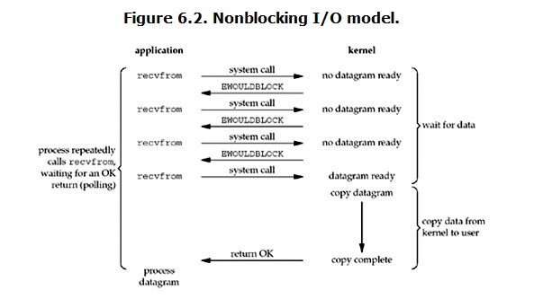
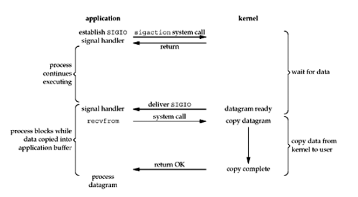

###UNIX系统下5种IO模型
在unix网络编程的第6章总结了unix操作系统下5种可用的IO模型，不愧是网络编程的圣经，总结和图都画得非常好，这里就摘录了书中的内容和原图。5种I/O模型分别是：

+ 阻塞I/O（blocking I/O）
+ 非阻塞I/O（nonblocking I/O）
+ I/O多路复用（I/O multiplexing）
+ 信号驱动I/O （signal driven I/O）
+ 异步I/O （asynchronous I/O）

####阻塞I/O


上面这个图解释了阻塞I/O的工作流程，当应用进程调用recvfrom系统调用，kernel开始了I/O的第一个阶段，准备数据（过程中可能是等待网络另一端的主机传输的数据包到达），当数据准备完成之后，第二个阶段kernel会将数据从内核的缓冲区送到用户内存。然后kernel才从recvfrom返回。用户进程将会变成可运行的状态，重新被调度运行。
> 因此阻塞I/O的特点就是在这两个阶段都阻塞。


####非阻塞I/O



非阻塞I/O的工作流程是当应用进程执行I/O操作recvfrom，如果没有数据准备好，kernel将会返回一个error，也就是说，recvfrom系统调用会立即返回一个error值。用户进程通过这个error值知道数据还没准备好，会再次调用recvfrom，就这样直到第四次调用recvfrom才发现那个数据已经准备好了，然后kernel拷贝数据到用户内存，recvfrom正常返回。
> 像上面的过程中不断轮询(polling)的过程是很消耗CPU资源的。

####I/O多路复用


I/O多路复用就是经常看到的一些系统调用select, poll, epoll等，有些地方也称为事件驱动I/O（event driven IO）。使用I/O复用的好处是可以等待多个描述符就绪。基本的原理就是这三个系统调用负责管理用户进程关心的描述符，这些描述符中有就绪的就会从复用的系统调用中返回。然后通过recvfrom调用将数据拷贝到用户内存。
> 其实和阻塞I/O相比，I/O复用没有优势，反而I/O复用需要使用两个系统调用，还在效率上不如阻塞I/O。所以，如果处理的连接数不是很高的话，使用select/epoll的web server不一定比使用multi-threading + blocking IO的web server性能更好，可能延迟还更大。select/epoll的优势并不是对于单个连接能处理得更快，而是在于能处理更多的连接。


####信号驱动I/O



信号驱动I/O的流程在上图中已经很清楚了，信号驱动I/O的特点是调用I/O的进程不阻塞，当kernel准备好数据产生一个信号，然后用户进程的处理函数处理这个信号，调用recvfrom接收数据。


####异步I/O


异步I/O和上面的信号驱动I/O有些类似，两者的最大区别就是在通知用户进程的时刻，信号驱动I/O是在kernel准备好数据，可以启动一个I/O操作，而异步I/O则是kernel通知用户进程I/O操作何时完成。


然后将上面的5种I/O模型放入一张图中进行对比，就能很明显地看出任意两者两者之间的区别了。


synchronous IO和asynchronous IO的区别
在说明synchronous IO和asynchronous IO的区别之前，需要先给出两者的定义。POSIX的定义是这样子的：

- A synchronous I/O operation causes the requesting process to be blocked until that I/O operation completes;
- An asynchronous I/O operation does not cause the requesting process to be blocked;

两者的区别就在于synchronous IO做”IO operation”的时候会将process阻塞。按照这个定义，之前所述的blocking I/O，non-blocking I/O，I/O multiplexing，signal-driven I/O都属于synchronous I/O。

###select，poll，epoll介绍
上面的I/O模型介绍完了，这里介绍一个这三个I/O复用函数的区别和联系。

####select
```
#include<sys/select.h>
#include<sys/time.h>
/*
*函数在readset可读，writeset可写，exceptset异常或者超时的情况下才返回
*maxfdp1 用户关心的描述符中最大的 + 1
*readset，writeset, exceptset需要内核测试的读，写，异常条件的描述符
*timeout 超时时间，Linux操作系统的定义会修改timeout这个变量
*/
int select(int maxfdp1, fd_set *readset, fd_set *writeset, fd_set *exceptset, const struct timeval *timeout);
```
select存在一个限制，当个进程能够监听的文件描述符存在最大限制，Linux上一般是1024。

####poll

epoll是在2.6内核中提出的，是之前的select和poll的增强版本。相对于select和poll来说，epoll更加灵活，没有描述符限制。epoll使用一个文件描述符管理多个描述符，将用户关系的文件描述符的事件存放到内核的一个事件表中，这样在用户空间和内核空间的copy只需一次。


```
#include<poll.h>
int poll(struct pollfd *fds, nfds_t nfds, int timeout);
```
和select不同，poll的参数明显就是更加简单明了，也少了最大数量的限制（但是性能上和select是一致的），pollfd的定义是
```
struct pollfd {
    int fd; /* file descriptor */
    short events; /* requested events to watch */
    short revents; /* returned events witnessed */
};
```
> 通过上面的API来看（内核怎么实现的select和poll不清楚，以后有时间再来补这块），select和poll都需要对关注的描述符集合进行遍历，判断该描述符集合上是否有事件发生，当这个集合很大时，这种线性扫描就会成为性能瓶颈


####epoll

epoll是在2.6内核中提出的，是之前的select和poll的增强版本。相对于select和poll来说，epoll更加灵活，没有描述符限制。epoll使用一个文件描述符管理多个描述符，将用户关心的文件描述符的事件存放到内核的一个事件表中，这样在用户空间和内核空间的copy只需一次(不太明白什么意思)。

使用epoll只需要三个接口：
```
int epoll_create(int size)；
int epoll_ctl(int epfd, int op, int fd, struct epoll_event *event)；
int epoll_wait(int epfd, struct epoll_event * events, int maxevents, int timeout);
```
接下来挨个说明这三个接口

1 . **int epoll_create(int size)**
    创建一个epoll的描述符，size之前的版本是预先分配资源，自从Linux kernel 2.6.8之后就没用了。在linux系统下，查看进程使用的fd可以在`/proc/进程id/fd/`目录进行查看。
2 . **int epoll_ctl(int epfd, int op, int fd, struct epoll_event *event)**
函数是对指定描述符fd执行op操作。

+ epfd：是epoll_create()的返回值。
+ op：表示op操作，用三个宏来表示：添加EPOLL_CTL_ADD，删除EPOLL_CTL_DEL，修改EPOLL_CTL_MOD。分别添加、删除和修改对fd的监听事件。
+ fd：是需要监听的fd（文件描述符）
+ epoll_event：是告诉内核需要监听什么事，struct epoll_event结构如下：

```
struct epoll_event {
  __uint32_t events;  /* Epoll events */
  epoll_data_t data;  /* User data variable */
};

//events可以是以下几个宏的集合：
EPOLLIN ：表示对应的文件描述符可以读（包括对端SOCKET正常关闭）；
EPOLLOUT：表示对应的文件描述符可以写；
EPOLLPRI：表示对应的文件描述符有紧急的数据可读（这里应该表示有带外数据到来）；
EPOLLERR：表示对应的文件描述符发生错误；
EPOLLHUP：表示对应的文件描述符被挂断；
EPOLLET： 将EPOLL设为边缘触发(Edge Triggered)模式，这是相对于水平触发(Level Triggered)来说的。
EPOLLONESHOT：只监听一次事件，当监听完这次事件之后，如果还需要继续监听这个socket的话，需要再次把这个socket加入到EPOLL队列里
```

3 . **int epoll_wait(int epfd, struct epoll_event * events, int maxevents, int timeout)**

等待epfd上的io事件，最多返回maxevents个事件。
参数events用来从内核得到事件的集合，maxevents告之内核这个events有多大，这个maxevents的值不能大于创建epoll_create()时的size，参数timeout是超时时间（毫秒，0会立即返回，-1将不确定，也有说法说是永久阻塞）。该函数返回需要处理的事件数目，如返回0表示已超时。

#####epoll的工作模式

根据事件通知不同的方式epoll有两种工作模式：LT(level trigger，水平触发或者条件触发)和ET(edge trigger，边缘触发)。

LT模式：epoll_wait检测到描述符关心的事件时会通知(通过events参数)调用进程，调用进程可以不立即处理该事件，下次调用epoll_wait时，调用进程还是会被通知该事件。

ET模式：当epoll_wait检测到描述符关心的事件通过调用进程，调用进程必须处理该事件，下次调用epoll_wait时不会通知调用进程该事件。

对比两种模式举个可能不是特别恰当的例子，就像老妈和老婆同时知道你感冒发烧了，老妈可能会每天唠叨，吃药，喝水，多睡觉。老婆就说一次吃饭，喝水，多睡觉。老妈工作的模式就是LT模式，老婆工作的模式就是ET模式。

正规一点说就是，LT(level triggered)是缺省的工作方式，并且同时支持block和no-block socket.在这种做法中，内核告诉你一个文件描述符是否就绪了，然后你可以对这个就绪的fd进行IO操作。如果你不作任何操作，内核还是会继续通知你的。

ET(edge-triggered)是高速工作方式，只支持no-block socket。在这种模式下，当描述符从未就绪变为就绪时，内核通过epoll告诉你。然后它会假设你知道文件描述符已经就绪，并且不会再为那个文件描述符发送更多的就绪通知，直到你做了某些操作导致那个文件描述符不再为就绪状态了(e.g. 接收缓冲区有数据，但是你一直调用read，导致接收缓冲区的数据被读完，那么接受缓冲区从可读变成不可读）。但是请注意，如果一直不对这个fd作IO操作(从而导致它再次变成未就绪)，内核不会发送更多的通知(only once)

ET模式在很大程度上减少了epoll事件被重复触发的次数，因此效率要比LT模式高。epoll工作在ET模式的时候，必须使用非阻塞套接口，以避免由于一个文件句柄的阻塞读/阻塞写操作把处理多个文件描述符的任务饿死。

> 罗嗦两句，ET模式只会为状态的改变通知一次，所以为了让下次的状态改变能得到通知你就只能一直调用read，write或者其他系统调用将当前的状态改变，在使用block socket时，调用到改变的情况会使得系统在处理单个fd时阻塞，而I/O复用的系统一般是单线程的，那么整个系统就阻塞掉了

**花了两天多的时间查看资料，和自己实践，感觉收获很大**

最后是一个简单的tcp回显服务器，采用单线程，I/O复用函数供大家参考
```
#include<stdio.h>
#include<sys/select.h>
#include<sys/socket.h>
#include<arpa/inet.h>
#include<sys/epoll.h>
#include<fcntl.h>
#include<strings.h>
#define MAXEPOLLSIZE 1000
#define MAXLINE 1024
int setnonblocking(int sockfd)
{
	if (fcntl(sockfd, F_SETFL, fcntl(sockfd, F_GETFD, 0) | O_NONBLOCK) == -1)
		return -1;
	return 0;
}
/*
客户端传来的数据进行回显
*/
int handle(int connfd)
{
	char buf[MAXLINE];
	int n;
	/*
	*首先要理解read调用的工作过程，read的第三个参数指明了读取的最大字节数，但是read系统调用是一个抽象的概念，可以从文件中读，从串口中读取，从网络套接字中读取，
	*因此在这些情况下，read读取的字节数目可能少于指定的字节数目。那么我们为何不在此处循环调用read
	*因为在这个代码中，tcp stack接收到了64B的数据，I/O复用函数返回，然后进程调用handle进行处理，read系统调用读取64个字节，写入套接字。如果此时socket没有被设置成非阻塞，再次调用read已经没有数据，
	*整个服务器就会因为处理一个连接的数据而被阻塞。而这里只调用一次read，就算对方传来的数据可能大于MAXLINE，但是epoll工作在LT(默认触发模式)时，下次还能触发epollin事件
	*/
	if ((n = read(connfd, buf, MAXLINE)) > 0)
		write(connfd, buf, n);
	if (n < 0) return -1;
	return n;
}
int select_server(int listenfd)
{
	int client[FD_SETSIZE], i, socklen = sizeof(struct sockaddr_in), maxfd = listenfd, nready, connfd, curfds = 1, fd, maxi;//FD_SETSIZE 一般为1024
	struct sockaddr_in cli_addr;
	fd_set rset, allset;

	for (i = 0; i < FD_SETSIZE; ++i)
		client[i] = -1;
	FD_ZERO(&allset);
	FD_SET(listenfd, &allset);

	for (;;)
	{
		rset = allset;
		nready = select(maxfd + 1, &rset, 0, 0, 0);
		if (FD_ISSET(listenfd, &rset))//监听套接字可读
		{
			connfd = accept(listenfd, (struct sockaddr *)&cli_addr, &socklen);
			if (connfd < 0)
			{
				perror("accept error");
				continue;
			}
			for (i = 0; i < FD_SETSIZE; ++i)
			{
				if(client[i] < 0)
				{
					client[i] = connfd;
					break;
				}
			}
			if(i == FD_SETSIZE)
			{
				perror("too many clients");
				return -1;
			}
			printf("%d conn, accept from %s:%d\n", curfds, inet_ntoa(cli_addr.sin_addr), cli_addr.sin_port);
			++curfds;
			FD_SET(connfd, &allset);
			if (connfd > maxfd)
				maxfd = connfd;
			if (i > maxi)
				maxi = i;
			if (--nready <= 0) 
				continue;
		}
		for (i = 0; i <= maxi; ++i)
		{
			fd = client[i];
			if(fd < 0) 
				continue;
			if (FD_ISSET(fd, &rset))
			{
				if(handle(fd) == 0)
				{
					close(fd);
					client[i] = -1;
					FD_CLR(fd, &allset);
					--curfds;
				}
			}
		}
	}
	return 0;
}
int epoll_server(int listenfd)
{
	int epoll_fd, curfds = 1, nfds, i, connfd, socklen = sizeof(struct sockaddr_in), event_fd;
	struct epoll_event ev, events[MAXEPOLLSIZE];
	struct sockaddr_in cli_addr;
	epoll_fd = epoll_create(MAXEPOLLSIZE);
	ev.events = EPOLLIN;
	ev.data.fd = listenfd;
	if(epoll_ctl(epoll_fd, EPOLL_CTL_ADD, listenfd, &ev) < 0)
	{
		perror("epoll ctl error");
		return -1;
	}
	for (;;)
	{
		nfds = epoll_wait(epoll_fd, events, curfds, -1);
		if (nfds == -1)
		{
			perror("epoll_wait error");
			continue;
		}
		for (i = 0; i < nfds; ++i)
		{
			event_fd = events[i].data.fd;
			if (event_fd == listenfd)
			{
				connfd = accept(listenfd, (struct sockaddr *)&cli_addr, &socklen);
				if (curfds >= MAXEPOLLSIZE)
				{
					perror("too many connection");
					close(connfd);
					continue;
				}

				if (connfd < 0)
				{
					perror("accept error");
					continue;
				}
				printf("%d conn, accept from %s:%d\n", curfds, inet_ntoa(cli_addr.sin_addr), cli_addr.sin_port);
				ev.events = EPOLLIN;
				ev.data.fd = connfd;
				if (epoll_ctl(epoll_fd, EPOLL_CTL_ADD, connfd, &ev) < 0)
				{
					perror("epoll ctl error");
					return -1;
				}
				++curfds;
				continue;
			}
			if (handle(event_fd) == 0)
			{
				epoll_ctl(epoll_fd, EPOLL_CTL_DEL, event_fd, &ev);
				close(event_fd);
				--curfds;
			}
		}
	}
	close(epoll_fd);
}
int poll_server(int listenfd)
{
	return 0;
}
int main(int argc, char **argv)
{
	int serv_port = 8888, opt = 1, listenq = 1024, listenfd;
	struct sockaddr_in servaddr;

	if (argc != 2)
		return -1;

	bzero(&servaddr, sizeof(servaddr));
	servaddr.sin_family = AF_INET;
	servaddr.sin_addr.s_addr = htonl(INADDR_ANY);
	servaddr.sin_port = htons(serv_port);

	listenfd = socket(AF_INET, SOCK_STREAM, 0);
	if (listenfd == -1)
	{
		perror("can't create socket file");
		return -1;
	}
	setsockopt(listenfd, SOL_SOCKET, SO_REUSEADDR, &opt, sizeof(opt));
	if (bind(listenfd, (struct sockaddr *)&servaddr, sizeof(struct sockaddr)) == -1)
	{
		perror("bind error");
		return -1;
	}
	if (listen(listenfd, listenq) == -1)
	{
		perror("listen error");
		return -1;
	}

	if (!strcmp("epoll", argv[1]))
		epoll_server(listenfd);
	else if (!strcmp("select", argv[1]))
		select_server(listenfd);
	else if (!strcmp("poll", argv[1]))
		poll_server(listenfd);//这个函数不想写了，有点懒
	close(listenfd);
	return 0;
}

```

**内容来自**

[Linux IO模式及 select、poll、epoll详解](https://segmentfault.com/a/1190000003063859)

[Linux IO多路复用之epoll网络编程(含源码)](http://www.cnblogs.com/ggjucheng/archive/2012/01/17/2324974.html)

《UNIX网络编程第三版》


