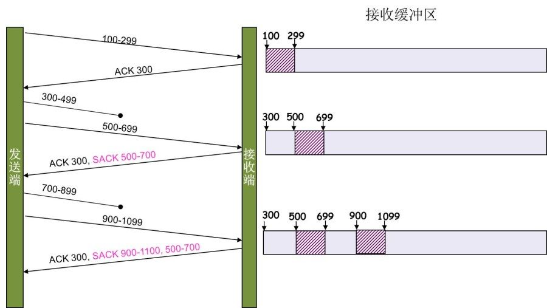

###TCP状态机
TCP的连接，本质上是通信双方维护的一个“连接状态”。下图是状态转换机，和TCP/IP详解上好像不完全一样，但是看起来更顺眼


+ 关于ISN的初始化。ISN是不能hard code的，不然会出问题的——比如：如果连接建好后始终用1来做ISN，如果client发了30个segment过去，但是网络断了，于是 client重连，又用了1做ISN，但是之前连接的那些包到了，于是就被当成了新连接的包，此时，client的Sequence Number 可能是3，而Server端认为client端的这个号是30了。全乱了。RFC793中说，ISN会和一个假的时钟绑在一起，这个时钟会在每4微秒对ISN做加一操作，直到超过2^32，又从0开始。这样，一个ISN的周期大约是4.55个小时。因为，我们假设我们的TCP Segment在网络上的存活时间不会超过Maximum Segment Lifetime（缩写为MSL – Wikipedia语条），所以，只要MSL的值小于4.55小时，那么，我们就不会重用到ISN。

+ 关于 MSL 和 TIME_WAIT。通过上面的ISN的描述，相信你也知道MSL是怎么来的了。我们注意到，在TCP的状态图中，从TIME_WAIT状态到CLOSED状态，有一个超时设置，这个超时设置是 2*MSL（RFC793定义了MSL为2分钟，Linux设置成了30s）为什么要这有TIME_WAIT？为什么不直接给转成CLOSED状态呢？主要有两个原因：1）TIME_WAIT防止对FIN的响应ack丢失，如果被动关闭的那方没有收到Ack，就会触发被动端重发FIN，一来一去正好2个MSL，2）有足够的时间让这个连接不会跟后面的连接混在一起（你要知道，有些自做主张的路由器会缓存IP数据包，如果连接被重用了，那么这些延迟收到的包就有可能会跟新连接混在一起）。你可以看看这篇文章《TIME_WAIT and its design implications for protocols and scalable client server systems》
注意上图中有个同时打开和同时关闭的过程。这个过程是A，B两个主机，A在7777端口想要连接到B的8888端口，B在8888端口，连接到A的7777端口，建立的是一个TCP连接。

三次握手和四次挥手的过程


####TCP延迟确认（Delayed Acknowledgments）
正常情况下，TCP当它收到数据时不会立即发送ack，它会延迟发送ack，希望有需要发送的数据附带上这个确认的ack，从而减少网络种数据包的数量。

####Nagle算法
当TCP连接中有外出的，没有被确认的数据时，小的数据包是不能发送的。这时，数据会被收集起来，等到发送的数据被确认的时候发送出去。这个算法增加了带宽利用效率。但是对于telnet这种交互式的应用程序，很影响用户体验。


####带宽带宽时延乘积（Bandwidth-Delay Product）
首先介绍RTT的概念，从发送端的角度来说，就是发送一个比特，到得知已经接收这个比特已经被接收的时间，也就是传播时长。

```
capacity = bandwidth(bits/sec) * round-trip time(sec)
```

这个带宽时延积的含义是以最大的带宽传输数据，然后第一个比特到达目的地的时候发送比特的数量，而这些比特都在信道里传输，也就是某时链路上可容纳的最大比特数。


####紧急模式
> 也不知到有什么具体的作用，看着也是一知半解的，具体可以看《unix网络编程》24章带外数据。

带外数据，许多传输层都有带外数据（out-of-band data）的概念，想法就是一个连接的某端发生了重要的事情，该端希望迅速通告对端，这里的迅速是指这种通知应该在已经排队等待发送的任何数据之前。带外数据被认为具有比普通数据更高的优先级。TCP没有带外数据，它提供了紧急模式。

要从一端告知另一端数据流中有紧急数据通需要设置TCP的两个字段：URG标志位和16比特的紧急指针偏移（这个指针偏移加上序列号才是真正的紧急数据的实际字节位置）。紧急数据是和普通数据一起传送的（所以很有可能设置了这两个字段而真正的数据没有到来），它的长度只有一个字节。对于接收者来说只有一个紧急指针，如果发送端指明了新的值之后就会被重写。

####TCP流量控制
流量控制是一种端到端的控制，流量控制解决的问题是针对发送方和接收方速度不匹配问题。流量控制是由接收方控制，发送方被迫调整到与接收方同步。在TCP中进行流量控制的方法是滑动窗口协议。

在TCP头部有个16-bit字段window size，又叫做通告窗口（advertised-window），这个字段是接收端告诉发送端自己还有多少缓冲区可以接收数据。下图是滑动窗口的示意图。


黑色的部分就是滑动窗口，图中分成了4个部分

+ #1是已经收到ack确认的数据
+ #2是发送出去但没有确认的数据
+ #3是在窗口中还没有发送出去的数据
+ #4是窗口以外的数据（接收方还没有空间）

窗口的左端点向右移动是因为数据被发送了，并且收到确认ack。窗口的右端点向右移动，能够让更多的数据发送出去是因为接收端接收进程读取了确认数据，释放了TCP缓冲（通过接收端发送通告窗口的大小）


**0窗口**

从上面的图中可以看出接收方的可以告诉发送方窗口大小是0，暂停发送端发送数据。当接收方处理完成数据之后，发送ack，win=xxx的报文告诉发送端可以重新发送数据。但是此时如果这个报文丢失，这是普通的ack报文，是不会被重传，就会造成TCP的死锁。为了防止以上情况发生，发送方实现了一个零窗口探测定时器，当窗口为0时，发送方会主动发送探测包，通过迫使对端响应来得知接收窗口有无打开。

**糊涂窗口综合症（Silly Window Syndrome）**

这个就是因为当接收方的缓存满时，接收方的应用进程每次只取几个字节，这样导致接收方每次告知发送方的窗口的大小是几个字节，从而发送方每次只发送几个字节的数据。而IP+TCP头部大小是40字节，严重影响了传输效率。可以使用David D Clark’s方案——在接收端，如果接收到了数据导致通告窗口小于某个值，直接ack（win 0）关闭发送端，等到receiver端处理了一些数据后windows size 大于等于了MSS，或者，接收端buffer有一半为空，就可以把window打开让发送端发送数据过来。

####TCP拥塞控制
拥塞控制是为了防止过多的数据注入到网络中，使网络中的路由器或者链路不过载。拥塞控制是一个全局的控制，涉及到网络中的所有主机、路由器以及降低网络传输性能的。拥塞控制是TCP控制发送方的发送速率。为了防止网络的拥塞现象，TCP提出了一系列的机制来进行拥塞控制。

1. 慢启动（slow start）
2. 拥塞避免（congestion avoidence）
3. 快速重传（fast retransmit）
4. 快速恢复(fast recovery)

发送端发送的速率其实是min（rwnd，cwnd）rwnd就是由对方确定的用于流量控制的通告窗口，cwnd是拥塞窗口的大小。

**慢启动**

慢启动的算法如下(cwnd全称Congestion Window)：

1. 连接建好的开始先初始化cwnd = 1，表明可以传一个MSS大小的数据。
2. 每当收到一个ACK，cwnd++; 呈线性上升
3. 每当过了一个RTT，cwnd = cwnd*2; 呈指数让升
4. 还有一个ssthresh（slow start threshold），是一个上限，当cwnd >= ssthresh时，就会进入“拥塞避免算法”（后面会说这个算法）

**拥塞避免**

前面说过，还有一个ssthresh（slow start threshold），是一个上限，当cwnd >= ssthresh时，就会进入“拥塞避免算法”。一般来说ssthresh的值是65535，单位是字节，当cwnd达到这个值时后，算法如下：

1. 收到一个ACK时，cwnd = cwnd + 1/cwnd
2. 当每过一个RTT时，cwnd = cwnd + 1


这样就可以避免增长过快导致网络拥塞，慢慢的增加调整到网络的最佳值。很明显，是一个线性上升的算法
所以，我们可以看到，如果网速很快的话，ACK也会返回得快，RTT也会短，那么，这个慢启动就一点也不慢。

上面的慢启动和拥塞避免都没有说丢包，丢包cwnd会怎么调整呢？

丢包的表现在TCP看来有两种：一种是RTO（retransmission timeout）超时，重传数据包；另一种是收到3个duplicate ACK（假设本次TCP发送了1,2,3,4,5一共5个数据包，接收方正确接收了1，然后3到达了接收方，接收方发送下一个要接收的数据包是2，3,不是按序到达的数据，因此发送ack 2；4到达发送ack 2；5到达发送ack 2。接收方接受到三个冗余的ack，那么很有可能2已经丢失了）


**快速重传**

TCP引入了一种叫Fast Retransmit 的算法，不以时间驱动，而以数据驱动。快速重传就是收到三个冗余的ack，重传数据包，而不等RTO超时。快速重传只是缩短了重传丢失数据包的时间，没有解决的是到底丢失了哪些数据包。于是出现了一种解决方案——**选择重传（Selective Acknowledgment-SACK）**，这是在接受到乱序的数据包才会出现的机制，可以重传丢失的数据。下图是一个选择重传的示意图



对于RTO超时，TCP认为情况很糟糕，会采取以下的措施:

+ ssthresh = cwnd / 2
+ cwnd = 1
+ 进入慢启动算法

对于3个duplicate ACK，TCP Tahoe的做法和RTO超时的做法一样，而TCP Reno的做法是

+ cwnd = cwnd /2
+ sshthresh = cwnd
+ 进入快速恢复算法——Fast Recovery（这个快速恢复就是针对Tahoe的丢包发生时恢复发送速率的一个改进）

**快速恢复**

+ cwnd = sshthresh  + 3 * MSS （3的意思是确认有3个数据包被收到了）
+ 重传Duplicated ACKs指定的数据包
+ 如果再收到 duplicated Acks，那么cwnd = cwnd +1（有数据包被接收方收到，保持数据包守恒，增加利用率）
+ 如果收到了新的Ack，那么，cwnd = sshthresh ，然后就进入了拥塞避免的算法了。

如果你仔细思考一下上面的这个算法，你就会知道，上面这个算法也有问题，那就是——它依赖于3个重复的Acks。注意，3个重复的Acks并不代表只丢了一个数据包，很有可能是丢了好多包。但这个算法只会重传一个，而剩下的那些包只能等到RTO超时，于是，进入了恶梦模式——超时一个窗口就减半一下，多个超时会超成TCP的传输速度呈级数下降，而且也不会触发Fast Recovery算法了。

因此针对上面问题1995年提出的TCP New Reno在没有SACK的支持下进行改进，在收到3个duplicate ACK之后，发送端肯定知道已经发送数据的最大序号recover，这个时候正常重传ack指示的数据，如果接收方的ack没有确认这个最大的序号，表示之后的数据已经丢失，需要发送方重传ack之后，recover之前的数据包。


####TCP的RTT算法
从前面的重传机制，我们知道RTO的设置对于重传非常重要。设置长了，重传太慢，影响效率。设置短了，导致没有丢包就重传，增加网络拥塞，浪费了带宽。并且，由于网络的情况不断地变化，RTO没法设置一个固定的值，必须针对网络环境动态调整。由于事先是不知道这个发出去的数据包的RTT的，只能根据之前的RTT测量的数据进行预测。

经典的算法

1. 首先，先采样RTT，记下最近好几次的RTT值。

2. 然后做平滑计算SRTT（ Smoothed RTT）。公式为：（其中的 α 取值在0.8 到 0.9之间，这个算法英文叫Exponential weighted moving average，中文叫：加权移动平均）
```
SRTT = ( α * SRTT ) + ((1- α) * RTT)
```
3. 开始计算RTO。公式如下：
```
RTO = min [ UBOUND,  max [LBOUND,   (β * SRTT) ] ]
```
其中：

UBOUND是最大的timeout时间，上限值
LBOUND是最小的timeout时间，下限值
β 值一般在1.3到2.0之间。

对于经典的算法，有人提出来说经典算法不能够应对RTT剧烈的变化，导致了不必要的重传。提出了一个改进的算法Jacobson/Karels算法，这里就不详细介绍了。

其实上面的算法里有一个问题没有说。RTO超时，重传了的数据包这次的RTT数据的问题（要不要作为采样数据计算下一次的RTO）。从下面的图中可以看出来，如果采样的RTT是从原始的发送开始计时，这个数据包可能真的丢失了，那么重传之后，接收端返回了ack，计时结束，那么明显是比真正网络中的RTT要大很多。如果从重传开始计时，那么可能存在网络拥塞，本次ack到达晚了，就是造成采样的RTT比真实情况小很多。因此重传的数据包的RTT值采样是没有意义的。


不采样的方法（1987年的时候，Karn / Partridge Algorithm说的就是这个意思），也会有一个问题。如果网络突然拥塞，产生了很大的延时，那么所有的数据包都要重传（之前的RTO很小），由于重传的不进行采样，RTO不会被更新，结果就很惨烈了。于是Karn采取了一个办法，只要发生重传，现有RTO翻倍（Exponential backoff）
###常见问题


文章内容和图片出处

[TCP那些事儿（下）](http://coolshell.cn/articles/11609.html#comments)

[TCP慢启动、拥塞避免、快速重传、快速恢复](http://blog.csdn.net/itmacar/article/details/12278769)

[TCP的定时器系列 — 零窗口探测定时器](http://blog.csdn.net/zhangskd/article/details/44571323)