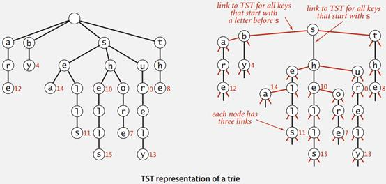
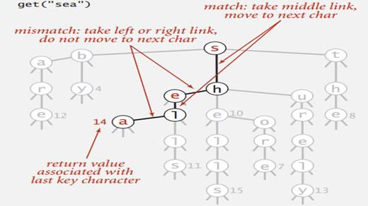

###trie树
在计算机科学中，trie又称为digital tree, radix tree(基数树), prefix tree(前缀树)，是一种有序树，用于保存关联数组，其中的键通常是字符串。与二叉查找树不同，键不是直接保存在节点中，而是由节点在树中的位置决定。一个节点的所有子孙都有相同的前缀，也就是这个节点对应的字符串，而根节点对应空字符串。一般情况下，不是所有的节点都有对应的值，只有叶子节点和部分内部节点所对应的键才有相关的值。

Trie树，即字典树，又称单词查找树或键树，是一种树形结构，是一种哈希树的变种。典型应用是用于统计字符串出现次数和排序大量的字符串（但不仅限于字符串），所以经常被搜索引擎系统用于文本词频统计。它的优点是：最大限度地减少无谓的字符串比较，查询效率比哈希表高。Trie的核心思想是空间换时间。利用字符串的公共前缀来降低查询时间的开销以达到提高效率的目的。

它有3个基本性质：
+ 根节点不包含字符，除根节点外每一个节点都只包含一个字符。
+ 从根节点到某一节点，路径上经过的字符连接起来，为该节点对应的字符串。
+ 每个节点的所有子节点包含的字符都不相同。

>从具体的例子中看前缀树的应用。
>1. 现在有1000w的字符串，需要去掉重复的字符串。这个过程可以使用trie树，将1000w的字符串逐个读取，然后构建trie树。最后遍历trie树输出结果。每次构建查询trie树的时间复杂度假设是O(1)，那么总的时间复杂度就是O(1000w)

下图就是一个关于输入的keys集合{A, to, tea, ted, ten, i, in, inn}建立的trie树的例子


根据操作效率与内存使用之间的平衡度不同，有不同的实现方式：
+ 最基本的方式是使用指针数组，每个节点包含孩子节点的指针数组，每个指针代表一个符号(对于小写的英文字母就是26个指针)。这是最简单的方式，也是最浪费内存的方式。如果输入的字符串中很少有重叠的前缀，那么节点的个数大约是是输入字符串的长度和。
+ 采用ternary search tree
+ 采用Tripple-Array Trie和Double-Array Trie

###ternary search tree
ternary search tree(三叉搜索树)，为了避免使用trie的多余的空指针占用内存，结点不用数组表示，而是表示成“树中有树”的形式。Trie结点中的每个非空指针都会在三叉搜索树中得到它属于自己的结点。这几句话可能很不理解，看下面两种树的对比图就很清楚了。



ternary search tree每个结点有三个指针（smaller, equal, larger)，分别指向关键字开始字符小于当前结点的关键字，关键字开始字符等于当前结点的关键字，关键字开始字符大于当前结点的关键字。

有了上面的性质之后使用ternary search tree对关键字进行搜索的算法流程为，以下图为例。搜索的key = "sea"，根节点是s，发现当前结点与关键字开始字符匹配，移动到正下方的h节点，key变成"ea"，接下来发现关键字开始字符小于当前结点，于是当前节点向右移动到e结点，key不变。当前结点与关键字开始字符匹配，key变成"a",当前节点下移到l节点。重复上面的搜索过程，如果匹配到最后key的最后一个字符，返回当前节点关联的值(表示从根结点到当前结点的路径是否构成被插入的字符串)，其他情况表示没有找到 。



字符串的插入过程和搜索很相似

ternary tree参考代码
```
#include<stdio.h>
#include<stdlib.h>
#include<string.h>
/*
*ternary tree的一个简单实现，ternary是一种前缀树
*/
typedef struct tnode
{
	char symbol;//当前结点的数据
	char end_str;//到达该结点的路径是否构成字符串
	struct tnode *left, *mid, *right;
}tnode;

void insert(tnode **proot, char *s);//ternary tree插入字符串，s目标字符串，proot根节点指针的指针
void travel(tnode *root, char *buf, int depth);//按照字典序列输出，buf遍历过程中需要用到的缓冲区，depth当前的层次
int search(tnode *root, char *s);//ternary tree搜索字符串

void travel(tnode *root, char *buf, int depth)
{
	if (root == NULL)
		return;
	//左子树
	travel(root->left, buf, depth);

	//输入当前结果
	buf[depth] = root->symbol;
	if (root->end_str)
	{
		buf[depth + 1] = '\0';
		printf("%s\n", buf);
	}


	travel(root->mid, buf, depth + 1);

	//右子树
	travel(root->right, buf, depth);
}


void insert(tnode **proot, char *s)
{
	tnode *root = *proot;
	if (root == NULL)
	{
		root = (tnode *)malloc(sizeof(tnode));
		root->end_str = 0;
		root->left = root->mid = root->right = NULL;
		root->symbol = *s;

		*proot = root;
	}

	if (*s < root->symbol)
	{
		insert(&root->left, s);
	}
	else if (*s > root->symbol)
	{
		insert(&root->right, s);
	}
	else
	{
		if (*(s + 1) != '\0')
			insert(&root->mid, ++s);
		else
			root->end_str = 1;
	}
}


int search(tnode *root, char *s)
{
	while (root && s)
	{
		if (*s < root->symbol)
			root = root->left;
		else if (*s > root->symbol)
			root = root->right;
		else
		{
			if (*(s + 1) == '\0')
				return root->end_str;
			root = root->mid;
			++s;
		}
	}
	return 0;
}


int main(int argc, char **argv)
{
	tnode *root = NULL;
	char cmd[32], str[64], buf[128];
	while (1)
	{
		scanf("%s", cmd);
		if (!strcmp(cmd, "insert"))
		{
			scanf("%s", str);
			insert(&root, str);
		}
		else if (!strcmp(cmd, "search"))
		{
			scanf("%s", str);
			if (search(root, str))
				printf("find\n");
			else
				printf("not find\n");
		}
		else if (!strcmp(cmd, "travel"))
		{
			travel(root, buf, 0);
		}
	}
	return 0;
}


```

**内容来自**

[知乎钟宇腾](https://www.zhihu.com/question/22069841)

[trie树](https://en.wikipedia.org/wiki/Trie)

[Ternary Tree](https://www.cnblogs.com/gccbuaa/p/6999920.html)