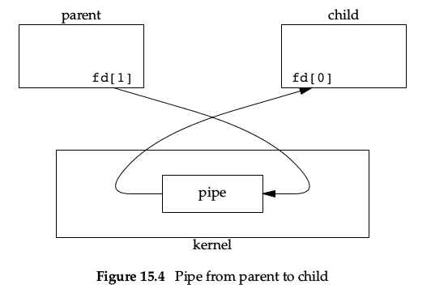

##unix ipc----apue读书笔记


###三个时间
书上有几个表格比较这时间，于是就查了这几个时间的含义

+ 时钟时间： 从进程开始运行到结束，时钟走过的时间
+ 用户CPU时间：用户进程获得了CPU资源之后在用户态获执行的时间
+ 系统CPU时间：用户进程获得了CPU资源之后在内核态的执行时间

简单来说进程有三种状态，阻塞，就绪，运行

时钟时间 = 阻塞时间 + 就绪时间 + 运行时间
用户CPU时间 = 运行状态下用户空间的时间
系统CPU时间 = 运行状态下系统空间的时间

用户CPU时间+系统CPU时间 = 运行时间
用time命令就可以看到这三个时间
```
tan@tan:~/Documents/code/apue/15$ time ./a.out 
real	0m1.228s
user	0m1.228s
sys	    0m0.000s
```
但是在书上15-29这个表格有明显的错误


###管道

管道是UNIX系统IPC的最古老的方式，所有的UNIX系提都提供这种通信方式。


管道的缺点是：

1. 是半双工的（数据只能在一个方向上流动）。虽然某些系统提供全双工的管道，为了保证移植性，不应该使用。
2. 管道只能在具有公共祖先的两个进程之间使用。通常，一个管道由一个进程创建，在进程调用fork之后，这个管道就能在父进程和子进程之间使用了。

管道是由pipe函数创建的，通过fd返回两个文件描述符：fd[0]为读而打开，fd[1]为写打开。fd[1]的输出是fd[0]的输入
```
#include<unistd.h>
int pipe(int fd[2]);
```

下面的三张图很好地解释了为什么管道只能在具有公共祖先关系的两个进程间使用。因为单个进程的管道毫无用处，通常进程会调用pipe，接着调用fork，从而创建从父进程到子进程的IPC通道（或者反过来说从子进程到父进程）。fork之后的操作取决于我们想要的数据的流向。对于从父进程到子进程的管道。父进程关闭管道的读端（fd[0]），子进程关闭管道的写端（fd[1]）。




当管道的一端被关闭后，下面两条规则发生作用：

1. 当读（read）一个写端被关闭的管道时，在所有数据被读取后，read返回0表示读到了EOF（从技术上来讲，如果管道的写端还有进程就不会产生EOF）
2. 如果写（write）一个读端已被关闭的管道，则产生信号SIGPIPE。如果过忽略该信号或者捕捉该信号并从其处理程序返回，则write返回-1，errno设置为EPIPE。
3. 在写管道（或者是FIFO）时，常量PIPE_BUF规定了管道缓冲区大小。如果对管道调用write，且要求字节数小于PIPE_BUF，则此操作不会和其他进程对同一管道的write操作交叉进行。但是如果大于PIPE_BUF那么有可能造成write数据的相互交叉。pathconf或者是fpathconf可以确定PIPE_BUF的值。


###命名管道（FIFO）

FIFO是一种文件类型，创建FIFO类似于创建文件。

```
#include<sys/stat.h>
int mkfifo(const char *path, mode_t mode);
int mkfifoat(int fd, const char *path, mode_t mode);
```

mkfifo函数中mode和open函数的mode相同。path参数是创建fifo文件的位置。mkfifoat函数可以用fd代表的打开目录的相对位置创建FIFO（path是绝对路径时fd会被忽略。path是相对路径时表示相对于fd目录的path目录建立一个FIFO文件）。


通过上面的函数创建了FIFO文件之后需要通过open来打开它。当open一个FIFO时，非阻塞标志（O_NONBLOCK）会产生以下影响：

1. 默认情况（没有指定O_NONBLOCK），只读open要阻塞到某个其他进程为写而打开这个FIFO为止。类似的，只写open要阻塞到其他进程为读而打开它。
2. 如果指定了O_NONBLOCK，那么只读open立即返回。但是对于只写open，如果没有进程为读而打开一个FIFO，它将返回-1,并且将errno置为ENXIO。


类似于管道，若write一个尚无进程为读而打开的FIFO，则产生信号SIGPIPE。若某个FIFO最后一个写进程关闭了该FIFO，则为该FIFO的读进程产生一个EOF标志。一个给定的FIFO有多个写进程是很常见的，为了保证数据不交叉，应该合理地设置PIPE_BUF大小。


FIFO常见的作用有两个：
1. shell命令使用FIFO传送数据无需创建中间文件（不是还要创建FIFO吗？）
2. 在客户端进程，服务器进程中，FIFO用作汇聚点，在客户进程和服务器进程二者之间传递数据。

第一个常见作用的图解和命令代码：
```
mkfifo fifo1
prog3 < fifo1 &
prog1 < infile | tee fifo1 | prog2
```


第二个常见作用的图解：


上面的工作过程不是很完善，理由如下：
1. 服务器不能判断一个客户进程是否异常终止，导致进程专用的FIFO会遗留在文件系统中。
2. 服务器需要捕获SIGPIPE信号，因为客户进程可能在发送一个请求之后没有读取响应就终止了。
3. 当客户进程从1变成0时，服务器进程就将在FIFO中read到一个EOF标志。（这个可以使用的技巧是读写方式打开，即第一次非阻塞只读，第二次阻塞只写。反过来逻辑上也没问题，但是非阻塞写会产生ENXIO错误）

##XSI IPC
三种常见的XSI IPC：消息队列，信号量以及共享存储。系统内核使用一个非负整数来引用IPC对象，这个非负整数是IPC对象在内核中的名字，如果要在外部引用IPC对象需要用一个key关联。key是基本的key_t类型，在`<sys/types.h>`中通常定义为long类型。三个get函数（msgget，semget，shmget）都有两个相似的参数：
+ key，key_t类型。可取IPC_PRIVATE表示创建一个IPC对象；或者是自定义的key值，根据flag设置的标志表示是引用原有的还是创建新的类型。
+ flag，int类型。可取的值有IPC_CREAT（key不存在则创建，存在就引用），IPC_EXCL（如果指定的key存在则失败，类似O_EXCL）。然后异或上对ipc_perm.mode的设置，mode取值下面会介绍。

每个IPC对象都有关联了一个类似下面的权限结构，每个字段的含义已经解释很清楚了：


在创建IPC时，对所有字段都赋初值（这个地方存在一个很有意思的现象，初始情况下没有对IPC对象赋初始读写权限，那么默认的权限位为0。表示所有者再也没有权限更改这个IPC对象，除非是root账户）。以后可以通过msgctl，semctl，shmctl修改uid，gid和mode。由于对任何IPC结构都不存在执行权限，因此只有读写权限，下面是mode的取值表(值是8进制表示的常量0开头)：


在编写使用上面三种进程通信方式的程序时，学会使用两个命令ipcs和ipcrm能够很好地帮助调试程序。


###消息队列(Message Queues)

消息队列是消息的链表，存储在内核中，由消息队列的标志符标志。消息队列可以按照先入先出的方式，或者是消息的类型取出消息。每个消息队列都有一个msqid_ds结构与其关联。结构体描述如下：


主要使用4个API进行操作:


+ msgget的返回值是msgqid，作为后面三个函数的传入参数。
+ msgctl的cmd命令包括IPC_STAT,IPC_SET,IPC_RMID三个命令，分别表示返回：消息队列状态；将字段msg_perm.uid,msg_perm.gid,msg_perm.mode和msg_qbytes从buf指向的结构复制到与这个队列相关的msqid_ds结构中；删除消息队列和其中的数据。这些命令都会按照指定的权限判断执行。
+ msgsnd的ptr参数是一个自定义的结构体的指针，第一个字段必须为long类型的，表示消息的类型，接下来表示的是消息的数据。如果最长的消息数据是512B，那么可以定义如下结构体描述需要发送的消息。nbytes需要发送数据的长度，就是下图中mtext字段存储的实际数据。flag可取IPC_NOWAIT表示非阻塞，例如当消息队列满时，指定非阻塞能够立刻出错返回EAGAIN，没有指定非阻塞将会阻塞到系统有空间发送消息，或者消息队列被删除，或者从信号处理函数被中断。

+ msgrcv的ptr同msgsnd，nbytes表示接受缓冲区的长度。type表示消息的类型，type==0返回队列中第一个消息；type>0返回队列中消息类型为type的第一个消息；type<0返回队列中消息类型值小于type绝对值的消息，如果消息有若干个，则取类型值最小的消息。flag同msgsnd。


###信号量(Semaphores)

信号量和已经介绍过的IPC机制有些区别。它是一个计数器，用于为多个进程提供对共享数据的访问。为了获得共享资源，需要执行以下操作：
1. 测试控制该资源的信号量。
2. 如果信号量的值为正，则进程可以使用该资源。在这种情况下，进程会将信号量值减1,表示了它使用了一个单位的资源。
3. 否则，若此信号量的值为0,则进程进入休眠状态，直至信号量的值大于0。该进程被唤醒后返回步骤1。

常用的信号形式被称为二元信号量(binary semaphore)。它控制单个资源，其初始值为1。一般而言信号量可以是任意一个正整数，表示有多少共享资源单位可供使用。而XSI信号量的设计相比之下要复杂得多，主要是下面三个原因造成的。
1. 信号量并非单个非负值，而需要定义一个或者多个信号量集合。创建信号量集合时需要指明其中信号量的数量。
2. 信号量的创建独立于初始化，不能原子地创建一个信号量集合，并且对其赋初值。
3. 没有进程使用它也是存在的。

内核为每个信号量集合维护一个semid_ds结构体：


而每个信号量则对应下面的结构体，结构体的semval表示当前信号量的值（剩余资源的数量），因此它是非负的。semncnt表示在此信号量上等待的进程的数量。semzcnt表示等待semval为零的进程数量。


下面3个API用于对信号量进行操作：


+ semget用于创建和引用信号量，nsems表示信号量集合中信号量的个数。
+ semctl垃圾桶函数，根据执行cmd命令的不同有不同的功能。sumnum是一个数组的索引从[0,nsems-1]，用来指定操作信号量集合中对应位置的那个信号量。最后一个可选的参数是semun类型的联合体（这个联合体通常情况下是要自己定义，但是在FreeBSD 8.0已经在`<sem.h>`定义过了）。对于GETALL以外的所有GET命令都返回对应值，对于其他命令成功返回0，出错设置errno返回-1。


+ semop是对信号量值进行更改的。semoparray是一个指针，指向一个sembuf数组，sembuf表明了要进行什么样的操作。nops表示这个sumbuf数组中元素的个数。sembuf.sem_num表示被操作信号量在信号量集合中的索引。sem_op如果为正值，就是释放资源（将sem_op加上semval）。如果sem_op为负值，那么就是获取资源，在资源够的情况下(|sem_op| <= semval)，直接获取相应的资源；如果不够就需根据sem_flg判断是否需要等待了。SEM_UNDO标识表示对信号量的操作在操作进程退出时是否恢复。eg：semval的初始值是1，这时某进程释放了1个单位的某个资源，semval = 1 + 1 = 2，并且设置了SEM_UNDO标识。如果该进程退出，semval = 2 - 1 = 1。

#####POSIX接口
上面的信号量接口是XSI的接口，接口的定义过于复杂。POSIX定义了一系列更为简单高效的接口。


+ sem_open中，name是信号量的名字，可以是任意名字，书上推荐用文件系统路径命名。oflag使用的是类似文件打开的标志O_CREAT和O_EXCL。和XSI的flag不同，这里的flag中不包括对信号量的mode位，mode位作为一个单独的参数。
+ sem_close类似于文件系统的fd的close。sem_close()并不会将信号量从系统中删除，它只是起到释放资源和减小引用计数的作用。进程没有调用sem_close而退出，那么内核将自动关闭它打开的任何信号量。
+ sem_unlink销毁一个命名信号量。如果没有打开的信号量引用，信号量将会被销毁。否则，销毁将延迟到最后一个打开的引用关闭。
+ sem_trywait和sem_wait都是让信号量值减1的操作。不同的是sem_trywait如果是信号量的值为0不会阻塞，会返回-1并且将errno设置为EAGAIN。
+ sem_timewait就是有等待时间的sem_wait，tsptr是一个绝对时间。如果信号量能立即减1，那么超时时间就没有作用。如果到了超时时间信号量没能减1，sem_timewait将返回-1，并且将errno设置为ETIMEDOUT。
+ sem_post能将信号量的值加1，能够将sem_wait等待的进程唤醒。
+ sem_init用来创建一个未命名的信号量。pshared表示是否在多个进程中使用信号量，是则使用一个非0值。sem是自定义一个信号量对象的指针。value是信号量的初始值。
+ sem_destroy用来销毁一个未命名的信号量。调用之后不能再使用任何sem函数。
+ sem_getvalue用来获取信号量的值。valp指向值的指针。我们试图使用刚刚读取的值时，信号量的值已经改变。除非使用额外的同步机制来避免这种竞争条件，否这sem_getvalue只适合调试。

>Linux系统关于POSIX信号量的详细信息可以`man sem_overview`。这里摘取两个常见注意事项。第一个是上面的sem函数都需要链接pthread库，不然会找不到实现的函数出现链接错误。第二个name要求是"/somename"的形式，并且要求somename中不包含任何"/"(去掉“/”好像也行)，它会在`/dev/shm/`目录下创建一个sem.somename的文件来记录这个信号量的数据。

###共享存储

共享存储允许两个或者多个进程共享一个给定的存储区。因为没有数据的复制，是最快的一种IPC方式。

内核为每个共享存储段维护着一个结构：


接下来可以通过4个API操作共享存储：


+ shmget用于创建和引用共享存储段。szie是共享存储段的长度，单位是字节。实现通常是将其上取为系统页长的整数倍。如果指定的size不是系统页长的整数倍，最后一页剩余的部分是不可用的。引用现有的共享存储时可以将size设置为0。当创建一个新段时，段的内容将会被初始化为0。
+ shmctl共享存储的垃圾桶函数。cmd有三个命令IPC_STAT,IPC_SET,IPC_RMID(Linux和Solaris还支持SHM_LOCK,SHM_UNLOCK，用于对共享内存加锁，只能由超级用户执行)。

+ shmat将这块内存连接到进程的地址空间。flag可以指定SHM_RDONLY表示只读。shmat返回值是该段连接的实际地址。shmat成功执行之后shm_nattach计数器值加1
    + 如果addr参数为0，表示内核选择的第一个可用的地址，这是推荐的方式
    + 如果addr非0，并且flag没有指定SHM_RND，则此段连接到addr指定的地址上
    + 如果addr非0，并且flag指定SHM_RND，则此段连接到(addr-(addr mode SHMLBA))，即表示向下取整最近1个SHMLBA的倍数。flag标识SHM_RND表示取整
+ shmdt用于进程与共享存储段分离。addr是shmat的返回值。shmdt执行成功，shmdt将使shmid_ds.shm_nattch计数器值减1。


