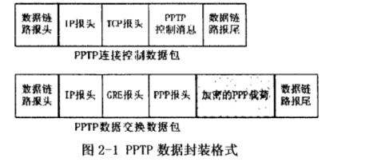
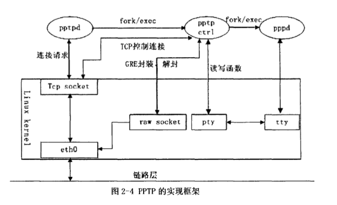

### vpn的一个总结
之前一段时间一直在看vpn相关的东西，这里做一个笔记，也不知道这个总结能够写多少。每次看到vpn的时候，一般都能看见这几个词。PPTP，L2TP，IPSec，MPLS。下面都会一一解释。

**相关的基础知识**
我们知道vpn的目的就是利用公共的网络来传输内部网络的信息。这里就有三个概念，这里有个**链接强力推荐[vpn技术概览](http://www.tongji.edu.cn/~yangdy/computer/vpn/paper1.htm)**

+ 传输协议：在公共的网络上传输数据的叫传输协议(和传输层的协议不是一个东西)
+ 隧道协议：**维基百科的定义**（英语：Tunneling Protocol）[1]是一种网络协议，在其中，使用一种网络协议，将另一个不同网络的协议，封装在负载部分。使用隧道的原因是在不兼容的网络上传输数据，或在不安全网络上提供一个安全的路径。隧道协议一般有第二层隧道协议和第三层隧道协议，这两者的区别就是用户的数据被封装在哪种数据包中在隧道中传输的。应该就是看乘客协议是在网络模型的哪层。
+ 用户数据包的格式叫乘客协议
 

### pptp
看到一篇论文《Linux下VPN安全网关实现技术研究》，以下基本出自论文中，写得很好，但是还有一部分我还是没看懂。
pptp是二层的隧道协议，是个C/S的协议，客户端为PAC（PPTP Access Concentrator，PAC），服务器为PNS（PPTP Network Server，PNS），PPTP的实现仅局限于PAC和PNS上，其他的客户或者主机不需要知道pptp的存在。PAC通过拨号与服务器端PNS建立隧道（Tunnel）。每一对PAC和PNS之间仅能够建立一个隧道，但是可一存在多个会话（Session）。会话就是PAC和PNS之间的PPP连接。每个会话的PPP数据包在PAC处被封装成以PNS为目的地址的PPTP数据报文。
PPTP包括两个并行的部分：控制连接和数据传输隧道。PPTP在PAC与PNS之间建立一个TCP连接来管理隧道和会话。这个TCP连接中传输的是PPTP的控制报文。PAC和PNS都可以作为控制连接的发起者。控制连接建立后，PAC和PNS可以通过发起外出呼叫请求或响应呼入请求来建立会话。PPTP指定了两种控制连接报文类型：控制报文和管理报文。管理保温目前还没有定义，已经定义的控制连接报文有15种，一功能分组有控制连接管理类、呼叫管理类、错误报告类、以及PPP会话控制类。

这里简要的分析一下控制连接以及会话的建立流程
1. 首先PAC发送Start-Control-Connection-Request报文等待PNS应答，报文中包含帧格式，信道类型，支持最大会话量
2. PNS接收到报文，发现没有冲突的后，响应Start-Control-Connection_Reply报文。报文中包含连接是否成功的信息，出错给出原因，成功给出帧格式，信道类型，PAC支持的最大PPP会话数量等信息。
3. 控制连接完成之后，建立会话。PAC发起需要三次握手：呼入请求（Incoming-Call-Request）、呼入应答（Incoming-Call-Reply）和呼入连接（Incoming-Call-Connected）。如果会话请求由PNS发起，那么就只有两个报文，呼出请求报文（Outgoing-Call-Request）和呼出应答报文（Outgoing-Call-Reply）报文。

pptp数据包的格式

这里的GRE报头和标准的GRE略有不同。具体可以查看论文。

然后在Linux系统下的实现架构为：

首先是pptp进程，它是监听在tcp的1723端口，如果有会话连接请求就fork出子进程，调用exec执行pptpctrl，完成连接的建立。然后pptpctrl就接受gre封装的数据包，去掉gre头，拿到ppp帧，然后通过pty写入。或者从pty中读取ppp枕，然后加上gre头，用raw socekt进行传输。

PPP协议是一个二层的协议，可以传输三层的IP协议等其他协议。但是除了封装以外，PPP还包括了一系列的协议，包括LCP(Link Control Protocol)，IPIP(Internet Protocol Control Protocol),CHAP等，用于协商连接参数、建立连接、用户认证等功能。而Linux实现将PPP分成用户空间运行的PPPD和内核的可加载驱动程序。pppd完成连接协商和建立连接，认证等功能。而内核部分完成低层的加密和封装PPP帧，然后在串口和内核网络协议栈或者是串口和pppd进程之间转发数据包。

**那么从上面的过程中我就有很多问题——pppd和ppp是什么关系？为什么在pptpctrl和pppd之间传送的数据要经过pty和tty之间来转换？难道用管道在进程中传递数据不行吗？还有就是在pptp vpn运行的时候ifconfig 可以看到一个ppp0的网络接口，这个数据是流向pppd？/dev/ppp是pppd和ppp kernel 交换数据的接口吗？**

其实从上面的架构中我们可以猜测一二，这个vpn肯定在一个工作循环中就是从原始套接口接收数据，去掉gre头部，得到ppp帧写入pty主设备，然后pppd从从设备中获取到数据，然后和ppp内核交互，由内核解除其中的数据部分（一般是IP数据包），然后交由TCP/IP协议栈处理，这样上层的应用程序就能获取到数据了。上层的应用程序写数据的过程就是相反的过程，当然这个全都是猜测。

这是查找到的资料。设备文件/dev/ppp。通过read系统调用，pppd可以读取PPP协议处理模块的数据包，当然，PPP协议处理模块只会把应该由pppd处理的数据包发给pppd。通过write系统调用，pppd可以把要发送的数据包传递给PPP协议处理模块。通过ioctrl系统调用，pppd可以设置PPP协议的参数，可以建立/关闭连接。

