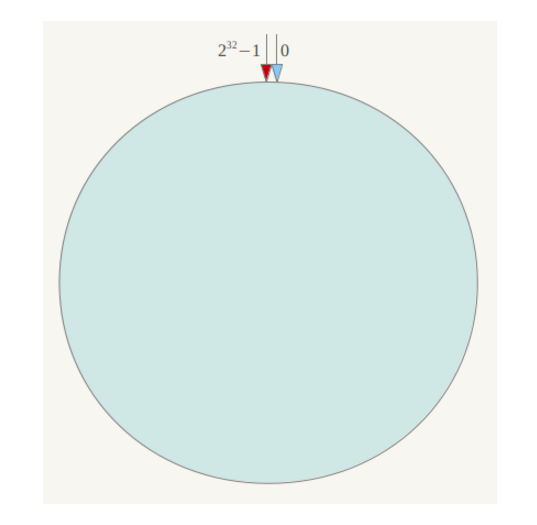
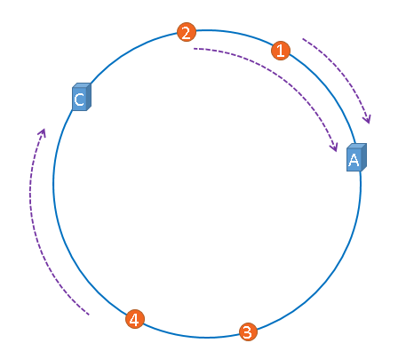

一致性哈希（consistent hashing）算法由于一些优良的特性，广泛地被应用到分布式缓存系统的设计中。对一致性哈希实现有很多的版本，比较有名的是Ketama算法。

###普通hash的问题
假设我们需要提供一个图片缓存服务，手里有三台服务器，标号为0, 1, 2。那么为了充分利用三台服务器的资源，一个很自然的想法就是通过文件名字计算hash值，然后对结果取余（肯定不会将图片随机存到这三台服务器上，这样对于查找图片的工作量很大，必须遍历每台服务器）。这样能够将需要缓存的图片均匀地分散到三台服务器上。如果需要查找文件，只需要计算该文件对应的服务器的标号，在该目标服务器上查找该文件。

如果这个时候需要增加服务器分摊三台服务器的压力，那么服务器数量是4，那么计算公式就会变为hash(test.jpg) % 4，这样就会使得大量的缓存失效，给后面的服务器带来很大的压力。

一致性hash算法能够很好地解决上面的问题。

###算法过程
简单来说，一致性哈希将整个哈希值空间组织成一个虚拟的圆环，例如假设哈希函数H的值空间为$0～2^{31}-1$

0点在正上方，顺时针方向依次为1, 2, 3。

接下来确定服务器在圆环上的位置。可以利用`hash(服务器IP或者名字) % 2 ^32`来确定在圆环上的位置。通过这个方法，能够计算A，B，C三台服务器在圆环上的示意图为：

其次计算图片在圆环上的位置，同样是利用`hash(图片名字) % 2^32`进行映射。映射之后，图片用橘黄色表示。

最后从图片的位置出发，沿着顺时针方向遇到的第一个服务器作为存储该图片的服务器。1，2号图片存储在A上，3号图片存储在B上，4号图片存储在C上。

###算法优点

如果这个时候B发生了故障，需要移出。那么将B从hash环上删除。

这样图片3将会存储到服务器C。因此对于图片3的第一次读取操作会失效，而其他的图片的访问都会正常进行。

所以一致性哈希在服务器数量发生改变时只会令部分缓存失效。

###hash环的偏斜

在下面的情况中三台服务器没有被合理的平均的充分利用，缓存分布极度不均匀。这种情况称为hash环的偏斜。如何解决这样的问题呢？一致性hash算法中使用的虚拟节点能够很好地解决上面的问题。

虚拟节点是实际物理服务器的复制品，一个实际节点可以对应多个虚拟节点。从下面的图中可以看出，A，B，C分别多出了一个虚拟结点。具体做法可以在服务器ip或主机名的后面增加编号来实现。例如A的名字副本可以A#1,A#2然后利用这个名字计算hash值。

内容来自

[白话解析:一致性哈希算法 consistent hashing](http://www.zsythink.net/archives/1182)

[一致性哈希算法原理](https://www.cnblogs.com/lpfuture/p/5796398.html)