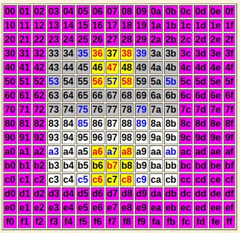

### 中国象棋通用引擎协议
中国象棋通用引擎协议（Universal Chinese Chess Protocol，简称UCCI），因该是为了不同象棋软件之间进行对弈用的。引擎部分都是编译成可执行文件，然后通过标准输入输出来进行交互的。


```
ucci 启动引擎之后第一个命令，执行之后引擎会进行初始化，输出一堆信息和ucciok

```

接下来介绍象棋程序的每一个部分，每个部分都会用一个开源的象棋引擎的例子eleeye来说明，主要包括以下模块：

+ 走法生成
+ 搜索
+ 局势评估
### 走法生成
走法生成其实就是象棋规则的体现，马走日，象飞田等等规则。我们知道一个棋类的游戏主要是两个部分，局势评估和搜索。而在象棋搜索中，计算量最大的就是走法的生成，因为象棋相对于其他的棋类规则要更复杂。因此一个高效的走发生成的方法能够提高程序不少的运行速度。

在eleeye中这个设计有很多的可以借鉴的地方。（吐槽一下，代码确实还不错，就是变量的命名看着不是很习惯）

####棋盘表示
首先先从棋盘的设计上来看。象棋的棋盘大家应该都不陌生9 * 10的大小。一开始的时候大家第一个想到的肯定就是设计一个9 * 10的数组，这么设计一个很明显的好处就是很直观。但是这么做在走法生成的就要频繁判断这个点有没有出边界了。

eleeye采用的是下图所示的方式。



整个数组的大小是256 = 16*16 的一维数组，水平向右是x正方向，竖直向下是y的正方向，灰色区域都是棋盘区域，紫色的都是边界区域。那在走子的时候还是需要判断边界，它是采用一个**位棋盘（这个位的概念很重要，它也可以用在棋盘上，也可一用在行列上，只要抓住下面的这个思想，关心的条件满足就填1，不关心的条件就填0）**的思想。位棋盘描述的是“哪些格子上面符合____（需要填写）的条件”，例如哪些格子是棋盘的正常区域，哪些是棋盘的王宫区域，哪些是象能够走的区域。在满足条件时候该位代表的格子填充1，否则填充0。举个例子就明白了，cbcInBoard这个数组它的大小和棋盘数组是一样大的，如果要判断一个坐标`0<= dst <=255`是否在棋盘区域内，只要看`cbcInBoard[dst]`的返回值就能知道，不需要过多的条件判断。

```
const bool cbcInBoard[256] = {
  0, 0, 0, 0, 0, 0, 0, 0, 0, 0, 0, 0, 0, 0, 0, 0,
  0, 0, 0, 0, 0, 0, 0, 0, 0, 0, 0, 0, 0, 0, 0, 0,
  0, 0, 0, 0, 0, 0, 0, 0, 0, 0, 0, 0, 0, 0, 0, 0,
  0, 0, 0, 1, 1, 1, 1, 1, 1, 1, 1, 1, 0, 0, 0, 0,
  0, 0, 0, 1, 1, 1, 1, 1, 1, 1, 1, 1, 0, 0, 0, 0,
  0, 0, 0, 1, 1, 1, 1, 1, 1, 1, 1, 1, 0, 0, 0, 0,
  0, 0, 0, 1, 1, 1, 1, 1, 1, 1, 1, 1, 0, 0, 0, 0,
  0, 0, 0, 1, 1, 1, 1, 1, 1, 1, 1, 1, 0, 0, 0, 0,
  0, 0, 0, 1, 1, 1, 1, 1, 1, 1, 1, 1, 0, 0, 0, 0,
  0, 0, 0, 1, 1, 1, 1, 1, 1, 1, 1, 1, 0, 0, 0, 0,
  0, 0, 0, 1, 1, 1, 1, 1, 1, 1, 1, 1, 0, 0, 0, 0,
  0, 0, 0, 1, 1, 1, 1, 1, 1, 1, 1, 1, 0, 0, 0, 0,
  0, 0, 0, 1, 1, 1, 1, 1, 1, 1, 1, 1, 0, 0, 0, 0,
  0, 0, 0, 0, 0, 0, 0, 0, 0, 0, 0, 0, 0, 0, 0, 0,
  0, 0, 0, 0, 0, 0, 0, 0, 0, 0, 0, 0, 0, 0, 0, 0,
  0, 0, 0, 0, 0, 0, 0, 0, 0, 0, 0, 0, 0, 0, 0, 0
};
```
还有，为什么需要用16 * 16的棋盘呢？这个设计也很有技巧，大家仔细看16进制的值就能很明显地看出来。如果知道一个坐标dst，通过`dst & 0x0f`获取列坐标（x坐标），通过`dst >> 4`获取行坐标（y坐标），这样在编码的过程中就省了很多事情，在程序的效率上也有一定的提高。

####走子

走子因为不同的子有不同的规则，存在一定的差异。但是总的来说eleeye使用了两种走子的策略。

**非车炮类**
非车炮类的走子较为简单，可以采用通用的一个模板，拿马来说，下面是马能够移动的8个偏移的方向，马的终点坐标是`dst = src + cnKnightMoveTab[i]`。但是问题还没有这么简单，由于还有马腿的存在，并不是8个方向都能移动。

```
static const int cnKnightMoveTab[8]  = {-0x21, -0x1f, -0x12, -0x0e, +0x0e, +0x12, +0x1f, +0x21};
```
这个又该怎么解决呢？因为马腿的位置是随着马需要行走的方向不同而变化的。

eleeye的策略是采用空间换取时间的准则。通过预处理的方式，在程序开始运行的时候就产生走子需要的所有信息，在真正走子的时候只需要直接取出这些信息，或者结合棋盘进行一个简单的判断。下面是进行预处理的关键的数据结构。

```
extern struct PreGenStruct {
  // Zobrist键值表，分Zobrist键值和Zobrist校验锁两部分
  ZobristStruct zobrPlayer;
  ZobristStruct zobrTable[14][256];

  uint16_t wBitRankMask[256]; // 每个格子的位行的屏蔽位
  uint16_t wBitFileMask[256]; // 每个格子的位列的屏蔽位

  /* 借助“位行”和“位列”生成车炮着法和判断车炮着法合理性的预置数组
   *
   * “位行”和“位列”技术是ElephantEye的核心技术，用来处理车和炮的着法生成、将军判断和局面分析。
   * 以初始局面红方右边的炮在该列的行动为例，首先必须知道该列的“位列”，即"1010000101b"，
   * ElephantEye有两种预置数组，即"...MoveTab"和"...MaskTab"，用法分别是：
   * 一、如果要知道该子向前吃子的目标格(起始格是2，目标格是9)，那么希望查表就能知道这个格子，
   * 　　预先生成一个数组"FileMoveTab_CannonCap[10][1024]"，使得"FileMoveTab_CannonCap[2][1010000101b] == 9"就可以了。
   * 二、如果要判断该子能否吃到目标格(同样以起始格是2，目标格是9为例)，那么需要知道目标格的位列，即"0000000001b"，
   * 　　只要把"...MoveTab"的格子以“屏蔽位”的形式重新记作数组"...MaskTab"就可以了，用“与”操作来判断能否吃到目标格，
   * 　　通常一个"...MaskTab"单元会包括多个屏蔽位，判断能否吃到同行或同列的某个格子时，只需要做一次判断就可以了。
   */
  SlideMoveStruct smvRankMoveTab[9][512];   // 36,864 字节
  SlideMoveStruct smvFileMoveTab[10][1024]; // 81,920 字节
  SlideMaskStruct smsRankMaskTab[9][512];   // 36,864 字节
  SlideMaskStruct smsFileMaskTab[10][1024]; // 81,920 字节
                                            // 共计:  237,568 字节

  /* 其余棋子(不适合用“位行”和“位列”)的着法预生成数组
   *
   * 这部分数组是真正意义上的“着法预生成”数组，可以根据某个棋子的起始格直接查数组，得到所有的目标格。
   * 使用数组时，可以根据起始格来确定一个指针"g_...Moves[Square]"，这个指针指向一系列目标格，以0结束。
   * 为了对齐地址，数组[256][n]中n总是4的倍数，而且必须大于n(因为数组包括了结束标识符0)，除了象眼和马腿数组。
   */
  uint8_t ucsqKingMoves[256][8];
  uint8_t ucsqAdvisorMoves[256][8];
  uint8_t ucsqBishopMoves[256][8];
  uint8_t ucsqBishopPins[256][4];
  uint8_t ucsqKnightMoves[256][12];
  uint8_t ucsqKnightPins[256][8];
  uint8_t ucsqPawnMoves[2][256][4];
} PreGen;
```
我们先看和马相关的两个数据结构，下面是截取的这个数据结构更新的代码

```
  // 生成马的着法预生成数组，包括马腿数组
n = 0;//表示符合规则的走发个数
for (i = 0; i < 8; i ++) {
     sqDst = sqSrc + cnKnightMoveTab[i];
     if (IN_BOARD(sqDst)) {
         PreGen.ucsqKnightMoves[sqSrc][n] = sqDst;
         PreGen.ucsqKnightPins[sqSrc][n] = KNIGHT_PIN(sqSrc, sqDst);//通过马的开始地址和目地址算出该走法马腿的位置
         n ++;
     }
}
__ASSERT(n <= 8);
PreGen.ucsqKnightMoves[sqSrc][n] = 0;
```
经过这样的预处理之后，只需要已知马在棋盘上的位置`0 <= src <= 255`，就能够ucsqKnightMoves数组知道该位置有几种可能的走法，然后结合具体棋盘的排部（目标位置是否是己方棋子，马腿上是否有棋子）这样几乎不用计算，通过“查表”的方式就能知道真正的走法了。


**车炮类**

由于车炮的活动范围和局面密切相关，因此车炮类的棋子的走法不能和之前的设计一样。在eleeye中使用的是预置数组。。。


`SlideMoveStruct smvRankMoveTab[9][512]` 9就代表的是棋盘横向的9个开始的位置，然后512 = 2^9，这表示这9个位置上分为有子和没子（我们只关心有子还是没子，这个对车炮的走法影响是最大的。而这些棋子是否是己方的棋子可以放在生成走法时候进行判断）所以这行最多的排部情况是512种，下面是这个结构体记录的信息。直接可以通过开始的位置,和现在棋盘的位分布，来知道吃子和不吃子的位置信息。至于这个SlideMaskStruct，恕我没看懂。

```
/*
* 假设这是棋盘的行位，1表示有子，0表示没子，r表示的就是车所在的位置，101r00111，通过这个行位，就能判断出车最多能够向左走一格，向右走三格，只需要遍历车在行的9个位置，每个位置去生成2^9的不同的行位就能生成车在行上的所有情况了
*/

struct SlideMoveStruct {
  uint8_t ucNonCap[2];    // 不吃子能走到的最大一格/最小一格
  uint8_t ucRookCap[2];   // 车吃子能走到的最大一格/最小一格
  uint8_t ucCannonCap[2]; // 炮吃子能走到的最大一格/最小一格
  uint8_t ucSuperCap[2];  // 超级炮(隔两子吃子)能走到的最大一格/最小一格
}; // smv


// 借助“位行”和“位列”判断车炮着法合理性的预置结构
struct SlideMaskStruct {
  uint16_t wNonCap, wRookCap, wCannonCap, wSuperCap;
}; // sms
```


**内容出处**
1. [中国象棋通用引擎协议](https://www.xqbase.com/protocol/cchess_ucci.htm)


