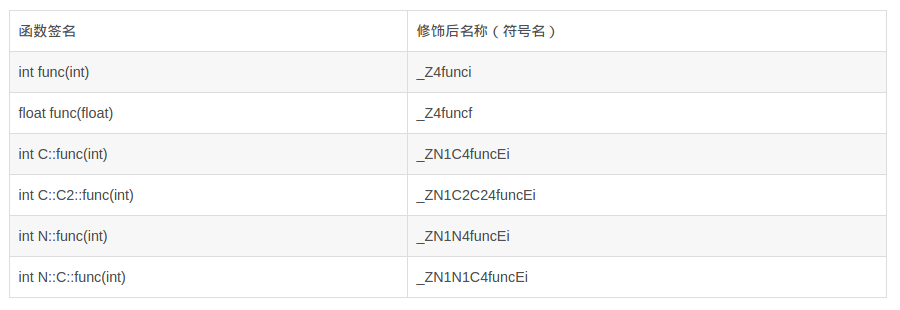
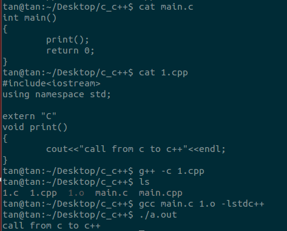

###C++符号修饰
强大而又复杂的C++拥有类，继承，虚机制，重载，名称空间等特性，他们使得编译器对符号的管理更为复杂。举个例子，拥有两个相同名字的函数func(int)和func(double)，尽管函数名字相同，但是参数列表不同，这是C\+\+的函数重载。那么编译器和链接器在链接过程中如何区分这两个函数呢？为了解决上面的问题，人们提出了符号修饰（Name Decoration）机制。


先看下面的6个不同的func函数

```
int func(int);
float func(float);
class C {
	int func(int);
	class C2 {
		int func(int);
	};
};
namespace N {
	int func(int);
	class C {
		int func(int);
	};
}

```

这六个func函数只是它们的返回类型和参数以及所在的名称空间不同。**我们定一个函数的签名包括函数名，参数类型，所在的类和名称空间以及其他信息**。函数的签名就是用于表示不同的函数。这个时候编译器就不能像对C语言一样直接将函数名字直接变成符号名（其实可能会加上下划线，具体不一定），而是将函数和变量的名字进行修饰，形成符号名。

下面的图是上面6个函数的签名和对应的修饰之后的名字



>这个名字我在我的ubuntu系统下测试，先用g++ -c test.cpp生成test.o文件，再用nm命令查看test.o符号名称发现是空。然后对函数加上空的函数体，只是出现了三个符号名称，没有出现6个，不知是什么缘故。


签名和名称修饰机制不光被使用到函数上，C++中的全局变量和静态变量也有同样的机制。

###extern "C"
从上面的分析过程中不难发现C和C\+\+并没有本质的区别，就是因为编译器对符号的修饰，然后C和C\+\+之间的函数调用出现了障碍，造成找不到函数的问题。为了解决这个问题，c\+\+提供了一个语法，extern "C"，这个关键字可以使语句可以按照类C的编译和连接规约来编译和连接，而不是C++的编译的连接规约。通过这样的方式，只要将被调用的函数声明为extern "C"。

举个使用C语言调用C++的例子



main.c是一个c语言的main函数，里面调用了一个print的函数，这个函数是用c++语言在1.cpp中实现的。首先将1.cpp编译成目标文件，然后用gcc将main.c和1.o编译链接成可执行文件a.out。最后可以看到成功执行的效果。gcc使用-l是表示c语言不会自动加入链接c\+\+标准库


内容来自

[符号修饰与函数签名](https://blog.csdn.net/weiwangchao_/article/details/7165467)