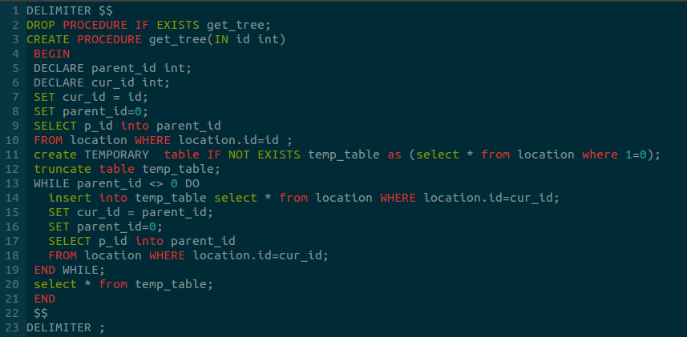

我们经常会遇到这样的需求，填写地址时地址是分级的。例如辽宁省，大连市，金州区。而需要进行的查询包括查询所有的省，查询某个省下辖的市，以及如何在另外一个表格中存储地理位置信息。

为此，一个常见的设计方法是设计一个location表，包括下面几个字段。id和p_id意思很明白，用来保存上级关系。name就是该id对应的名字。class_type为该id对应的位置等级，用来满足查询某个级别所有地址的需求。
```
mysql> desc location;
+------------+--------------+------+-----+---------+----------------+
| Field      | Type         | Null | Key | Default | Extra          |
+------------+--------------+------+-----+---------+----------------+
| id         | int(10)      | NO   | PRI | NULL    | auto_increment |
| p_id       | int(10)      | NO   | MUL | 0       |                |
| name       | varchar(128) | NO   |     |         |                |
| class_type | tinyint(1)   | NO   | MUL | 2       |                |
+------------+--------------+------+-----+---------+----------------+

```

给出location表里的样例数据就能明白了：

```
+------+------+-----------+------------+
| id   | p_id | name      | class_type |
+------+------+-----------+------------+
| 2079 |  245 | 金州区    |          3 |
|  245 |   18 | 大连      |          2 |
|   18 |    1 | 辽宁      |          1 |
+------+------+-----------+------------+
```

**怎么在别的表中存储这种位置信息？**

这个问题其实很好回答，直接存储低级位置的id，这样低级位置能够通过p_id一直向上找到所有的地址。

但是写sql时就会遇到麻烦，怎样使用sql查询所有的父级地址。在mysql中没有向oracle数据库一样提供这样的层次查询的功能，解决的思路有：

1. 如果层次固定就是3级地址，那么可以使用location表连接查询:
```
select xxx
from location l1 left join location l2 on l1.pid = l2.id left join l3 on l2.p_id = l3.id
where l1.id = xxx
```

2. 如果id是有序的。id有序意思是每条记录的p_id都比id要小。这样的假设是完全合理的，因为记录之间有父子关系，父记录本来就应该在子记录之前创建。这条SQL可能理解起来很费力。先要理解SQL的执行流程，SQL语句首先执行的肯定是from，然后是where条件对数据行进行筛选，最后使用select将需要的数据列选取出来。对于下面的SQL。最首先执行的是(select * from location order by id desc，将原表按照id逆序排列)然后join一个只有一行一列的表(2079)，这个表的作用就是对pv赋值为2079。对from产生的表进行where条件的过滤，过滤条件当前是id=2097的，然后只有id=2097的记录被挑选出来，然后执行select，select中pv被赋值为245。然后继续使用id=245的where条件进行过滤
```
/* @表示用户自定义变量 */
select tmp.id, tmp.name, @pv:=tmp.p_id p_id
from  (select * from location order by id desc) tmp join
(select @pv:= 2079) t
where id=@pv
```

3. 使用存储过程，存储过程是编译存储在MySQL的服务器，有很多的好处。(上面的存储过程DELIMITER命令是设置MySQL客户端的语句结束符为`$$`，因为客户端默认是以分号为结束标志，这样导致存储过程的创建失败)


4. 使用好象是mysql 5.8的新特性。with recursive语句。

内容参考：

[How to do the Recursive SELECT query in MySQL?](https://stackoverflow.com/questions/16513418/how-to-do-the-recursive-select-query-in-mysql)