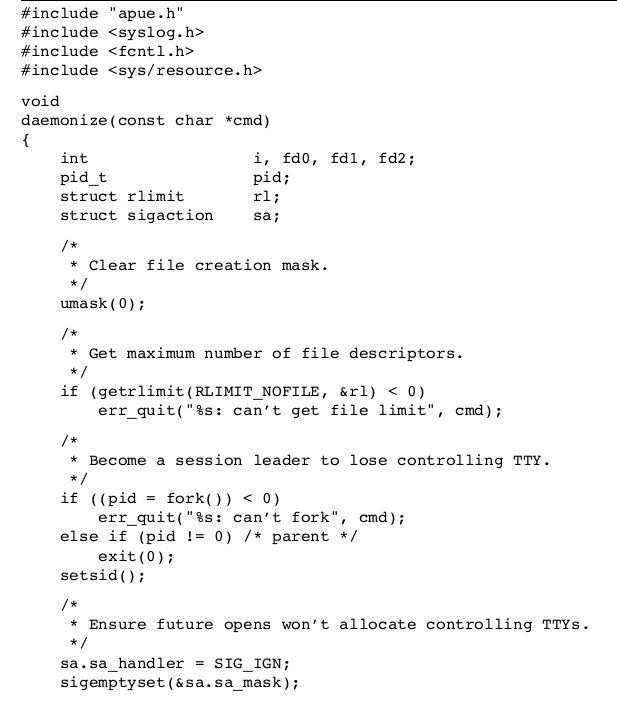
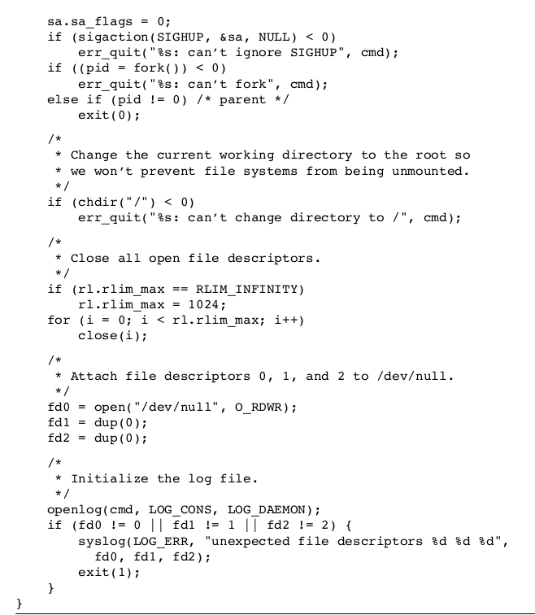

守护进程（daemon）是长期生存的一种进程。它们常常在系统引导装入时启动，仅在系统关闭时才终止。因为他们没有控制终端，所以他们是在后台运行的。UNIX系统有很多守护进程，例如：inetd（侦听系统网络接口），cron（在定期安排的日期和时间执行命令），init（负责启动各运行层次特定的系统服务）

###编写守护进程

1. 调用umask将文件屏蔽字设置为一个已知的值（通常是0）。因为从父进程继承而来的文件创建屏蔽字可能会被设置为某些拒绝权限。
2. 调用fork，然后使父进程exit。因为，第一，如果守护进程是shell启动的，那么父进程的终止会让shell认为这条命令已经执行完毕。第二，子进程和父进程有不同的进程ID，这保证了子进程不是一个进程组的组长进程。这个是调用setsid的先决条件。
3. 调用setsid创建一个新会话。这样使调用进程：a）成为新会话的首进程。b）成为新进程组的组长进程。c）没有控制终端
4. 将当前的工作目录设置为根目录。防止守护进程的当前工作目录在一个挂在的文件系统中，该文件系统就不能被卸载
5. 关闭不需要的文件描述符。这能够使得守护进程不再持有从父进程继承而来的任何文件描述符
6. 某些守护进程打开/dev/null使其具有文件描述符0，1，2，这样任何一个试图读取标准输入，写标准输出，或者标准错误的库例程都不会产生任何效果

除了上面的编程要求之外，守护进程通常遵循下面惯例：

+ 守护进程如果使用锁文件，那么该文件通常存储在/var/run目录中。锁文件的名字通常是name.pid，name是守护进程的名字
+ 守护进程支持配置选项，那么文件通常存放在/etc目录中。配置文件的名字通常是name.conf，name是守护进程的名字
+ 守护进程可以通过命令行启动，但通常他们是系统的初始化脚本之一（/etc/rc*或/etc/init.d/*）启动的。如果守护进程终止，因该自动地重新启动它，则我们可以在/etc/inittab中为该守护进程包括respawn记录项，这样init就将重新启动该守护进程
+ 为了让守护进程读取配置文件，可以为守护进程注册SIGHUP信号（我的理解是这样）

样例代码：

内容来自

《UNIX环境高级编程》