### 装机感想
周二实验室来了新电脑很开心，然后老电脑就可以扔掉了。新电脑刚开机发现是win10的系统，用不习惯。果断刷个win7的系统。开始装机。之前一直以为装机特别无脑，没什么新东西。后面刷机安装的时候安装了一下午也没有安装成功，老是提示no boot device，心里很是纳闷，明明系统已经写入到磁盘了，重启的时候也拔掉u盘，然后bios的启动方式也已经改了，重新尝试了两次之后，意识到了不是这个问题。于是本来是用老毛桃的安装方式的，然后改为从u盘安装，把系统的镜像用ultraiso写入u盘安装，win7发现还是不行，win10的话提示无法在gpt磁盘上安装系统，这个时候引起了我的注意。于是上网脑补了一波，忽然想起来原来的win10系统的引导方式是uefi，就对应gpt的分区表格式。而我改成了legacy的引导方式，那么磁盘的分区表应该设定成mbr。尝试之后安装成功。一看时间晚上10点，这一天的时间真是浪费了。


### ubuntu的fcitx框架的输入法快捷键
每次在ubuntu安装输入法是我最痛苦的事情，ubuntu的自带框架ibus，别人说什么的难用我还是能忍，不能忍的就是经常alt+tab切换程序的时候输入法就莫名奇妙的不能用了，得切两次切回来才能用。于是就安装了fcitx框架和googlepin，用着感觉能接受。就是快捷键设置各种bug啊，本来好用的快捷键，用着用着就不行了。而且坑的是快捷键设置的时候我比较喜欢ctrl+shift这个组合键，但是组合键输入设置的时候居然有按住两个之后先放哪个的问题，如果不按照设定的顺序放开，就不能激活输入法。还有这个框架的快捷键我也是醉了，也可能我英文不好看不太懂日了哈士奇Trigger input method,extra key for trigger input method 两个不应该是一个功能吗？我这里如果打开新窗口必须要用第一个，但是这个输入法被打开以后第二个也能用了。日了哈士奇

### 双系统调调整磁盘空间大小

问题描述：现在主机上有两个系统，一个是win 7另外一个是ubuntu。有两块硬盘，一块120G的固态硬盘，一块1T的机械硬盘。固态硬盘是windows的启动盘，然后ubuntu安装在机械硬盘上。但是由于刚开始时给ubuntu划分的磁盘空间太少了。导致/dev/sdb3（/home目录的挂载点，使用了60%）。

>/dev/sdb是硬盘设备，sdb3是硬盘设备的一个分区

现在的需求是能够让/home目录使用的空间增大。

有两个解决的方案：

+ 调整分区/dev/sdb3的大小。这是最直接的方式。但是由于这个地方涉及到另外一个系统管理的磁盘分区中获得空间，另外一个系统中也有一些重要的文件，没敢尝试
+ 重新挂载。可以调整机械硬盘中某个分区的大小，重新切割出一个大的分区，将这个分区挂载到/home目录。

第二种方法很简单。

首先启动win 7。然后使用分区工具，例如分区助手，调整某个盘的分区大小，F盘，划分出150G（这是无损调整）。然后在win 7系统删除新划分的盘（不删除应该也行）

然后将分区格式化。mkfs只是一个前端命令，它根据不同的文件系统格式调用不同的文件系统格式化命令。
```
#mkfs -t ext4 /dev/sdb8  格式化为ext4格式
```

接着将新分区挂载到某个目录，例如/mnt/home
```
#cd /mnt/
#mkdir home
#mount /dev/sdb8 /mnt/home  挂载到/mnt/home
```

最重要的一步是将原来/home目录的所有文件复制到/mnt/home这个挂载点，也就是/dev/sdb8这个分区里面。cp的-a选项是`-dR --preserve=all`选项的组合，意思是递归子文件夹，并且复制链接本身而不是被链接的文件。
```
#cp -a /home/* /mnt/home/  把home下的东西拷到挂载的目录下，备份
#umount /dev/sdb8
```

这时准备工作已经完成，更改系统的开机挂载配置文件，将/dev/sdb8这个设备挂载到/home这个挂载点。

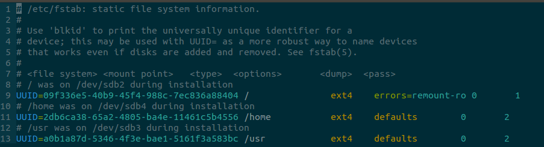

原来的/etc/fstab文件的内容。现在我们需要的就是将11行注释掉。添加下面的一行:

```
# UUID怎么来的，文件中的注释已经说得很清楚了，可以使用blkid查询出/dev/sdb8对应的UUID。第一个0是是否使用某个检查工具的，一般填0。第二个检查的顺序根目录填写1,其他的写2就行
UUID=56952f6c-3c9b-47a0-8316-f913972cd9f7 /home           ext4    defaults        0       2
```
最后开机启动，使用df命令查看文件系统的使用和挂载情就能看到效果了。

### 键盘

今天按住了键盘的fn+win（win上有一把锁图标） 估计就是把win键给锁住了，结果ubuntu下各种和win有关的快捷键都不能用了。解锁的办法很简单，也是fn + win。这个win是右边的win。

例如
```
ctrl + win + up 窗口最大化
ctrl + win + down 窗口最小
ctrl + win + d 显示桌面
win 长按 显示快捷键列表
```

### ubuntu配置solarized主题

先看看配置的效果，真的是有一种相见恨晚的感觉。之前的显示效果感觉弱爆了。

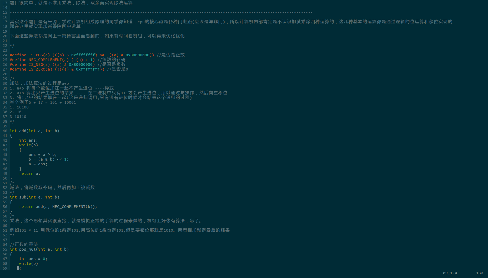


虽然看起来是美好的，但是配置的过程真的是很艰辛。为什么要选solarized，solarized不光是配色好看，而且包含的应用很全面。
接下来就讲讲配置过程中遇到的问题。

**修改vim**

就是新建一个~/.vim/colors的文件夹，然后在文件夹里面加入下载好的solarized.vim文件，最后更改~/.vimrc文件的配置。
```
syntax enable
set background=dark
colorscheme solarized
```
上面这个过程更改之后在ubuntu中依然会看见灰蒙蒙的一片，因为终端的配色还没有更改，接下来需要更改的是终端的配色。

**修改dircolors**
这个dircolor就是你使用ls的时候各种文件的配色，这个配色很关键，能够在你使用ls命令的时使用颜色帮你区分文件的类型。下面是进行这个配置的代码
```
git clone git://github.com/seebi/dircolors-solarized.git
cp ~/dircolors-solarized/dircolors.256dark ~/.dircolors
eval 'dircolors .dircolors'
echo 'export TERM=xterm-256color' >> .bashrc
这几行代码就要隆重介绍了
第一行克隆一个git的仓库
第二行从你的仓库中复制dircolors.256dark文件到用户的主目录，文件的名字为.dircolors。但是就不知道为什么，我瞬间脑袋瓜子抽风了，就觉得.dircolors是个文件夹，然后把dircolors.256dark文件放在了这个文件佳下，估计是受之前.vim文件夹的影响。
第三行是关键代码，先看里面的dircolors命令，这个命令是`dircolors [OPTION] ...[FILE]` man文档的解释是Output commands to set the LS_COLORS environment variable.就是通过读取后面接的配置文件产生设置LS_COLORS这个环境变量的命令。然后执行这些命令。其实第三行没有必要执行，如果执行只是能立即看到效果，假如你的文件名字不叫做.dircolors，那么开启的新的终端是不会受影响的。
第四行是想bashrc文件中追加echo产生的代码，设置终端的颜色是256色。
```

再说说上面的.dircolors文件为什么要叫.dircolors。直接看.bashrc文件包含的内容。看完之后就明白了为什么要叫做这个名字了，不叫这个名字会有怎么样的后果了
```
# enable color support of ls and also add handy aliases
if [ -x /usr/bin/dircolors ]; then #判断dircolors命令是否可执行
    #test 是测试这个文件是否存在，dircolors -b ~/.dircolors这个就是读取这个配置文件，以bash命令的形式打印出来，然后eval执行这个配置
    test -r ~/.dircolors && eval "$(dircolors -b ~/.dircolors)" || eval "$(dircolors -b)"
    alias ls='ls --color=auto'
    #alias dir='dir --color=auto'
    #alias vdir='vdir --color=auto'

    alias grep='grep --color=auto'
    alias fgrep='fgrep --color=auto'
    alias egrep='egrep --color=auto'
fi
```

**设置终端的配色**
终端配色可以在git上下载这个shell脚本去执行就行了
```
git clone git://github.com/sigurdga/gnome-terminal-colors-solarized.git
cd gnome-terminal-colors-solarized 
./set_dark.sh 或./set_light.sh
```

就这么点东西折腾了好久，其实关键的问题还在于，要玩转linux操作系统还得熟悉命令和shell脚本


###LaTex相关配置
首先理顺一下关系
1. TeX是一种语言，类似于java，c之间的计算机语言，是为了排版操作设计的
2. LaTeX是TeX的扩展，简单说就是TeX的命令太原始了，为了方便作者写作，Leslie Lamport给TeX语言加入了很多新的功能，这些他写的功能跟TeX加在一起被称为LaTeX
3. TeX Live是一个TeX发行版，它是一组程序的集合，主要作用就是将你写的TeX代码进行解析排版输出成PS或者pdf。“TeX发行版相对于TeX语言”大致可以理解为“C语言编译器(如GCC或Clang)相对于C语言”的关系
4. Tex Studio就是Tex的一个集成开发环境

在ubuntu的环境下按转Tex Live比较简单，一条命令`sudo apt install texlive-full`就行，但是不知道这个东西为什么这么大好几个G，


###Python环境配置
最近在做一个索尼职工离职预测的项目，综合考虑了之后决定使用python作为工具。在网上找了好久之后决定使用PyCharm这个IDE。下载了一个`pycharm-professional-2017.2.4.tar.gz`的文件。之后执行命令：
```
tar -xzvf pycharm-professional-2017.2.4.tar.gz
cd pycharm-2017.2.4/bin
./pycharm.sh
```
按照提示根据自己的需要配置安装就行。(需要注意的是安装完成之后解压的文件就是安装目录的一部分，不能删除)

基本的IDE安装完成之后，需要安装python科学计算的库numpy，scipy，pandas等单个安装比较麻烦，还可能有兼容性的问题。所以可以使用anaconda这样的发行版本，里面已经整合了一些常用的数据分析库。

anaconda的官网可能被墙了打不开，所以使用清华镜像就行`https://mirrors.tuna.tsinghua.edu.cn/anaconda/archive/`。下载完成之后只有一个文件，给这个Anaconda2-5.0.0-Linux-x86_64.sh一个执行权限，执行之后按照提示安装就行。

最后在PyCharm中设置File->Settings->Project Interpreter中设置anaconda自带的python解释器(anaconda的bin/python文件)。

最后就能愉快地使用这些库了


###Pycharm使用


调试常用快捷键：
+ shift + F9开始运行到断点
+ ctrl + F2调试结束
+ Alt + shift + F7进入自定义代码(不包括库函数)
+ F7进入函数调用(可能包括库函数)
+ F8运行到下一行，不进入函数
+ Alt + F9 运行到光标


###java的相关软件安装
下载安装包，ideaIU-2018.1.tar.gz，jdk-8u162-linux-x64.tar.gz， apache-maven-3.3.9-bin.tar.gz。

安装idea（激活的过程可以使用license server）：


1. sudo tar -xvf ~/Downloads/ideaIU-2018.1.tar.gz -C /opt。将安装文件解压到/opt目录。
2. cd /opt/idea-IU-181.4203.550/bin/。切换到bin目录
3. ./idea.sh。之后按照要求安装就行

安装jdk：

1. sudo tar -xvf ~/Downloads/jdk-8u162-linux-x64.tar.gz -C /opt。将安装文件解压到/opt目录。
2. 在~/.bashrc中加入下面几个环境变量，然后执行source ~/.bashrc
```
# install JAVA JDK
export JAVA_HOME=/opt/jdk1.8.0_162
export CLASSPATH=.:${JAVA_HOME}/lib
export PATH=${JAVA_HOME}/bin:$PATH
```
3. 执行java -version查看是否配置成功。

安装maven：

1. sudo tar -xvf ~/Downloads/apache-maven-3.3.9-bin.tar.gz -C /opt。将安装文件解压到/opt目录
2. sudo ln -s apache-maven-3.3.9/ maven。创建一个软链接，这个可做可不做，做了的好处是更新maven的版本时不需要更新~/.bashrc的环境变量的配置。
3. 在~/.bashrc中添加下面一个环境变量。
```
#install maven
export M_HOME=/opt/maven
export PATH=$M_HOME/bin:$PATH
```
4. 使用mvn -version测试是否安装成功

安装tomcat：

1. sudo tar -xvf ~/Downloads/apache-tomcat-8.5.29.tar.gz -C /opt。将安装文件解压到/opt目录
2. 进入opt目录，使用sudo chown -R tan:tan apache-tomcat-8.5.29。更改目录下所有文件的所有者和所在的组。因为用户需要更改该目录的某些目录的修改权限（不这么做在idea中将会认为tomcat的目录不合法）。

###使用IDEA建立一个简单的maven web项目
对于初学者来说这个还真不是个简单的过程。中间遇到了很多的问题。记录一下过程：

首先使用idea创建一个maven工程，勾选Create from archetype，然后选择选中的模板类型（在搜索的过程中别选错了，有两个叫webapp的）

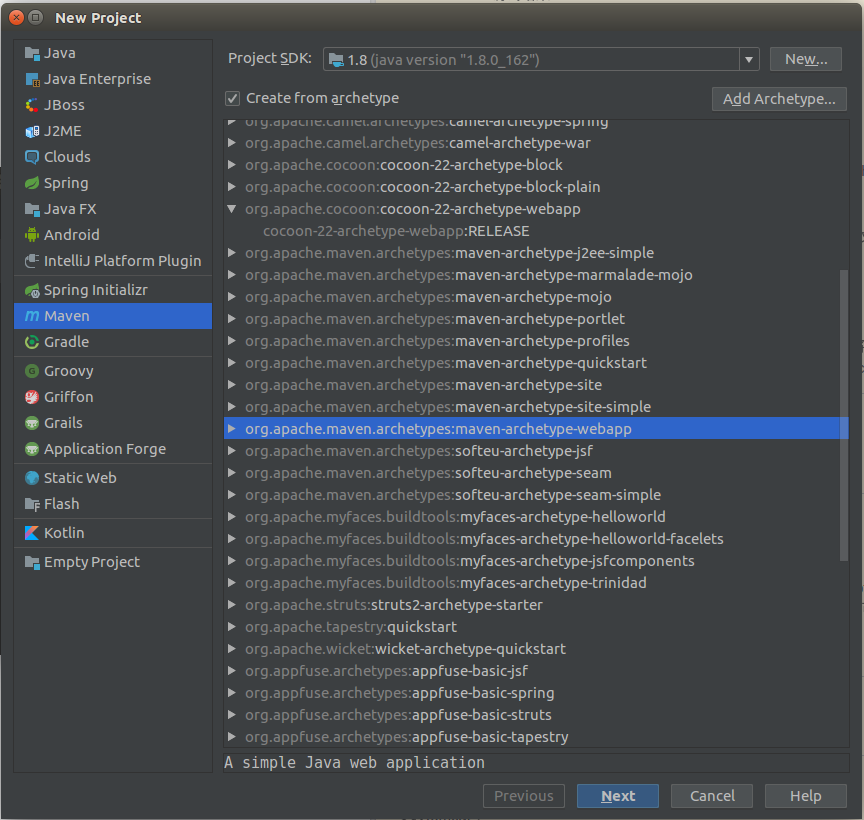

接下来输入groupid和artifactid。这两个应该可以随便写，这两个名字唯一确定一个maven项目。然后可能是为了别人引用的方便。

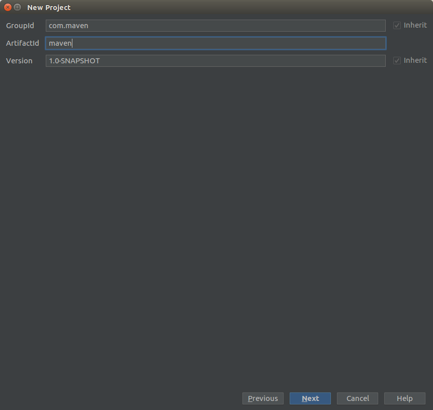

这个是配置maven，使用默认选项就行：

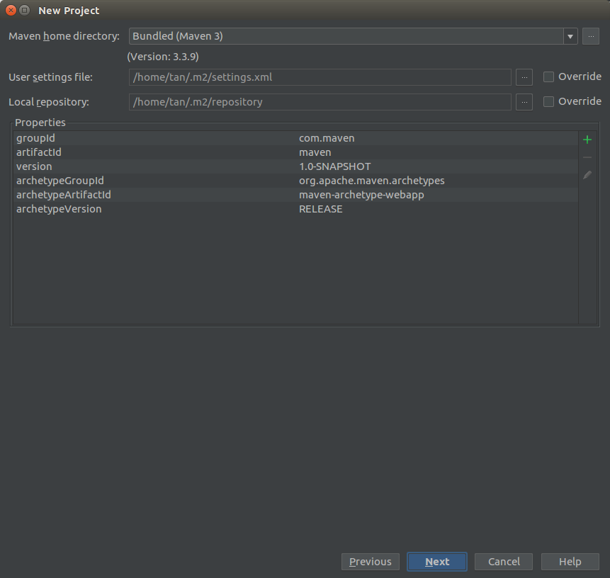

这个是给项目命名和给模块命名的，因为可能就是一个项目有多个模块。不想该名字，默认吧，点击finish完成。

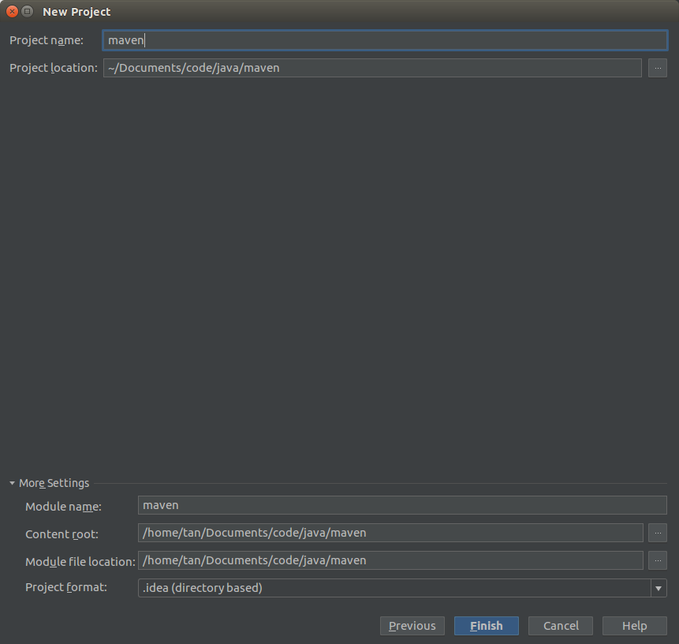

在新建项目的过程中，有一些jar包maven和模板maven需要下载导入，点击import changes：

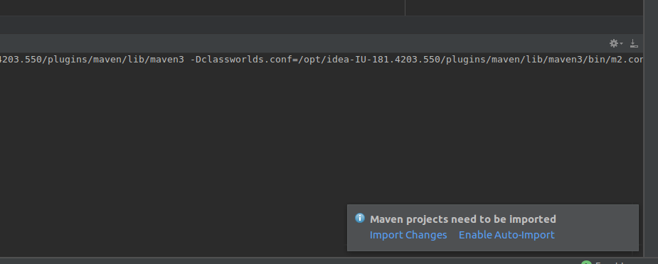

最后等待完成，生成了下面这个目录结构：


接下来需要点击，放大镜左边的重叠矩形，这是项目的配置：

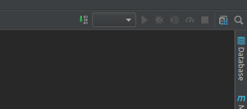

然后出现下面的窗口，选择facets。这个设置页面主要设置的是当前应用的上下文（就是访问localhost:8080后面开始的url），以及web.xml文件的位置。这块已经自动识别完成，不需要过多的更改。artifacts也是，如果出现了war exploded就不需要更改。

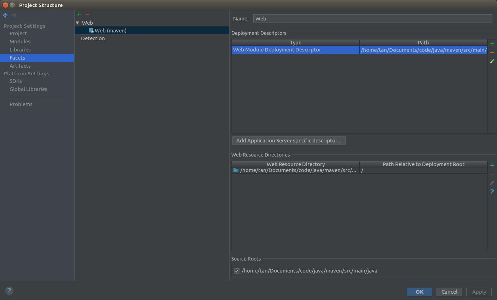

配置tomcat，需要点击下拉框，添加tomcat服务器，选择的是tomcat server，local。在server使用默认的选项就行。在deployment里面选择war exploded：

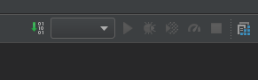

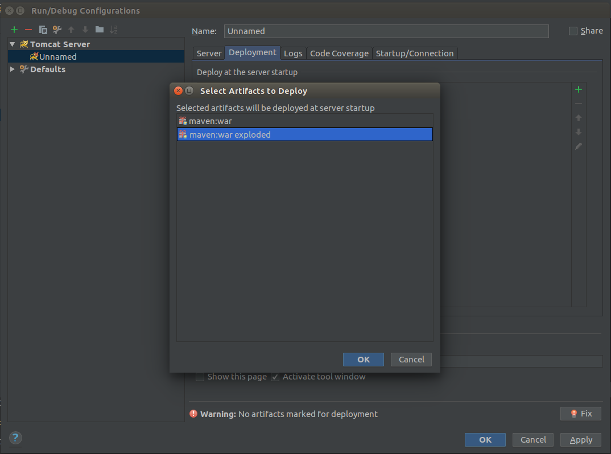

**编译的过程特别注意，如果使用idea直接进行build会出错。以前用idea编译java web项目都没有问题，不知道maven项目就开始抽风，所有的jsp文件居然不能被编译到target或者是out里面的输出，结果访问肯定是404,都没有这个index.jsp文件**

一个解决的办法是选择使用maven编译，选择mavenprojects，点击lifecycle里面的install。

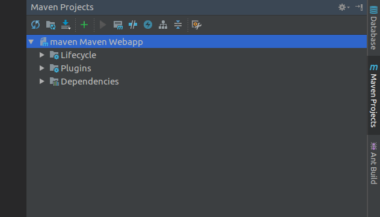

最后install的结果是：

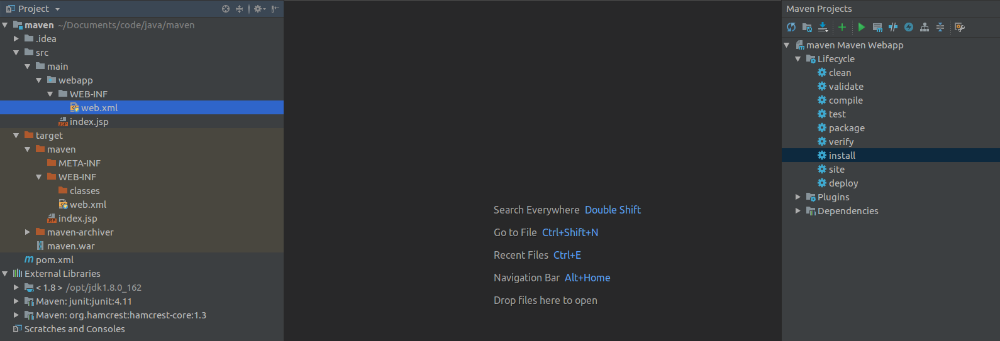

然后运行tomcat，就会开心地看到hello world的页面

###idea的maven web项目的bug
使用maven创建一个java web项目时经常会出现404的错误。很可能的一个原因是大家看看自己的编译输出的目录没有各种资源文件，例如spring的配置文件，页面jsp文件。这个时候需要选择project structure里面artifacts那项中指定WEB-INF目录中的输出还包括WEB-INF目录下面的所有文件。如果想要编译包含webapp下面的其他资源文件，将webapp目录标记成resource文件夹。


