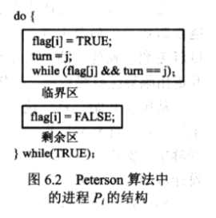
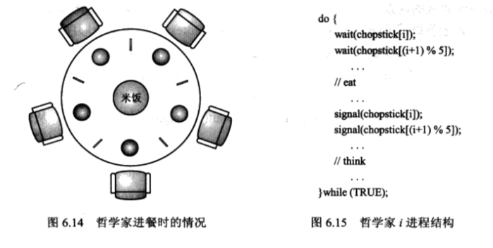

最近重新读了《操作系统概念--第七版》之后发现特别有感觉。这本教材不愧是经典著作。这里总结一下读过的知识，加入一些自己的一些看法。


###第六章进程同步

多个进程并发访问和操作同一数据且执行结果与访问发生的特定顺序有关，称为**竞争条件（race condition）**。为了避免竞争条件，需要确保一段时间内只有一个进程能够操作变量，这种保证要求一定形式的进程同步。

假设某个系统有n个进程，每个进程有一个代码段称为临界区（critical section），该区中进程可能改变共同变量，更新一个表，写一个文件等。而临界区问题就是设计一个进程协作的协议，保证没有两个进程能够同时在临界区执行。

+ 进入区（entry section）。实现请求进入临界区的代码
+ 退出区（exit entry）。实现退出临界区的代码
+ 剩余区（remainder section）。是进程剩下的其他代码


临界区问题的解答必须满足下面三项要求：

+ 互斥（mutual exclusion）。如果进程Pi在临界区执行，那么其他进程都不能在其临界区内执行。
+ 前进（progress）。如果没有进程在临界区执行，且有进程需要进入临界区。那些在退出区执行的代码参加选择下一个进入临界区的进程。
+ 有限等待（bounded waiting）：从一个进程作出进入临界区的请求，直到请求允许为止，其他进程进入临界区的次数有上限（这个要求举个例子，p1和p2两个进程，如果p1进入了临界区，p2等待进入，之后不管操作系统怎么调度（可能一直调度p1执行），需要保证p2不能永远等待。直白点就是公平性的问题）


我们知道操作系统为了管理和保护硬件资源，用户进程运行的状态有内核态和用户态。因此对于操作系统的内核也会有竞争条件。有两种方法处理这个问题：

+ 非抢占内核（nonpreemptive kernel）。非抢占内核不允许处于内核模式的进程被抢占，处于内核模式运行的进程会一直运行，直到它退出内核模式，阻塞或者自动退出CPU的控制。显然非抢占内核不会导致竞争条件，因为某个时刻只有一个进程处于内核模式。
+ 抢占内核（preemptive kernel）。对于抢占内核需要认真设计确保内核数据结构不会导致竞争条件。在SMP体系结构上，抢占内核更难设计，因为两个处于内核模式的进程可同时运行在不同处理器上。但是抢占内核适合实时编程，响应更快。


>调度程序决定什么时候停止一个进程的运行，以便其他进程能够得到执行的机会。这个强制挂起的动作叫做抢占（preemption）

####Peterson算法
这个算法不能保证在现代计算机体系结构上正确运行，但是这个算法设计出来一个满足互斥，前进，有限等待等要求的软件设计的复杂性。

Peterson算法适用于两个进程在临界区和剩余区交替执行。两个进程为P0和P1。为了方便，使用Pi和Pj表示两个不同的进程。Peterson算法需要在两个进程之间共享两个数据:
```
int turn; //表示哪个进程可以进入临界区。turn == i，表示Pi允许进入
bool flag[2];//表示两个进程哪个想要进入临界区。flag[i] == true表示Pi想要进入
```


算法的执行流程（图中是Pi的代码，Pj的代码也是对称的）：



上面的代码中，互斥条件是很显然的。如果两个进程同时执行进入区代码，turn只能被设置成一个值。假设turn为i，那么Pi可以进入临界区，而Pj满足while循环的所有条件执行while循环。当Pi执行退出区flag[i] = FALSE时，此时Pj的while条件不满足可以进入临界区。如果操作系统这是没有执行Pj进程，继续调度Pi执行。那么当Pi执行到turn = j时，它满足了while的所有条件，Pi不可能再次进入临界区。等操作系统调度Pj，Pj可以进入临界区(此时不满足turn == i这个while条件)。因此从上面的分析中，这个算法满足了前进和有限等待的要求。


####硬件同步

对于临界区问题，可以问题抽象为一个锁的解决方案，进入临界区请求锁，退出临界区释放锁。


但是我们肯定会有这样的问题，这个锁又是怎么实现的呢？锁的实现必须要保证是原子（不可中断）的。

+ 对于单处理器环境，这个实现借助硬件很简单。在修改共享变量之前禁止中断。由于其他指令不可能执行，所以共享变量不会被意外修改。这是非抢占内核的实现方式
+ 对于多处理器环境。禁止中断的方法是不可行的。在多处理器上要将消息传递给多个处理器，所以禁止中断很费时。而且如果系统时钟是通过中断更新的，这个方法影响了系统时钟。因此许多系统提供了特殊的硬件指令允许原子地检查和修改字的内容和交换两个字的内容。使用这些指令就能相对简单地解决临界区问题。


上图的例子假设TestAndSet指令是原子的，那么互斥的实现就能使用右图的一个方式。但是6.5没有解决临界区问题的有限等待问题。要解决这个问题，需要用到Peterson算法类似的思想，使用共享的数据结构：

```
bool waiting[n]; //初始为false
boo lock;//初始为false
```
加上下面的算法。有兴趣可以自己去书上详细看看详细分析，因此操作系统实现一个互斥锁的API并不是那么简单的事情:


####信号量

硬件同步中使用的同步方案太过复杂，解决这个困难，操作系统提供了一组已经实现好的简单接口，我们称为**信号量（semaphore）**的工具。

信号量S是个整数变量，除了初始化之外，只能通过两个原子操作访问：wait()和signal()。

wait和signal对S的操作可以简单想像为：


信号量的分类：

+ 二进制信号量。信号量的值只能是0或者1，很多系统称为互斥锁，他们可以提供互斥访问。
+ 计数信号量。计数信号量值域不受限制，通常初始化为可用资源的数量。进程需要资源对该信号量执行wait()，释放资源对该信号量使用signal()操作。当信号量计数为0,表示资源使用完。之后需要使用资源的进程阻塞，直到计数大于0。

前面介绍的信号量实现都是一直循环（忙等待）。当一个进程位于临界区内，任何其他试图进入的进程必须在其代码中连续循环（这种信号量就是**自旋锁（spinlock）**，自旋锁也有自己的有点，等待进程不进行上下文切换，上下文切换可能需要花费相当长的时间。如果锁的占有时间短，自旋锁还是非常高效的。在多处理器系统中，如果一个线程在一个处理器自旋，另外一个线程可以在另外一个处理器的临界区内执行）。为了解决这个浪费问题，可以在发现信号量的值不为正时将进程阻塞到这个信号量的队列上。


####经典的同步问题

#####有限缓冲问题
问题描述：缓冲区的大小为n。有生产者进程每次生产一个单位的产品放入缓冲区，消费者进程每次消费一个单位的产品移出缓冲区。缓冲区满不能生产，缓冲区空不能消费。

解决方案，信号量empty初始化为n，full初始化为0。信号量mutex提供对缓冲区的互斥访问要求。


#####读者-写者问题
问题描述：读者对资源的访问是共享的，写者对资源的访问是排它的。

其实根据写者的优先级，可以对问题进行细分。第一种情况是没有读者需要保持等待，除非已有一个写者已经获得资源（这种情况下写者会产生饥饿）。第二种情况是，如果写者就绪，那么写者会尽快执行写操作（这样会造成读者饥饿）。

对于第一种情况的解决方案：
```
semaphore mutex, wrt;//信号量mutex和wrt初始化为1。wrt为读者和写者共用，防止写写和读写的情况。mutex确保readcount更新时互斥。
int readcount;//初始化为0,表示正在读取的进程数量。
```


第二种情况的解决方案（相比上面就是增加了read信号量，和write_count）：

```
//writer
do
{
	wait(mutex1);
	++write_count;
	if (write_count == 1)
		wait(read);
	signal(mutex1);

	wait(wrt);
	//writing is performed
	signal(wrt);

	wait(mutex1);
	--write_count;
	if (write_count == 0)
		signal(read);
	signal(mutex1);
} while (1);


//reader
do
{
	wait(read);//个人认为这对wait(read)和signal(read)操作是阻塞reader增加read_count，位置只要在++read_count前就行
	wait(mutex2);
	signal(read);
	++read_count;
	if (read_count == 1)
		wait(wrt);
	signal(mutex2);

	//reading is performed

	wait(mutex2);
	--read_count;
	if (read_count == 0)
		signal(wrt);
	signal(mutex2);
} while (1);

```


#####哲学家就餐问题
问题描述：假设有5个哲学家，他们一生用来思考和吃饭。这些哲学家共用一个圆桌，每位都有一把椅子。在桌子的中央是一碗米饭，在桌子上放着5只筷子。哲学家感到饥饿会拿起筷子，每次只能从临近的位置上拿起筷子，每次只能拿起一只筷子。当一个哲学家有两只筷子他就能吃饭，吃完后他开始思考。

一个存在死锁的解决方案（如果每个哲学家都拿起左手的筷子）：



解决死锁的方法有很多：

1. 最多只让4个哲学家在餐桌上。（使用people信号量，初始值为4，在上面代码的前后加上wait(people)和signal(people)）
2. 只有两个筷子都可用才允许一个哲学家拿起来。
3. 使用非对称的方法，奇数号哲学家先拿起左边的筷子，偶数哲学家先拿起右边的筷子

####管程
对于书本上管程的理解就是管程保证了任何时刻只能有一个进程在管程内执行（某些高级语言如java，提供synchronized关键字保证函数只有一个进程执行）。这样对于进程的同步问题就有了一定的简化，可以将操作和数据进行封装。但是这种同步机制不能解决所有的问题。这就引出了**条件变量**。条件变量支持wait和signal操作，但是signal操作和信号量的signal不同。条件变量的signal在没有挂起进程时不起作用，而信号量的signal操作会增加信号量的值，从而影响信号量的状态。其实从本质上来说，条件变量，管程都是通过信号量实现的。


