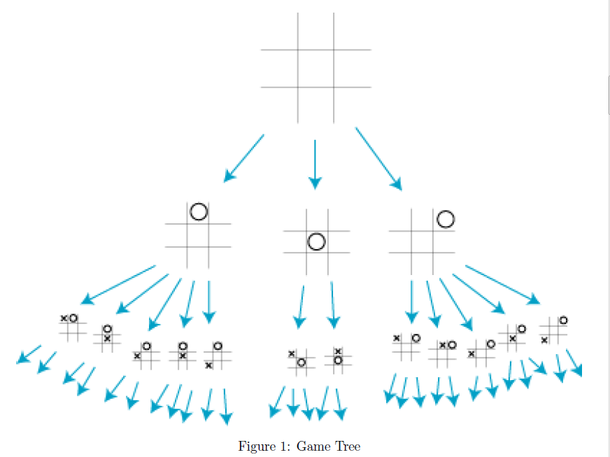
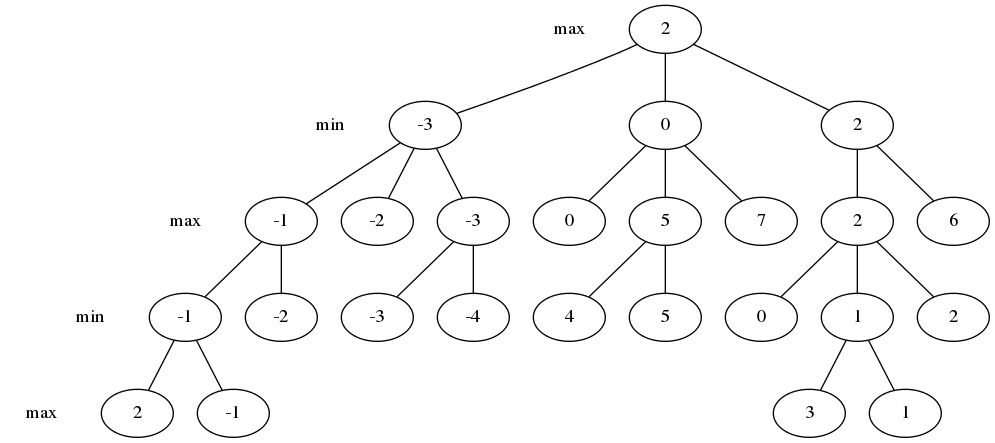
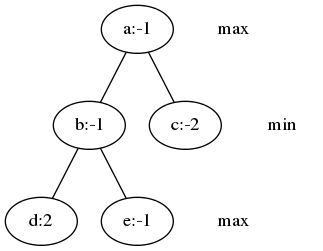
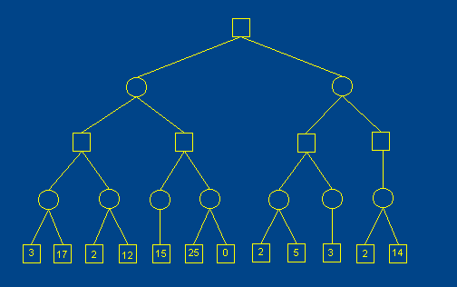
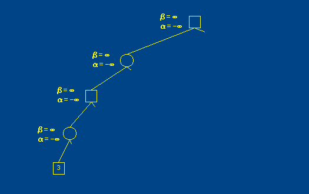
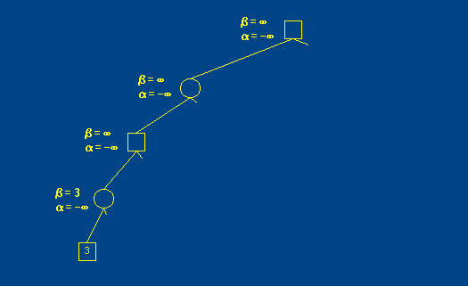
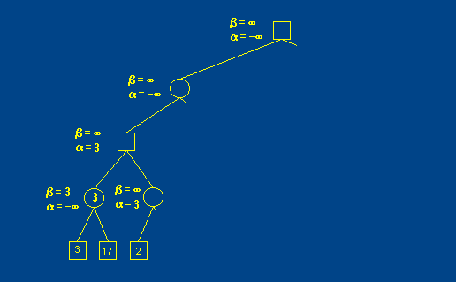
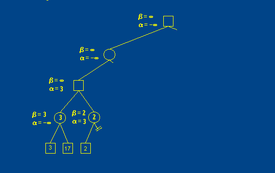

###基本概念

+ **分枝因子(branching factor)**：在树数据结构、博弈论领域中分枝因子是每个结点下的子结点数，即出度。如果各个结点分枝因子不同，则可以计算平均分枝因子。eg：在国际象棋中，如果把合法走法算作一个结点，那么平均分枝因子约为35，表示每走一步棋有大约35种合法走法。围棋分枝因子为250。
###棋类AI
要完成棋类的AI就必须要包括两个方面，一个是搜索，另一个就是局势判断。一个棋手比一般人下棋的长处在于棋手可以思索很多步数以后的棋（搜索的深度），有很好的大局观（局势判断）。因此，我认为只要这两个方面做得好，就一定能够超越人的。

###搜索树
对于棋类来说，下棋的过程可以展开为一棵有根的树（博弈树），一个结点代表一个局面，这个结点的子结点就是这个局面走一步能够到达的局面。下图是一个三子棋（Tic tac toe）的搜索树。




最后，我们假设搜索树是有限的，这样我们就不会遇到永无止境的棋局或者一步有无限多种着法的棋局。
搜索树中有三种类型的结点：

1. 偶数层的中间结点，代表棋手甲要走的局面；
2. 奇数层的中间结点，代表棋手乙要走的局面；
3. 叶子结点，代表棋局结束的局面，即棋手甲或棋手乙获胜，或者是和局。


###博弈树的评价
假设某个中间结点的所有子结点都是叶子结点，那么棋局会在一回合内结束。现在我们假设棋手会挑选最好的着法，如果有一个着法能使他赢下棋局，那么他一定会走这步。如果没有可以赢的着法，但是有取得和局的着法，那么他会走这步取得和局的着法。但是，如果所有的着法都使得对手获胜，那么无论如何他都会输。

因此在叶子结点的上一层结点，我们就能知道棋局的结果。现在我们知道了这个结点的结果，那么我们可以用同样的方法作推演，知道叶子结点的上两层结点的结果，然后是上三层结点，等等，直到我们达到搜索树的根结点。在每个结点上，棋手只要找到一个子结点能让他获胜，那么他就可以赢下棋局；他只要找到一个形成和局的子结点，棋局就和了；如果获胜与和局的子结点都没有，那么肯定是输的。如果我们有足够多的时间来计算，那么这就给了我们一个可以下棋的完美算法。但是对于任何常规的棋类游戏，我们都不可能有足够的计算时间，因为搜索树实在太大了。

另外，“正确”的评价函数只有三个值，赢、输或者和局。在实际的棋类程序中，我们通常使用一个更宽泛的实数来作评价值，就是因为赢、输或者和局是不确定的。如果棋手甲获胜的值用+1表示，和局的值用0表示，棋手乙获胜的值用-1表示，那么博弈树的每个中间结点的值就是子结点的最大值或最小值，这取决于棋手甲还是棋手乙着棋。


###最小最大搜索（Minimax Search）
在实战中，我们的搜索算法只能对博弈树展开一部分。我们用一些“中止规则”来决定搜索树展开到哪个结点就停下来，例如我们在8步变化以后听下来。由于棋局没有在叶子结点结束，我们只能用评价函数来猜哪一方获胜。现在我们来假设在我们展开的结点中，棋手甲总是希望棋局到达评价函数大的局面，而棋手乙总是希望棋局到达评价函数小的局面。


如果双方都用这种方法来下棋，那么我们可以使用同样的最小-最大过程，来确定到达的叶子结点的评价值，这个过程如下：对每个中间结点，计算子结点的最大值或最小值，这取决于是棋手甲还是棋手乙走棋。到达叶子结点的线路称为“主要变例”(Principal Variation)。最小-最大博弈树的基本原理，就是对博弈树作部分展开，去找主要变例，并走出变例中的第一步。


```
int Max(int depth) { // 甲方
　int best = -INFINITY;
　if (depth <= 0 || gameover()) { // 如果是叶子
　　return Evaluate();
　}
　GenerateLegalMoves();
　while (MovesLeft()) {
　　MakeNextMove();
　　val = Min(depth - 1); // 取子结点评分的最大值
　　UnmakeMove();
　　if (val > best) {
　　　best = val;
　　}
　}
　return best;
}

int Min(int depth) { // 乙方
　int best = INFINITY; // 注意这里不同
　if (depth <= 0 || gameover()) {
　　return Evaluate();
　}
　GenerateLegalMoves();
　while (MovesLeft()) {
　　MakeNextMove();
　　val = Max(depth - 1); // 取子结点评分的最小值
　　UnmakeMove();
　　if (val < best) { // 注意这里不同
　　　best = val;
　　}
　}
　return best;
}
```

下图给出的是最大最小搜索的结果图,它是一个5层的博弈树。根结点是max，接下来是min，依次交替（图中的分数是正的对max有利，负的对min有利）




###负值最大搜索（Negamax）

从之前的最小最大搜索的伪代码中可以看出，最小最大搜索的过程很类似，都是求最大最小值进行轮流交替。所以针对这个过程，可以做一个简单的变换，简化最小最大搜索算法。这个变换的核心就是对局面评分函数的一个修改。我们将“整数越大对甲越有利，正无穷大甲胜，负无穷大乙胜”修改为“整数越大对当前落子方越有利，正无穷大当前落子方胜利，整数越小对当前落子方越不利，负无穷大当前落子方败”。具体一点就是叶子结点的评分是根据当前的落子方进行打分的，整数表示对当前落子方有利，负数表示对当前落子方不利，然后所有非叶子结点的评分等于子结点评分相反数的最大值。再简单点说就是将乙落子的层数评分全都取反。这么做的原理也很简单，上层寻找走法的时候肯定是走它认为最好的，对上层局面是最好的，对下层局面就是最差的。因此，上层只需要对下层的所有结点的打分取反，取反之后找到最大的就一定是最好的。

可能这么说很抽象，举一个例子，拿出上面的最大最小搜索博弈树的左边这个部分，如下图所示



对于d，e两个局面，这是max层，也就是说选择下子的是max，2，-1的评分本来就是针对max进行评估的，所以这两个值是不用变。利用d，e两个子结点的评分，取相反数求最大值，求得b结点的得分是1（该得分是正数，这就说明这个局面对落子方min是有利的）。c结点的-2是针对max进行打分的，所以在负值最大搜索中，这个结点的分数应该是2。最后利用b，c两个结点求出a结点的得分为-1。表示这个局面对落子方max是不利的。利用负值最大搜索得出的博弈树应该是下图


用伪代码总结一下：

```
int NegaMax(int depth) {
　int best = -INFINITY;
　if (depth <= 0 || gameover()) {
　　return Evaluate();
　}
　GenerateLegalMoves();
　while (MovesLeft()) {
　　MakeNextMove();
　　val = -NegaMax(depth - 1); // 注意这里有个负号。
　　UnmakeMove();
　　if (val > best) {
　　　best = val;
　　}
　}
　return best;
}
```
这里还有一个问题，给出的伪代码中都只是给出了评分，并没有给出怎么找到最优的走法，这个其实很简单。直接给出伪代码
```
move rootSearch(int depth)
{
  int best = -INFINITY;
  move m;
　GenerateLegalMoves();
　while (MovesLeft()) {
　　MakeNextMove();
　　val = -NegaMax(depth - 1);
　　UnmakeMove();
　　if (val > best) {
      best = val;
      m = currentMove;
　　}
　}
　return m;
}
```

利用上面的算法，我实现了一个三字棋的console小程序，代码我的git上有。这个过程中发现了很多问题


第一个就是评估函数的选择，我的评估函数很简单（赢了10，平局0，输了-10，搜索的层数固定是3），但是没有考虑到可能层次不同带来的影响。
```
//点表示的是空白
oox
.x.
...
//对于这种局面，我们进行搜索，下图是搜索的一个局势
oox
xx.
...
//接着不管o下那个位置x还是能取得三子连城一线的局面，所以上图的评分是一个10分这个和下图评分10分是一模一样
oox
.x.
x..
//但是由于搜索的顺序是按照行的搜索，第二行的第一个位置是在第三行前面。所以程序默认选择了第一个多此一举的方法。
```
第二个问题是没有游戏结束进行判断（这个游戏结束可能是由三个子连城一线，或者被填满了），例如搜索层数5可能双方各下两个子，但是棋局没有这么多空的位置，这就导致搜索depth不为0，然后也没有从局面判断函数返回，返回了一个默认值。

然后还看到一个评估函数：f(p) = (将p中所有空格都放上MAX的棋子后，MAX三子成线的总数) — (将p中所有空格都放上MIN的棋子后，MIN三子成线的总数)这个函数也是有问题的，对于下面的这种局面的评分值是0，显然是不科学的。
```
oxx
xx.
ooo
```

###Alpha-Beta剪枝(Alpha-Beta Pruning)
主要思想是利用(alpha，beta)两个值维护一个窗口，这个窗口是对局面评分可能的范围进行的一个估计。在搜索这个结点a的子结点b时，会对alpha，beta进行更新，更新之后alpha >= beta，则停止对该结点的扩展(减枝，减枝的根据是满足这个条件时对这个结点进行扩展已经不能改变其父节点的值)，这样可以避免一些不必要的搜索。


上图是链接Minimax with alpha Beta Pruning中的一个例子，更多可以参考这个链接。图中的正方形是max结点，圆圈是min结点，这些值是min-max的打分。



上图就是算法初始的工作流程，从第一层max结点开始，初始的alpha和beta值是负无穷和正无穷，表示该结点的分值预期在这个范围内，即alpha<=score<=beta。它开始搜索第二层的第一个子结点，然后将父结点的打分值传递给子结点（道理很简单，父结点的分值是子结点中分值最大的，父结点在某个范围内，子结点肯定在某个范围内）。然后就这样搜索到第五层的叶子结点。由于第四层的是min结点，这时子结点有一个值3，那么我们就可以将beta的值更新为3，表示不管其他子结点是多少分，反正这个结点的分数是不会超过3的，更新之后的图如下：



继续搜索第四层min结点的其他子结点，得出另一个子结点的值是17，对beta值没有影响。此时第四层结点搜索完成，它的分值为3。返回到第三层的max结点，此时可以更新max结点的alpha=3，因为它有一个子结点的值为3。更新之后搜索max结点的另一个子结点。结果如下：



对第四层的右边的min结点，它的一个子结点的值为2，同理可以更新它的beta=2。此时发现这个结点的alpha>=beta那么这个结点没有继续搜索的必要了（因为如果选择这样的结点会影响父结点的分值——我觉得应该是如果选择了一个这样的结点，那么从这个结点，一个到根结点都是这个超限的值，然后中间肯定有一个结点会违背最小最大原理，这个不好怎么讲，意思就是例如图中被剪枝的第四层min结点分数是2，选择了这个结点，那么一个到根节点的路径上的所有结点分数肯定都是2，那么第三层的那个max结点就违背了最大最小原理），直接从第四层的min结点返回到第三层的max结点。这就是一个剪枝的过程。



用wiki中的伪代码总结一下上述过程
```
 function alphabeta(node, depth, α, β, maximizingPlayer)
      if depth = 0 or node is a terminal node
          return the heuristic value of node
      if maximizingPlayer
          v := -∞
          for each child of node
              v := max(v, alphabeta(child, depth – 1, α, β, FALSE))
              α := max(α, v)
              if β ≤ α
                  break (* β cut-off *)
          return v
      else
          v := +∞
          for each child of node
              v := min(v, alphabeta(child, depth – 1, α, β, TRUE))
              β := min(β, v)
              if β ≤ α
                  break (* α cut-off *)
          return v


(* Initial call *)
alphabeta(origin, depth, -∞, +∞, TRUE)
```
改成负值最大搜索形式也差不多，注意父结点是(α, β)子结点要变为(-β,-α)

```
 function negamax(node, depth, α, β, color)
     if depth = 0 or node is a terminal node
         return color * the heuristic value of node

     childNodes := GenerateMoves(node)
     childNodes := OrderMoves(childNodes)
     bestValue := −∞
     foreach child in childNodes
         v := −negamax(child, depth − 1, −β, −α, −color)
         bestValue := max( bestValue, v )
         α := max( α, v )
         if α ≥ β
             break
     return bestValue

```


###主要变例搜索（Principal Variation Search）

我们将Alpha-Beta搜索中的结点分为以下三类，并且任何结点都只属于这三类之一：
1. Alpha结点。每个着法搜索都会得到一个小于或等于Alpha的值。
2. Beta结点。至少一个着法会返回大于或等于Beta的值。
3. 主要变例结点(PV结点)。有一个或多个着法会返回大于或等于Alpha的值(即PV着法)，但是没有着法会返回大于或等于Beta的值

主要变例搜索的核心思想是：假设搜索对走法顺序进行了优化，使得第一个子结点是pv结点，剩下的结点比这个结点都差。那么发现了这个结点之后，在证明其他的结点都不如那个pv结点（证明的办法就是用窗口技术，使用了一个窗口(alpha,alpha + 1)，而不是准确的(alpha,beta)）。但是如果搜索之后无法给出证明，那么还会进行重新搜索。在这种情况下，相比alpha-beta搜索就会多出证明过程的时间。

证明中需要用到的知识，没看懂。假设“val = alpha_beta(depth,alpha,beta)”，这里val是一个局面的评分值，alpha_beta就是前面的剪枝搜索的函数,alpha,beta可以代表具体的常数。那么可以得出三个结论：

1. if alpha < val <　beta, then val = alpha_beta(depth,−∞,+∞)
2. if val <= alpha , then  alpha_beta(depth,−∞,+∞) <= alpha
3. if val >= beta, then val = alpha_beta(depth,−∞,+∞) >= beta

这是wiki中给出的伪代码
```
(* Negascout is also termed Principal Variation Search - hence - pvs *)

function pvs(node, depth, α, β, color)
    if node is a terminal node or depth = 0
        return color × the heuristic value of node
    for each child of node
        if child is first child
            score := -pvs(child, depth-1, -β, -α, -color)
        else
            score := -pvs(child, depth-1, -α-1, -α, -color)       (* search with a null window *)
            if α < score < β                                      (* if it failed high,
                score := -pvs(child, depth-1, -β, -score, -color)        do a full re-search *)
        α := max(α, score)
        if α ≥ β
            break                                            (* beta cut-off *)
    return α
```
**内容出处**

1. [象棋百科全书](https://www.xqbase.com/computer.htm)
2. [Negamax](https://en.wikipedia.org/wiki/Negamax)
3. [Tic Tac Toe: Understanding The Minimax Algorithm](http://neverstopbuilding.com/minimax)
4. [Minimax with alpha Beta Pruning](http://web.cs.ucla.edu/~rosen/161/notes/alphabeta.html)
5. 《从极大极小算法到主变例搜索》-孙锴
6. [Principal Variation Search](https://en.wikipedia.org/wiki/Principal_variation_search)


