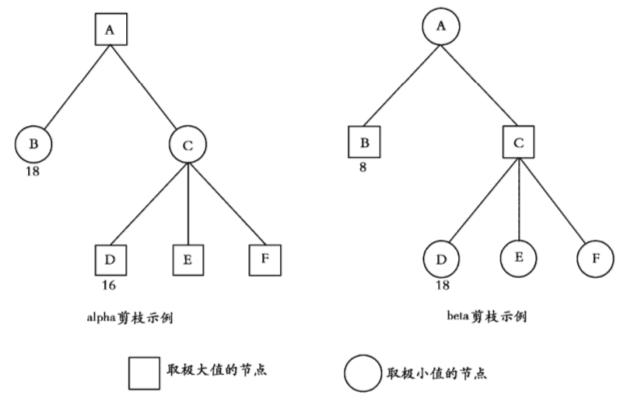

###基本概念

+ **分枝因子(branching factor)**：在树数据结构、博弈论领域中分枝因子是每个结点下的子结点数，即出度。如果各个结点分枝因子不同，则可以计算平均分枝因子。eg：在国际象棋中，如果把合法走法算作一个结点，那么平均分枝因子约为35，表示每走一步棋有大约35种合法走法。围棋分枝因子为250。


###棋类AI
要完成棋类的AI就必须要包括两个方面，一个是搜索，另一个就是局势判断。一个棋手比一般人下棋的长处在于棋手可以思索很多步数以后的棋（搜索的深度），有很好的大局观（局势判断）。因此，我认为只要这两个方面做得好，就一定能够超越人的。

###搜索树
对于棋类来说，下棋的过程可以展开为一棵有根的树（博弈树），一个结点代表一个局面，这个结点的子结点就是这个局面走一步能够到达的局面。下图是一个三子棋（Tic tac toe）的搜索树。


最后，我们假设搜索树是有限的，这样我们就不会遇到永无止境的棋局或者一步有无限多种着法的棋局。
搜索树中有三种类型的结点：

1. 偶数层的中间结点，代表棋手甲要走的局面；
2. 奇数层的中间结点，代表棋手乙要走的局面；
3. 叶子结点，代表棋局结束的局面，即棋手甲或棋手乙获胜，或者是和局。


###博弈树的评价
假设某个中间结点的所有子结点都是叶子结点，那么棋局会在一回合内结束。现在我们假设棋手会挑选最好的着法，如果有一个着法能使他赢下棋局，那么他一定会走这步。如果没有可以赢的着法，但是有取得和局的着法，那么他会走这步取得和局的着法。但是，如果所有的着法都使得对手获胜，那么无论如何他都会输。

因此在叶子结点的上一层结点，我们就能知道棋局的结果。现在我们知道了这个结点的结果，那么我们可以用同样的方法作推演，知道叶子结点的上两层结点的结果，然后是上三层结点，等等，直到我们达到搜索树的根结点。在每个结点上，棋手只要找到一个子结点能让他获胜，那么他就可以赢下棋局；他只要找到一个形成和局的子结点，棋局就和了；如果获胜与和局的子结点都没有，那么肯定是输的。如果我们有足够多的时间来计算，那么这就给了我们一个可以下棋的完美算法。但是对于任何常规的棋类游戏，我们都不可能有足够的计算时间，因为搜索树实在太大了。

另外，“正确”的评价函数只有三个值，赢、输或者和局。在实际的棋类程序中，我们通常使用一个更宽泛的实数来作评价值，就是因为赢、输或者和局是不确定的。如果棋手甲获胜的值用+1表示，和局的值用0表示，棋手乙获胜的值用-1表示，那么博弈树的每个中间结点的值就是子结点的最大值或最小值，这取决于棋手甲还是棋手乙着棋。


###最小最大搜索（Minimax Search）
在实战中，我们的搜索算法只能对博弈树展开一部分。我们用一些“中止规则”来决定搜索树展开到哪个结点就停下来，例如我们在8步变化以后听下来。由于棋局没有在叶子结点结束，我们只能用评价函数来猜哪一方获胜。现在我们来假设在我们展开的结点中，棋手甲总是希望棋局到达评价函数大的局面，而棋手乙总是希望棋局到达评价函数小的局面。


如果双方都用这种方法来下棋，那么我们可以使用同样的最小-最大过程，来确定到达的叶子结点的评价值，这个过程如下：对每个中间结点，计算子结点的最大值或最小值，这取决于是棋手甲还是棋手乙走棋。到达叶子结点的线路称为“主要变例”(Principal Variation)。最小-最大博弈树的基本原理，就是对博弈树作部分展开，去找主要变例，并走出变例中的第一步。


```
int Max(int depth) { // 甲方
　int best = -INFINITY;
　if (depth <= 0 || gameover()) { // 如果是叶子
　　return Evaluate();
　}
　GenerateLegalMoves();
　while (MovesLeft()) {
　　MakeNextMove();
　　val = Min(depth - 1); // 取子结点评分的最大值
　　UnmakeMove();
　　if (val > best) {
　　　best = val;
　　}
　}
　return best;
}

int Min(int depth) { // 乙方
　int best = INFINITY; // 注意这里不同
　if (depth <= 0 || gameover()) {
　　return Evaluate();
　}
　GenerateLegalMoves();
　while (MovesLeft()) {
　　MakeNextMove();
　　val = Max(depth - 1); // 取子结点评分的最小值
　　UnmakeMove();
　　if (val < best) { // 注意这里不同
　　　best = val;
　　}
　}
　return best;
}
```

下图给出的是最大最小搜索的结果图,它是一个5层的博弈树。根结点是max，接下来是min，依次交替（图中的分数是正的对max有利，负的对min有利）


###负值最大搜索（Negamax）

从之前的最小最大搜索的伪代码中可以看出，最小最大搜索的过程很类似，都是求最大最小值进行轮流交替。所以针对这个过程，可以做一个简单的变换，简化最小最大搜索算法。这个变换的核心就是对局面评分函数的一个修改。我们将“整数越大对甲越有利，正无穷大甲胜，负无穷大乙胜”修改为“整数越大对当前落子方越有利，正无穷大当前落子方胜利，整数越小对当前落子方越不利，负无穷大当前落子方败”。具体一点就是叶子结点的评分是根据当前的落子方进行打分的，正数表示对当前落子方有利，负数表示对当前落子方不利，然后所有非叶子结点的评分等于子结点评分相反数的最大值。再简单点说就是将乙落子的层数评分全都取反。这么做的原理也很简单，上层寻找走法的时候肯定是走它认为最好的，对上层局面是最好的，对下层局面就是最差的。因此，上层只需要对下层的所有结点的打分取反，取反之后找到最大的就一定是最好的。

可能这么说很抽象，举一个例子，拿出上面的最大最小搜索博弈树的左边这个部分，如下图所示


对于d，e两个局面，这是max层，也就是说选择下子的是max，2，-1的评分本来就是针对max进行评估的，所以这两个值是不用变。利用d，e两个子结点的评分，取相反数求最大值，求得b结点的得分是1（该得分是正数，这就说明这个局面对落子方min是有利的）。c结点的-2是针对max进行打分的，所以在负值最大搜索中，这个结点的分数应该是2。最后利用b，c两个结点求出a结点的得分为-1。表示这个局面对落子方max是不利的。利用负值最大搜索得出的博弈树应该是下图


用伪代码总结一下：

```
int NegaMax(int depth) {
　int best = -INFINITY;
　if (depth <= 0 || gameover()) {
　　return Evaluate();
　}
　GenerateLegalMoves();
　while (MovesLeft()) {
　　MakeNextMove();
　　val = -NegaMax(depth - 1); // 注意这里有个负号。
　　UnmakeMove();
　　if (val > best) {
　　　best = val;
　　}
　}
　return best;
}
```
这里还有一个问题，给出的伪代码中都只是给出了评分，并没有给出怎么找到最优的走法，这个其实很简单。直接给出伪代码
```
move rootSearch(int depth)
{
  int best = -INFINITY;
  move m;
　GenerateLegalMoves();
　while (MovesLeft()) {
　　MakeNextMove();
　　val = -NegaMax(depth - 1);
　　UnmakeMove();
　　if (val > best) {
      best = val;
      m = currentMove;
　　}
　}
　return m;
}
```

利用上面的算法，我实现了一个三字棋的console小程序，代码我的git上有。这个过程中发现了很多问题


第一个就是评估函数的选择，我的评估函数很简单（赢了10，平局0，输了-10，搜索的层数固定是3），但是没有考虑到可能层次不同带来的影响。
```
//点表示的是空白
oox
.x.
...
//对于这种局面，我们进行搜索，下图是搜索的一个局势
oox
xx.
...
//接着不管o下那个位置x还是能取得三子连城一线的局面，所以上图的评分是一个10分这个和下图评分10分是一模一样
oox
.x.
x..
//但是由于搜索的顺序是按照行的搜索，第二行的第一个位置是在第三行前面。所以程序默认选择了第一个多此一举的方法。
```
第二个问题是没有游戏结束进行判断（这个游戏结束可能是由三个子连城一线，或者被填满了），例如搜索层数5可能双方各下两个子，但是棋局没有这么多空的位置，这就导致搜索depth不为0，然后也没有从局面判断函数返回，返回了一个默认值。

然后还看到一个评估函数：f(p) = (将p中所有空格都放上MAX的棋子后，MAX三子成线的总数) — (将p中所有空格都放上MIN的棋子后，MIN三子成线的总数)这个函数也是有问题的，对于下面的这种局面的评分值是0，显然是不科学的。
```
oxx
xx.
ooo
```

###Alpha-Beta剪枝(Alpha-Beta Pruning)
alpha-beta减枝的原理就是利用在深度优先搜索的过程中利用已经搜索过的结点，避免搜索一些对最终结果没有影响的分支。下面是一个很好的例子：



在左图中，对于A点，当前已经搜索过它的一个子结点B，分数是18。因为A是一个极大值结点，那么A的最小是18，此时对C进行搜索。C的第一个子结点是16，根据C是一个极小值结点，那么C的最大值不会超过16。所以在搜索完D之后没有必要对C的任何子结点进行搜索了，此时C已经不可能找出一个值能够让A的值更高。在这种情况下，搜索算法能够直接从C返回。这个过程叫做alpha减枝。

在右图中，对于A点，当前已经搜索过它的一个子结点B，分数是8.因为A是一个极小值结点。那么A的最大值是8，此时对C进行搜索。C的地一个子结点是18,根据C是一个极大值结点，那么C的最小值是18，那么对于A来说，没有任何必要搜索C的另外两个结点，搜索算法从C直接返回。这个过程叫beta减枝。

**为什么叫alpha减枝，beta减枝?**
alpha表示的是极大值结点关心的值，它是一个maximum lower bound(最大下界)。beta表示的是极小值结点关心的值，它是一个minmum upper bound(最小下界)。对于极大值结点，它的任务是从子结点中挑出最大的更新alpha。对于极小值结点，它的任务是从子结点中找到最小的更新它的beta值。因此，一个结点的合理的值就是(alpha, beta)这个区间内的所有的值，因为如果alpha >= beta，那么这个结点肯定不存在一个分数值能够更新其父节点。回到最开始的问题。上图中的C点，因为beta的更新造成了alpha >= beta，所以叫alpha减枝。beta减枝同理。

用wiki中的伪代码总结一下上述过程
```
 function alphabeta(node, depth, α, β, maximizingPlayer)
      if depth = 0 or node is a terminal node
          return the heuristic value of node
      if maximizingPlayer
          v := -∞
          for each child of node
              v := max(v, alphabeta(child, depth – 1, α, β, FALSE))
              α := max(α, v)
              if β ≤ α
                  break (* β cut-off *)
          return v
      else
          v := +∞
          for each child of node
              v := min(v, alphabeta(child, depth – 1, α, β, TRUE))
              β := min(β, v)
              if β ≤ α
                  break (* α cut-off *)
          return v


(* Initial call *)
alphabeta(origin, depth, -∞, +∞, TRUE)
```


改成负值最大搜索形式也差不多，注意父结点是(α, β)子结点要变为(-β,-α)

```
 function negamax(node, depth, α, β, color)
     if depth = 0 or node is a terminal node
         return color * the heuristic value of node

     childNodes := GenerateMoves(node)
     childNodes := OrderMoves(childNodes)
     bestValue := −∞
     foreach child in childNodes
         v := −negamax(child, depth − 1, −β, −α, −color)
         bestValue := max( bestValue, v )
         α := max( α, v )
         if α ≥ β
             break
     return bestValue

```
Knuth和Moore所做的研究表明，在结点排列最理想的情况之下，使用Alpha-Beta建立的博弈树的结点的个数为
$$
W^{(d+1)/2} + W^{d/2} + 1
$$

W是博弈树的分支因子，d是最大搜索深度。这个值可以近似认为极大极小搜索建立的结点数的平方根的2倍。我们也称这颗最理想的博弈树为极小树(Minimal Tree)。因此对于Alpha-beta减枝，结点的排列顺序对算法减枝的效率是有很大的影响。

####Fail-soft alpha-beta
一个alpha-beta减枝的搜索算法的函数调用是：alphabeta(alpha, beta, depth)。开始的情况，alpha = −∞, beta = +∞。在递归调用的过程中，alpha和beta不断改变，搜索越深，其范围越小。也就是说落在其范围之外的内容就越多，减枝的效率也越来越高。如果一开始就将alpha，beta限定得小，那么整个搜索过程将会减去更多的枝条。但是这个情况下我们可能会得到三种结果：一种是需要查找的目标落在alpha，beta的范围之内，这样花费了很少的时间就得到了结果；还有两种情况就是不太好的情况，要找的值比alpha小，或者比beta大。这两种情况只能重新搜索。

在上面的过程中，对于搜索失败的两种情况，如果alphabeta对于搜索失败的情况返回的是alpha或者beta值，那么我们无法知道任何信息。因此我们对alpha-beta搜索的返回值稍作改进，返回的是当前的score。这样的alpha-beta搜索叫做Fail-soft alpha-beta。

有了上面的fail-soft的形式。我们就能从搜索失败的情况下得到一些信息。如果alphabeta返回值小于alpha，那么我们知道要找的结果小于alpha；同理，如果alphabeta返回值大于beta，那么我们知道要找的结果大于beta。

**这种改进不能提高算法的效率，但是有很多算法都是基于fail-soft的形式。上面的伪代码中描述的也是fail-soft alpha-beta搜索**

###主要变例搜索（Principal Variation Search）

假设“val = alpha_beta(depth,alpha,beta)”，这里val是一个局面的评分值，alpha_beta就是前面的剪枝搜索的函数,alpha,beta可以代表具体的常数。那么可以得出三个结论：

1. if alpha < val <　beta, then val = alpha_beta(depth,−∞,+∞)
2. if val <= alpha , then  alpha_beta(depth,−∞,+∞) <= alpha
3. if val >= beta, then val = alpha_beta(depth,−∞,+∞) >= beta

算法假设第一步是最好的走法，其后次之，直到另外一个结点被证明是最佳的。对于第一个子结点以完整的窗口(alpha, beta)进行搜索，产生一个位于窗口中的值v，后继的兄弟结点以一个(v, v + 1)的极小窗口搜索。如果搜索得到的值小于v(fail low)，那么不必进行搜索。如果得到的窗口值大于v + 1(fail high)，那么需要重新从(v + 1, beta)重新搜素。

由于(v, v + 1)搜索的效率非常高，并且fail high之后也相对于完整的窗口缩小了范围，所以其搜索效率也比以完整窗口进行搜索高。


这是wiki中给出的伪代码
```
(* Negascout is also termed Principal Variation Search - hence - pvs *)

function pvs(node, depth, α, β, color)
    if node is a terminal node or depth = 0
        return color × the heuristic value of node
    for each child of node
        if child is first child
            score := -pvs(child, depth-1, -β, -α, -color)
        else
            score := -pvs(child, depth-1, -α-1, -α, -color)       (* search with a null window *)
            if α < score < β                                      (* if it failed high,
                score := -pvs(child, depth-1, -β, -score, -color)        do a full re-search *)
        α := max(α, score)
        if α ≥ β
            break                                            (* beta cut-off *)
    return α
```

###历史启发(History Heuristic)
前面我们已经知道alpha-beta减枝效率受结点排序的影响很大，那么如何调整结点之间的排序是提高搜索效率的关键。

一种方法是利用相关棋类的知识，如果搜索过程中得到一个较好的局面，那么一些无关紧要的棋子的位置也会是一个较好的局面。但是这个过程判断复杂，导致效果不佳，没有通用性。

J.Schaefffer提出了历史启发的方法。避免了排序对棋类知识的依赖。在基于alpha-beta的搜索中，一个好的走法定义如下：
1. 由其产生的结点引发减枝。
2. 未引发减枝，但是是兄弟结点中最好的。

在搜索的过程中，每当找到一个好的算法，就将该走法相对应的历史得分作一个增量，一个多次被搜索并确认为好的走法历史得分就会高。当搜索中间结点时，将走法根据历史得分排序。那如何确定这个增加的历史得分值？可以根据下面的公式

$$
HistoryTable[move] = HistoryTable[move] + 2^{depth}    \\
or    \\
HistoryTable[move] = HistoryTable[move] + depth * depth    \\
$$

其中depth表示当前搜索深度，叶子结点的depth=0，初始值depth=max_search_depth

上面这个公式是基于两点考虑的：分支的depth越大，那么得到的搜索结果就越可靠；离根结点越近，走法对应局面的相似度越高，越往下搜索，相似度越低。


###迭代深化(Iterative Deepening)

迭代深化是一个由时间控制的算法。在游戏进行的不同阶段，其分枝因子是是差别很大的。在开局的情况下一般分枝因子较大，末期分枝因子较小。使用同样的搜索深度对算法的执行时间影响很大。如果我们使用时间来限制搜索深度，这样同人类棋手的习惯更为相近。并且在决定胜负的残局，可以进行更深层次的搜索。

算法的大致流程是：从较小的搜索层次i开始，逐渐增加搜索深度，一步步求出更精确的结果。直到达到最大的搜索深度，或者是时间用尽。

迭代深化过程所带来的额外的时间消耗和分枝因子关系很大。对于分支因子大概在40的棋类来说，搜索d层和d-1层的时间花费在5～10倍。迭代深化带来的额外时间不会使搜索效率明显降低。但是对于分支因子小的棋类是一个很大的代价。

使用迭代深化，在进行d-1层搜索时往往可以从d-1层的搜索结果中获得一些启发信息，往往可以使得整个搜索过程更快。最简单也是最常用的方法是以d-1层的最佳走法作为d层最先搜索的分支。因为两层之间的最佳走法可能差别不大。对于alpha-beta这种结点排序敏感的算法，这样能够产生一个较高的减枝效率。

**内容出处**

1. [象棋百科全书](https://www.xqbase.com/computer.htm)
2. [Negamax](https://en.wikipedia.org/wiki/Negamax)
3. [Tic Tac Toe: Understanding The Minimax Algorithm](http://neverstopbuilding.com/minimax)
4. [Minimax with alpha Beta Pruning](http://web.cs.ucla.edu/~rosen/161/notes/alphabeta.html)
5. 《从极大极小算法到主变例搜索》-孙锴
6. [Principal Variation Search](https://en.wikipedia.org/wiki/Principal_variation_search)
7. 《PC游戏编程（人机博弈）》

