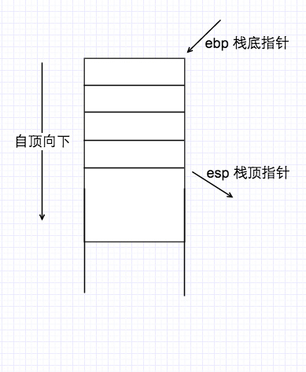
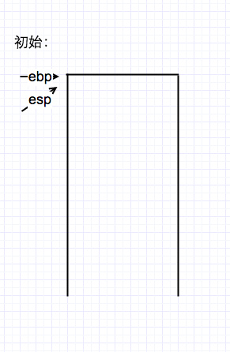
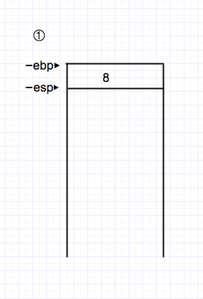
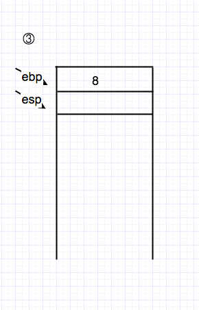
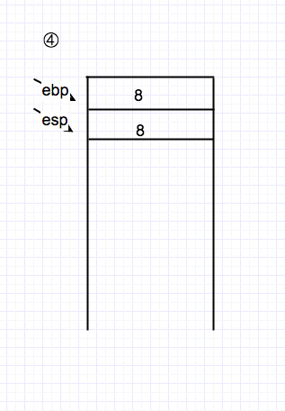
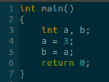
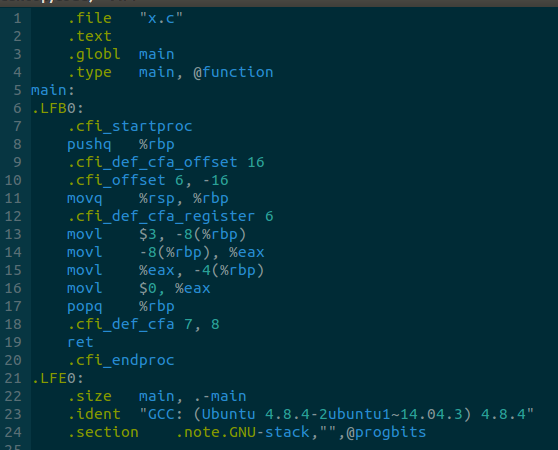

最近正好有点时间在研究操作系统的内核设计与实现，看到了很多地方都是汇编编写的，想想自己一点汇编的基础知识都不会，因此在这里总结一下汇编语言中的知识。

###通用寄存器

汇编中的通用寄存器：


寄存器	| 16位 | 32位 | 64位 | 功能
------|------|-----|------|-----
累加寄存器	| AX | EAX | RAX | 当运算器的算术逻辑单元ALU执行算术或逻辑运算时，为ALU提供一个工作区，可以为ALU暂时保存一个操作数或运算结果
基址寄存器	| BX | EBX | RBX |
计数寄存器   | CX | ECX | RCX | 
数据寄存器   | DX | EDX | RDX | 其主要功能是作为CPU和主存、外设之间信息传输的中转站，用以弥补CPU和主存、外设之间操作速度上的差异。数据寄存器用来暂时存放由主存储器读出的一条指令或一个数据字；反之，当向主存存入一条指令或一个数据字时，也将它们暂时存放在数据寄存器中
堆栈基指针	| BP | EBP | RBP | 寄存器中保存栈底地址
变址寄存器	| SI | ESI | RSI |
堆栈顶指针	| SP | ESP | RSP | 寄存器中保存栈顶地址
指令寄存器	| IP | EIP | RIP | 指令寄存器（Instruction Register，IR）用来保存当前正在执行的一条指令。当执行一条指令时，首先把该指令从主存读取到数据寄存器中，然后再传送至指令寄存器。指令包括操作码和地址码两个字段，为了执行指令，必须对操作码进行测试，识别出所要求的操作，指令译码器（Instruction Decoder，ID）就是完成这项工作的。指令译码器对指令寄存器的操作码部分进行译码，以产生指令所要求操作的控制电位，并将其送到微操作控制线路上，在时序部件定时信号的作用下，产生具体的操作控制信号。指令寄存器中操作码字段的输出就是指令译码器的输入。操作码一经译码，即可向操作控制器发出具体操作的特定信号


###汇编指令

#####mov
mov指令可以在CPU内或CPU和存储器之间传送字节。它可以从寄存器到寄存器，立即数（常数）到寄存器，立即数到存储单元，存储单元到寄存器，寄存器到存储单元之间的数据传输。

movb（8位）、movw（16位）、movl（32位）、movq（64位）。括号里面表示不同位数的mov指令

下面是使用movl指令展示了汇编指令中四种基本的寻址方式

+ 寄存器寻址：
```
movl %eax, %edx
eax -> edx
```
+ 立即数寻址：
```
movl $0x123, %edx
数字->寄存器
```
+ 直接寻址：
```
movl 0x123, %edx
直接访问内存地址数据，edx = *(int32_t *)0x123;
```
+ 间接寻址：
```
movl (%ebx), %edx
%ebx 是个内存地址，(%ebx)指的是该地址中的数据，edx = *(int32_t*)ebx;
```
+ 变址寻址：
```
movl 4(%ebx), %edx
edx = *(int32_t*)(ebx+4);
```


#####push，pop

push %eax相当于：
```
subl $4, %esp
//栈顶指针减4
movl %eax, (%esp)
//%eax -> esp 地址
```

pop %eax相当于：
```
movl (%esp), %eax
addl $4, %esp
//栈顶指针加4
```

这两个指令是和堆栈操作相关（虽然说是堆栈，但是好像就是栈，没有堆）。在汇编中堆栈数据结构的作用是：

+ 函数调用的框架
+ 参数传递
+ 保存返回地址
+ 提供局部变量



堆栈应该就是在内存中开辟的一块区域，esp是向小地址的方向增长

使用push和pop建立和拆除函数调用框架的过程：
```
//建立被调用者函数的堆栈框架
pushl %ebp //将原来栈底位置保存
movl %esp, %ebp //将新的栈底指针设置为当前栈顶

//拆除框架
movl %ebp, %esp //将栈底设置为栈顶
popl %ebp //读取原来的栈底指针
ret
```

#####call，ret

call 0x12345相当于：

```
pushl %eip //保存下一条需要执行指令的地址
movl $0x12345, %eip
//当前地址压栈，存入新地址
```

ret相当于：

```
popl %eip
//栈 -> eip
```


#####enter，leave

enter（重建堆栈）：
```
push %ebp
movl %esp, %ebp
//将堆栈置空（栈上重堆）
```

leave（撤销堆栈）：
```
movl %ebp, %esp
popl %ebp
//将堆栈置空（撤销堆栈）
```

#####例子

```
pushl $8    ①
movl %ebp, %esp        ②
subl $4, %esp    ③
movl $8, (%esp)        ④
```







还有一个C语言的例子：



和对应的汇编：




内容来自：

[几种基本汇编指令详解](http://blog.luoyuanhang.com/2015/07/07/%E5%87%A0%E7%A7%8D%E5%9F%BA%E6%9C%AC%E6%B1%87%E7%BC%96%E6%8C%87%E4%BB%A4%E8%AF%A6%E8%A7%A3/)

[CPU中主要寄存器](http://share.onlinesjtu.com/mod/tab/view.php?id=233)