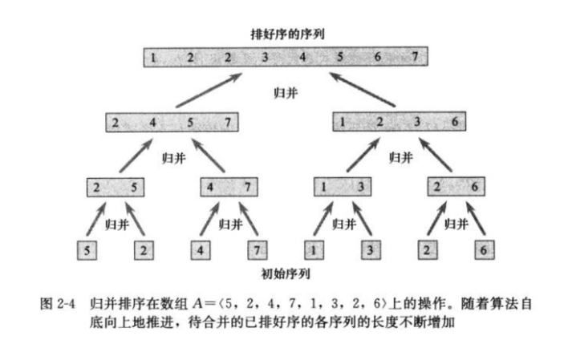

## 算法导论---第二章算法基础
第二章的内容比较少。

###归并排序和
着重讲了两个排序算法，插入排序和归并排序。插入排序有个很形象的例子，就是对抽取的扑克牌进行排序的过程，首先扑克牌是盖在桌面上的，玩家手里的牌都是有序的，玩家每次翻起一张牌，然后将这张拍插入的正确的位置上，最后将桌上的牌都抽完。上面的过程很清楚地介绍了插入排序的流程。归并排序是一个很经典的分治算法，主要思想是将输入集合不断划分，划分到一定程度的时候就能很快地进行排序，排序完成之后就是将划分的结果进行合并。以上这两种排序的伪代码可以在算法导论上找到，真的很详细，很清楚。


除了介绍上面的过程，本章还介绍了全书都在使用的证明算法正确性的方法---循环不变量。所谓循环不变量是指一种在整个循环过程中保持不变的性质，该怎么去找这个循环不变量那就和具体的证明过程有关了，其实这个类似于数学归纳法的证明方式。主要要证明三个方面，初始化（循环的第一次迭代之前），保持（如果在循环的某次迭代之前为真，在下次迭代前仍为真），终止


在本章最后的几个思考题比较有意思。


**霍纳(Horner)规则**
公式是有关x的一个多项式 
$$ 
P(x) = \sum_{k=0}^n a_kx^k 
$$

当知道x的值时如何快速地求得函数值。常规的方法是先求出每项的值，然后将各项加起来。而Horner一种很巧妙的方法，大幅提升了算法的运行效率

```
y = 0
for i = n downto 0
    y = ai + x * y
```


**逆序对(inversion)**

假设A[1...n]是一个有n个不同数的数组。若i < j且A[i] > A[j]，则对偶(i, j)称为A的一个逆序对(inversion)

根据前面讲的归并排序的思想不难写出一个确定逆序对数量的算法，相对归并排序的不同之处在于merge数组的过程中，每次将右边集合归并时，记录左边集合剩余的数目，将之加入到最终的结果中。例如5, 2进行归并，2在前，那么此时左边集合有一个5，故最后的逆序对的结果加1。