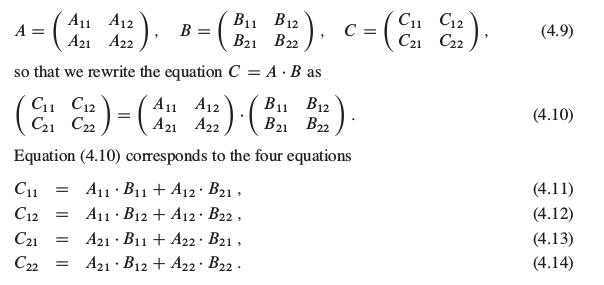
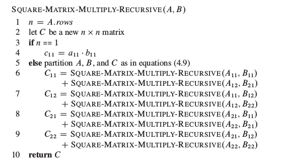
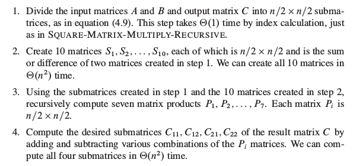
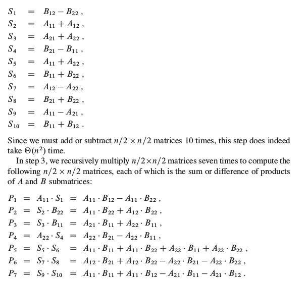

###分治策略
算法导论分治这一章内容很充实，有很多有意思的算法和问题。先讲讲什么是分治策略，其实分治策略可以用三个单词来概括:
1. 分解(Divide)将问题划分为子问题，子问题的形式与原问题一样，只是输入的规模更小
2. 解决(Conquer)递归求出子问题，子问题的规模足够小，停止递归，直接求解
3. 合并(Combine)将子问题组合成原问题的解

###最大子数组问题
这个问题是书上的关于分治算法的一个例子，书上给的是一个股票问题，股票的价格是每天变化的，通过股片的买入卖出就能获取利益，给出一段时间股票的价格，问股票在什么时间买入，什么时间卖出能够获得最大的收益。e.g.下面的表格是股票每天的价格和与前一天的差价。关键就在这个差价上，将求价格的最大差值就转换成求差价数组的最大子数组(最大的非空连续和)的问题了。

| 天 | 0 | 1 | 2 | 3 | 4 | 5 | 6 | 7 | 8 |
|----|---|---|---|---|---|---|---|---|---|
|价格|100|113|110|85|105|102|86|63|81|
|差价||13|-3|-25|20|-3|-16|-23|18

然后书上用分治的策略分析了问题的解决方案，一个数组的最大子数组要么在左边部分，要么在右边部分，或者横跨两个部分，求左右的直接递归求解，横跨的部分从左边部分的右端点向左扩展，右边部分的从左端点向右扩展。前面的时间复杂度是O(nlgn)，在习题中讨论了O(n)时间复杂度的解决方案(利用已知的A[1..j]表示以j结尾的最大子数组b，A[1..j+1]的最大子数组就是A[j]或者是b+A[j])


###矩阵乘法的Strassen算法
这个算法我算是开眼界了，本来根据矩阵乘法的定义，定义乘积C=AB中的元素为$c_{ij}$为(为了描述简单，假设A，B都是n*n的方阵并且$n=2^k,k=1,2,3...$)：
$$
c_{ij}=\sum_{k=1}^na_{ik}b_{kj}
$$

那么矩阵乘法的时间复杂度是$ \Theta(n^3) $，按照正常人的思维，这个是一个定义，应该没有什么更高效的算法。但是这个是后有人提出来了更加高效的算法Strassen用来计算矩阵的乘法，在讲解这个算法之前先看一个基于分治策略的矩阵乘法。



上面的过程就是利用分块矩阵的乘法重新定义了C矩阵的计算过程，利用上面的计算过程不难写出伪代码，这里直接给出书上的伪代码。



根据上面的过程，分析时间复杂度$ T(n) = 8T(n/2) + \Theta(n^2) $，利用主定理求得$T(n)=\Theta(n^3)$，普通的分治算法和直接按照定义计算相比并没有优势，而Strassen算法就是基于这个分治算法的改进。

分解的过程还是一样，Strassen算法创建了10个矩阵，保存中间的结果，使用常数次矩阵的加法和减法减少一次递归调用。算法的流程：




这10个矩阵具体的值和计算过程是



根据上面图中定义的P，C的四个子矩阵可以用P表示
$$
C_{11} = P_5+P_4-P_2+P_6   \\
C_{12} = P_1+P_2           \\
C_{21} = P_3+P_4           \\
C_{22} = P_5+P_1-P_3-P_7
$$

很明显地看到利用S保存的中间结果，只需要计算7次(计算7个P矩阵)矩阵的乘法，然后计算常数次矩阵的加减法就能得出C的四个子矩阵。

Strassen算法的递归方程是$T(n)=7T(n/2)+\Theta(n^2)$，同样利用主定理得出时间复杂度是$T(n)=\Theta(n^{log_27})$。


下面是strassen算法与按照定义直接相乘的算法进行的比较(输入的矩阵的规模是1024)，明显可以看到strassen的优势，测试的代码在最后，其实代码写得比较暴力，能对子矩阵划分那块进行改进
```
tan@tan:~/Documents/code/introduc_algo/4$ time ./a.out 1024 strassen

real	0m2.720s
user	0m2.652s
sys	0m0.068s
tan@tan:~/Documents/code/introduc_algo/4$ time ./a.out 1024 plain

real	0m8.035s
user	0m8.032s
sys	0m0.004s

```


其实上面的过程要求矩阵是2的幂，如果矩阵不是2的幂，那该怎么办呢？一个很直接的办法就是填充，将矩阵填充成2的幂的形式(填充的值是0不会对原矩阵的结果产生影响)，假设m是大于等于n的最小的2的幂，从下面的公式中可以看出填充是不会对时间复杂度产生影响，只是增大了常量
$$
m^{log_27} \le (2n)^{log_27} = 7n^{log_27} = \Theta(n^{log_27})
$$


###芯片检测问题
Diogenes教授有n片完全一样的集成电路芯片，可以用来相互检测。但是教授的夹具只能同时测试两块芯片，好芯片能够准确判断另一块的好坏，坏芯片的结果不确定。因此可能有下面四种可能情况：

| 芯片A的结果 | 芯片B的结果 | 结论 |
|-----------|------------|-----|
|B是好的 | A是好的 | 两片都是好的 |
|B是好的 | A是坏的 | 至少一块是坏的|
|B是坏的 | A是好的 | 至少一块是坏的|
|B是坏的 | A是坏的 | 至少一块是坏的|

1. 证明：如果超过n/2的芯片是坏的，不管怎么进行测试教授都不能确定哪些芯片是好的
2. 假设超过n/2的芯片是好的，用$\Theta(n)$的时间复杂度找出一块好的芯片

关于问题1,很遗憾，没有证明出来

关于问题2，可以参考[ 算法导论习题4-5：芯片检测](http://blog.csdn.net/groovy2007/article/details/25745345)

一个比较好理解的解决方法是：将芯片随意两两配对(可以将芯片排成一列，相邻的两个芯片配对)，配对的结果就只有上面的四种情况，对于后三种情况，将芯片直接丢弃，由于好的芯片超过了一半，这样丢弃还是可以保证这个特性。对于第一种情况，将所有第一种情况的芯片对中丢弃任意一个。因为剩下的芯片对中，无非就是两种情况：好-好，坏-坏，而且好的对数肯定要超过坏的对数，所以再经过这样的操作之后还是保持了原来的性质。就这样继续下去，直到最后剩下一个芯片就是好的。


```
#include<stdio.h>
#include<string.h>
#include<stdlib.h>
#define BOUND 32
int **square_matrix_mul(int **a, int **b, int n);
int **create_matrix(int row, int col);
void free_matrix(int **p);
void show_matrix(int **p, int row, int col);
void fill_matrix(int **p, int row, int col);
int **stassen_mul(int **a, int **b, int n);
void add_matrix(int **ans, int **a, int **b, int row, int col);
void sub_matrix(int **ans, int **a, int **b, int row, int col);

void add_matrix(int **ans, int **a, int **b, int row, int col)
{
	int i, j;
	for (i = 0; i < row; ++i)
		for (j = 0; j < col; ++j)
			ans[i][j] = a[i][j] + b[i][j];
}
void sub_matrix(int **ans, int **a, int **b, int row, int col)
{
	int i, j;
	for (i = 0; i < row; ++i)
		for (j = 0; j < col; ++j)
			ans[i][j] = a[i][j] - b[i][j];
}
//填充矩阵，进行测试
void fill_matrix(int **p, int row, int col)
{
	int i, j;
	for (i = 0; i < row; ++i)
		for (j = 0; j < col; ++j)
			p[i][j] = 1;
}
void show_matrix(int **p, int row, int col)
{
	int i, j;
	for (i = 0; i < row; ++i)
	{
		for (j = 0; j < col; ++j)
			printf("%d  ", p[i][j]);
		printf("\n");
	}
}
/*
*输入两个n*n的方阵，输出两个矩阵的乘法结果
*/
int **square_matrix_mul(int **a, int **b, int n)
{
	int i, j, k;
	int **c = create_matrix(n, n);
	for (i = 0; i < n; ++i)
	{
		for (j = 0; j < n; ++j)
		{
			c[i][j] = 0;
			for (k = 0; k < n; ++k)
				c[i][j] += a[i][k] * b[k][j];
		}
	}
	return c;
}
/*
*输入参数同上，使用strassen算法计算，n要求是2的幂
*/
int **strassen_mul(int **a, int **b, int n)
{
	int **S[11], **P[8], **A[5], **B[5], **c;
	int i, j, n0 = n / 2;
	if(n <= BOUND) //当输入的规模太小，直接使用定义进行计算
		return square_matrix_mul(a, b, n);
	c = create_matrix(n, n);
	for (i = 1; i <= 10; ++i)
		S[i] = create_matrix(n0, n0);
	for (i = 1; i <= 4; ++i)
	{
		A[i] = create_matrix(n0, n0);
		B[i] = create_matrix(n0, n0);
	}
	//划分a, b形成8个子矩阵
	for (i = 0; i < n0; ++i)
	{
		for (j = 0; j < n0; ++j)
		{
			A[1][i][j] = a[i][j];
			A[2][i][j] = a[i][j+n0];
			A[3][i][j] = a[i+n0][j];
			A[4][i][j] = a[i+n0][j+n0];
			B[1][i][j] = b[i][j];
			B[2][i][j] = b[i][j+n0];
			B[3][i][j] = b[i+n0][j];
			B[4][i][j] = b[i+n0][j+n0];
		}
	}
	//计算S
	sub_matrix(S[1], B[2], B[4], n0, n0);
	add_matrix(S[2], A[1], A[2], n0, n0);
	add_matrix(S[3], A[3], A[4], n0, n0);
	sub_matrix(S[4], B[3], B[1], n0, n0);
	add_matrix(S[5], A[1], A[4], n0, n0);
	add_matrix(S[6], B[1], B[4], n0, n0);
	sub_matrix(S[7], A[2], A[4], n0, n0);
	add_matrix(S[8], B[3], B[4], n0, n0);
	sub_matrix(S[9], A[1], A[3], n0, n0);
	add_matrix(S[10], B[1], B[2], n0, n0);
	//计算P
	P[1] = strassen_mul(A[1], S[1], n0);
	P[2] = strassen_mul(S[2], B[4], n0);
	P[3] = strassen_mul(S[3], B[1], n0);
	P[4] = strassen_mul(A[4], S[4], n0);
	P[5] = strassen_mul(S[5], S[6], n0);
	P[6] = strassen_mul(S[7], S[8], n0);
	P[7] = strassen_mul(S[9], S[10], n0);

	//用A存储C
	add_matrix(A[1], P[5], P[4], n0, n0);
	sub_matrix(A[1], A[1], P[2], n0, n0);
	add_matrix(A[1], A[1], P[6], n0, n0);

	add_matrix(A[2], P[1], P[2], n0, n0);

	add_matrix(A[3], P[3], P[4], n0, n0);

	add_matrix(A[4], P[5], P[1], n0, n0);
	sub_matrix(A[4], A[4], P[3], n0, n0);
	sub_matrix(A[4], A[4], P[7], n0, n0);

	//计算最后返回结果
	for (i = 0; i < n0; ++i)
	{
		for (j = 0; j < n0; ++j)
		{
			c[i][j] = A[1][i][j];
			c[i][j+n0] = A[2][i][j];
			c[i+n0][j] = A[3][i][j];
			c[i+n0][j+n0] = A[4][i][j];
		}
	}
	//释放空间
	for(i = 1; i <= 10; ++i)
		free_matrix(S[i]);
	for(i = 1; i <= 4; ++i)
	{
		free_matrix(A[i]);
		free_matrix(B[i]);
	}
	return c;
}
//创建二维矩阵
int **create_matrix(int row, int col)
{
	int i;
	int **p = malloc(sizeof(int *) * row);
	p[0] = malloc(sizeof(int) * row * col);
	for (i = 1; i < row; ++i)
		p[i] = p[0] + i * col;
	return p;
}
void free_matrix(int **p)
{
	free(p[0]);
	free(p);
}
int main(int argc, char **argv)
{
	int n = atoi(argv[1]);
	int **p1 = create_matrix(n, n), **p2 = create_matrix(n, n), **ans;
	fill_matrix(p1, n, n);
	fill_matrix(p2, n, n);
	if(!strcmp(argv[2], "plain"))
		ans = square_matrix_mul(p1, p2, n);
	else if(!strcmp(argv[2], "strassen")) 
		ans = strassen_mul(p1, p2, n);
	return 0;
}

```