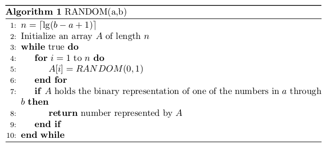
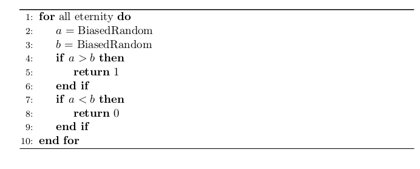
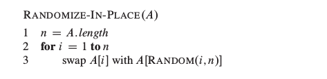
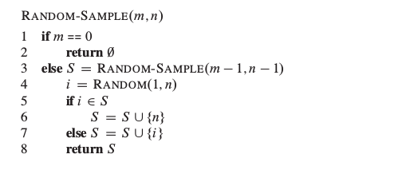

这片文章主要是《算法导论》第五章概率分析与随机算法，第六章堆排序中看完之后印象深刻的算法和问题。

###随机算法
如果一个算法的行为不仅由输入决定，而且由随机数生成器产生的数值决定，则称这个算法是随机的。就像书上雇佣问题的例子，如果应聘者是以随机的顺序出现，那么算法HIRE-ASSISTANT能够达到一个较好的效果，但是如果应聘者的顺序不是随机的，那么这个算法的效果就可能很差。因此使用随机算法打乱应聘者的顺序能够使其运行时间能够达到较好的期望运行时间。

###使用RANDOM(0, 1)获取RANDOM(a, b)
这里的RANDOM(0,1)表示产生[0,1]区间的随机整数

这个问题是算法导论上的一个练习题，看起来很复杂，其实很简单。下面就是算法的伪代码




举个例子，使用random(0, 1)表示random(3, 8)。根据上面的算法n=3，那么对应关系可以是
```
3---000
4---001
5---010
6---011
7---100
8---101
```
根据上面的对应关系，算法运行产生的A如果在上面的编码表中，就返回编码对应的数字，如果不在，那么就继续循环。

关于时间复杂度的分析，很明显执行一次终止的概率是$p = \frac{b-a+1}{2^n}$，所以期望的运行时间是(级数已经忘记得差不多，应该没算错)：
$$
E(X) = n\sum_{k=1}^{\infty}k(1-p)^{k-1}p = \frac{n}{p}=\Theta(lg(b-a+1))
$$

根据上面的办法还可以推广到一般的情况，[a,b]区间的随机整数产生[c,d]区间的随机整数。
+ 如果a-b >= c-d那么不用那么麻烦，让[a,b]区间的数与[c,d]区间的数一一对应，[a,b]中多余的不管，每次循环产生的[a,b]区间的数字输出[c,d]区间对应的数字，没有对应的再次执行循环
+ 其他情况复杂点，计算进制t = b-a+1，然后计算需要的位数n = $log_t(d-c+1)$，然后每次循环产生n个随机数，用这n个随机数组成的数输出[c,d]区间的数，没有对应的就再次执行循环

###使用概率不同的RANDOM(0,1)产生概率相同的RANDOM(0,1)
现在有一个函数能够以p的概率产生1，1-p的概率产生0，现在要编写一个等概率产生0,1的RANDOM函数。



其实上面伪代码的依据就是不管p是多少，执行两次提供的函数，产生的01，和10序列的概率是相同的。这个有兴趣可以自己计算算法的期望运行时间。

###随机排列数组
很多随机算法都是通过对给定输入变换排列以使输入随机化。这个随机排列数组的算法能够等可能地产生数组每个元素的排列。算法的伪代码描述如下：



证明的过程较为复杂，有兴趣的可以看算法导论。

###产生随机样本
假设我们希望创建集合{1, 2, 3, ..., n}的一个随机样本，即一个具有m个元素的集合S，其中0<=m<=n，使得每个m集合都能等可能的创建。

一种方法是对i=1, 2, ..., n设A[i]=i，调用RANDOMIZE-IN-PLACE，然后取前面的m个数组元素，但是会调用n次RANDOM过程，如果n比m大很多，算法的效率就不高。这里给出一个调用m次RANDOM函数的算法，算法的证明(每个m子集是等可能的)看了好几个证明都没有看懂。



###堆
算法导论上介绍很详细，堆的两个主要操作就是向下和向上调整

需要注意的是建立堆的方式不同时间复杂度是不一样的，如果使用先填充，后进行调整的策略是$O(n)$的时间复杂度，如果通过插入的方法建堆时间复杂度是$nlgn$。

使用堆可以实现优先队列，普通的队列是先进先出，优先队列是按照优先级的大小对出入队列的顺序排列。

**合并k个有序链表**：书上有一个练习题就是使用$O(nlgk)$的时间复杂度合并k个总节点数目为n的有序链表。这个题目就是堆的使用，首先将k个链表的头节点构建一个k个元素的最小堆($O(k)$的时间复杂度)，然后每次取出堆顶部的元素加入到新链表的尾部，再将这元素的下一个元素加入到堆中，调整成为新的最小堆($O(lgk)$的时间复杂度)，直到堆为空。
