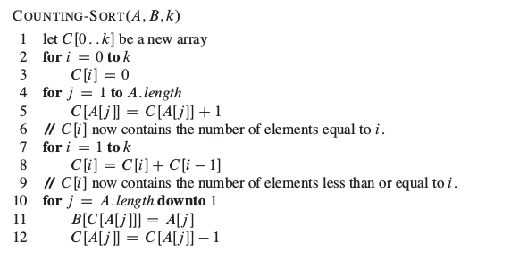
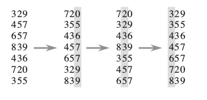
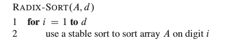
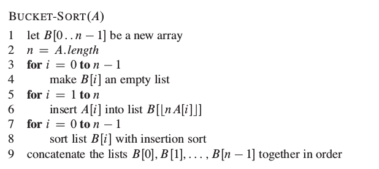
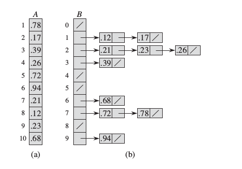

文章主要是算法导论第7章快速排序，第8章线性时间排序的内容。

###快速排序的改进版本
快速排序是一个很优秀的算法，有很多优良的特性，例如：算法隐藏的时间复杂度很小，能够在原址上排序(in place，不需要额外的辅助空间)等。但是快速排序对与某些特定的输入(输入的序列本身就是有序的，正序或者反序)的情况下时间复杂度是$\Theta(n^2)$，为了处理中情况提出了很多方法：例如随机划分方法(具体的做法是要确定[p,r]中的轴，可以假设A[r]为轴元素，产生一个i = RANDOM(p,r)，交换A[i]，A[r])、三位数取中方法([p, r]中随机的取三个数i，j，k，然后取A[i]，A[j]，A[k]中位数作为轴元素)。

上面的方法都很好地解决了快速排序的输入序列有序问题，但是还有可能输入的序列是全都相等的特殊情况，这个情况算法的运行时间是$\Theta(n^2)$。为了解决这个情况，提出了一个快速排序的改进方法，下面是这个改进的伪代码。主要的想法就是修改PARTITION函数，函数的返回值是q,t两个整数，并且p<=q<=t<=r，且有：
+ A[q..t]中的所有元素都相等
+ A[p..q-1]中的每个元素都小于A[q]
+ A[t+1..r]中的每个元素都大于A[q]

```
QUICKSORT(A, p, r)
	if p < r
		(q, t) = PARTITION(A, p, r)
		QUICKSORT(A, p, q - 1)
		QUICKSORT(A, t + 1, r)


PARTITION(A, p, r)
	i = RANDOM(p, r)
	exchange A[i] with A[r]
	x = A[r]
	i = p - 1
	k = p - 1
	for j = p to r - 1
		if A[j] < x
			k = k + 1
			i = i + 1
			exchange A[i] with A[j]
			exchange A[k] with A[j]
		else if A[j] == x
			k = k + 1
			exchange A[k] with A[j]
	k = k + 1
	exchange A[k] with A[r]
	return (i + 1, k)
```


很明显，通过上面的方法将相同的元素都没有放入下一次的快排中去，有效地减少了数据的规模

**模糊排序**

利用上面的算法还能解决算法导论上的问题7-6：实现区间的模糊排序。糊排序的定义是：对于给定的n个区间，生成一个区间排列，

$(I_1,I_2, ..., I_n)$，使得存在$c_j \in I_j$，满足$c_1 \le c_2 \le ... \le c_n$，通俗的解释就是每个区间都存在一个数，这些区间的数之间也是有序的。

解决的办法很简单，就是将区间当成一个元素。然后将最后一个区间x定义为轴区间，按照上面的做法将本次的区间分成三类，小于轴区间的(区间的右端点小于轴区间的左端点)，等于轴区间的(区间包括轴区间的左端点)，大于轴区间的(其他情况)。分成三类之后对小于和大于的依次递归。

解决的方案来自[牛肉豆腐干的解答](https://www.zhihu.com/question/28255901)

举个例子：[1,4], [2,5], [4,11]，[2, 7], [9,12], [5, 7], [5, 9], [8,11],  [1,2], [1,3], [2,3], [4, 7]。选取[4,7]为轴区间，
然后分成三类：
+ 左：[1,2]，[1,3],[2,3]
+ 中：[4,7]，[1,4],[2,5],[4,11],[2,7]
+ 右：[9,12]，[5,7]，[5,9]，[8,11]

为什么等于的要这么分呢？不直接与轴区间相交就行(好多解决方案都是使用区间相交)？因为使用区间相交不能保证其他区间之间还有交集，据给例子:[4,7]与[1,4]有交集，与[5,7]有交集，但是[1,4]，[5,7]没有交集，所以不能将[5,7]放入已经解决的集合中去

###计数排序(Counting sort)

计数排序的要求限制是：n个被排序的元素每一个都是在[0,k]区间的一个整数，这时算法的运行时间是$\Theta(n+k)$

计数排序的输入是一个数组A[1..n]，A.length=n，B[1..n]存放排序的输出，C[0..k]提供临时存储空间



代码是真的很整洁，没有一条if语句。关键是第10行和第12行的代码，第10行逆序遍历原数组A是为了保证**排序的稳定性**。排序的稳定性是指具有相同值的元素在输出数组中的相对次序与它们在输入数组中的相对次序相同。第十二行代码是为了防止相同的元素出现，因此下次相同的元素出现就会排在上次位置的前一个。

###基数排序(radix sort)
基数排序假设n个元素，每个元素都是一个d位数(当然也可是不是，但是这样就会出现数据填充，影响算法的效率)。如果稳定排序的算法采用的是计数排序，那么算法的运行时间是$\Theta(d(n+k))$，k是每个数位上的最大值



从图中可以看出来排序的顺序是从地位到高位，因为这样采用稳定的排序方法进行高位的排序时，低位的有序关系不会被破坏。



上图是基数排序的伪代码，非常直观。

###桶排序(bucket sort)
桶排序假设输入数据服从均匀分布，平均情况下它的代价为$O(n)$，其实我认为桶排序能够达到线性的时间复杂度完全是输入数据随机分布在每个桶上，桶中的数据个数是常数的数据量级(可能是要求桶的数量和输入数据是线性相关的)，所以进行插入排序的时间复杂度是常量的。

桶排序的伪代码：



第6行的意思是因为这里假设输入的数据是在[0,1)的范围内，这样计算之后输入的数据就会均匀的分布到每个桶上。

下图是个桶排序将10个[0,1)区间上的元素进行排序的例子。



###线性时间原址排序
这是算法导论上8-2的一个习题，题目的意思是假设有n条记录，所有关键字的值都在1到k的区间之内。要求修改计数排序的算法，在$O(n+k)$的时间内完成对n条记录的原址排序，除输入数组外，可以使用$O(k)$大小的额外空间

问题的解决办法就是对计数排序的代码进行一些更改，主要的问题在于不使用其他辅助空间的情况下如何将A数组调整为有序？基本的想法就是从前到后交换当前位置上的元素到正确的位置上。为了防止重复交换的情况，一个额外的数组记录这个元素已经交换过的位置

```
COUNTING-SORT-INPLACE(A, k)
	let B[0..k],C[0..k] be a new array

	for i = 0 to k
		B[i] = C[i] = 0

	for j = 1 to A.length
		B[A[j]] = B[A[j]] + 1
		C[A[j]] = B[A[j]]

	//计算A中元素i的开始位置B[i]结束位置C[i]
	for i = 1 to k
		C[i] = C[i] + C[i-1]
		B[i] = C[i-1] + 1

	for j = 1 to A.length
		while B[A[j]] <= C[A[j]] //当前元素的开始位置小于等于结束位置
			tmp = A[j]
			if A[B[tmp]] == tmp
				++B[tmp]
			else
				exchange A[j] with A[B[A[j]]] //交换时要注意A[j]不能先被更改
				++B[tmp]

```


