主要内容包括算法导论第13章红黑树的总结

###红黑树
先定义什么叫做红黑树，红黑树满足BST的性质，并且：
1. 每个结点要么是红色的，要么是黑色的
2. 根结点是黑色的
3. 每个叶结点(NIL)是黑色的
4. 如果一个结点是红色的，其他两个子结点都是黑色的(红红不能相连)
5. 对于每个结点从该结点到其所有后代叶子结点的简单路径上，均包含相同数目的黑色结点(black height--bh,黑色高度不包括当前结点)

然后看个红黑树的例子，a是概念上标准形式，b是为了节省空间所有的NIL都指向同一个结点：

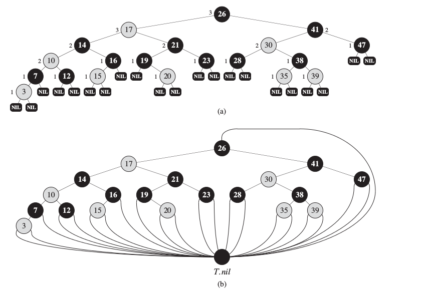

为了保证BST的基本性质，且保证树是基本平衡的，需要两个基本的操作--左旋和右旋：

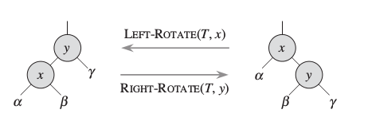

左右旋转的操作完全对称，给出左旋的代码：

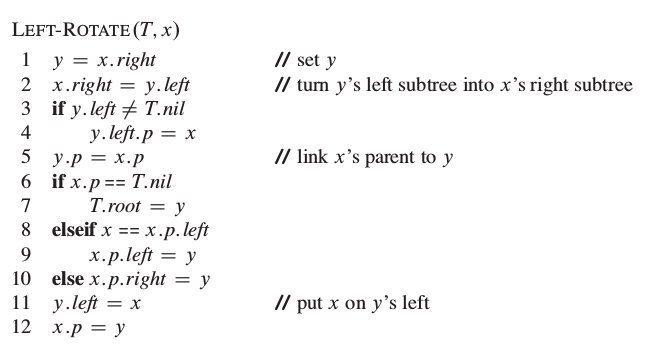

####插入
插入操作主要分成两个部分，一个是插入的主体，还有一个是用于维护红黑树性质的过程。

插入过程的伪代码描述：

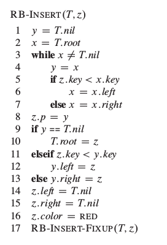

上面的代码需要说明的是16行z.color被赋值成红色，也就是插入的结点初始值要是红色。这里的原因个人认为：相比与其他性质的违反，bh违反调整难度较大(bh在某种程度上说是一种大范围的属性，其他性质都只是局部违反)，插入红色结点不会改变bh。而且如果插入结点的值是黑色，那么很容易导致bh不相等(n=4个内部结点都是黑色的情况，不管怎么旋转都是不满足bh高度相等的)

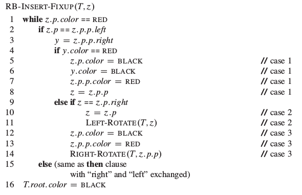

上面伪代码中y是z父节点的兄弟节点。

插入操作有三种情况，但是三种情况不是完全独立的，三种情况可以用一张图表示：

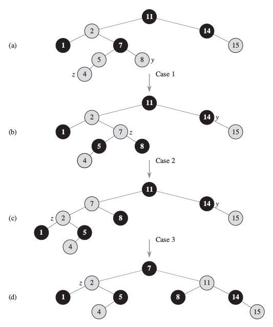

情况1局部：

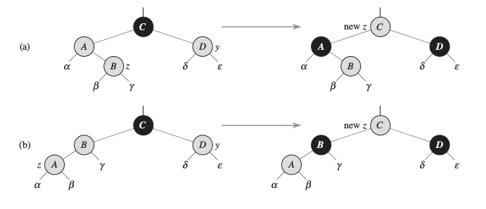

情况2、3局部：
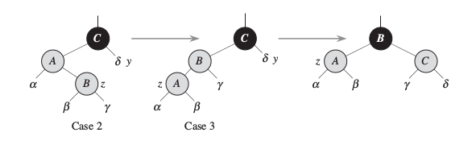

1. **z的叔结点(父结点的兄弟结点)y是红色的**
将z.p和y都染成黑色，z.p.p染成红色，然后将z.p.p作为新的z重复while循环。z.p.p染成红色是为了保持bh相等

2. **z的叔结点y是黑色且z是z.p的一个右孩子**
通过左旋z.p变成情况3

3. **z的叔结点y是黑色的且z是z.p的一个左孩子**
改变z.p的颜色和z.p.p的颜色，然后通过z.p.p的右旋。至此，红黑树的所有性质都满足

很明显能够看出来时间复杂度还是$O(lgn)$

####删除
红黑树的删除操作相比与插入操作略显复杂，但是仔细理解还是比较好懂的。和插入操作类似，删除操作也是分为两个主要的过程，一个是删除操作的主体，和普通的BST删除类似，还有一个用于维护红黑树的性质的操作防止删除操作破坏了红黑树的性质。

删除操作中用来移动子树的伪代码：

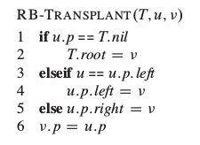

删除操作的主体的伪代码描述：

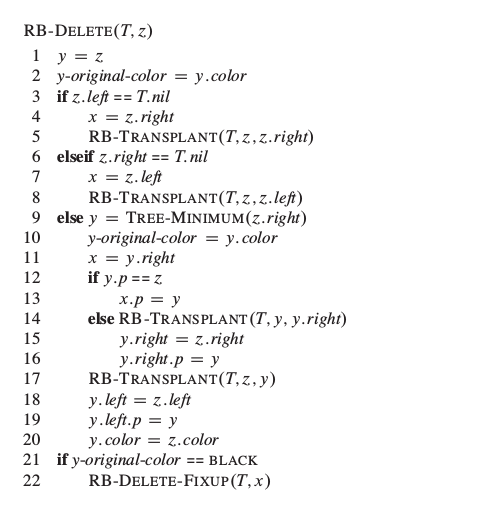

先弄清楚上面代码中x，y，z代表的含义。z不用说了，输入的参数表示需要删除的结点。a.当z只有一个孩子时，y指向z；b.当z有两个孩子时y指向z的后继结点。所以不管哪种情况，y才是真正需要删除的结点(a情况y=z，b情况y会被移动到原来z的位置，实际删除的还是y)。x表示y的唯一子结点(没有时指向T.nil)。

为什么根据y-original-color判断是否调整？为什么从x结点开始调整？
y-original-color存储的是y结点的颜色。而从上面的解释中我们知道y是真正被删除掉的结点，y节点的颜色是红色时是不需要调整的(树中的bh没有改变，不会出现红红相连--因为y的子结点肯定是黑色结点，y不可能是根结点)。所以当y-original-color为黑色时才调用RB-DELETE-FIXUP函数进行修正。那从x开始调整就显而易见了。x是y的唯一子结点，y结点被删除或者移动之后那么红黑树性质发生改变的地方肯定是x以及它的所有子结点。

对红黑树性质进行维护的思想是：需要维护时，实际被删除的y结点肯定是黑色的。因此为了保证红黑树的性质不改变，我们假设原来y结点的黑色push给了其子结点x。这样x的颜色就是双重黑色或者是红黑色。这样虽然保证了整个红黑树的其他性质不变，但是违反了性质1--每个结点要么是红色要么是黑色的。而对于红黑色的情况很好处理，直接将x染成黑色那就完成了(因为去掉红色不会改变红黑树的性质)。所以调整的主要过程都是围绕着x是双重黑色的情况怎么通过旋转、染色操作去掉一重黑色变成红黑的情况。

删除操作中用来维持BST性质的旋转在上文已经给出

删除之后维护红黑树性质的伪代码：

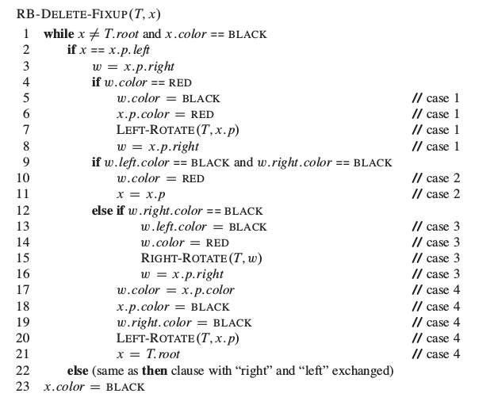

第一行的判断可能不是那么好理解。x.color是x原来的颜色，由于y结点push了一重黑色给x(这个push只是假设某个节点有两种颜色，并不是真正赋值)。如果x本来是红色，那么此时x真正的颜色是红黑色，那么这种情况直接while不通过，将染成黑色就行。如果x本来是黑色，那么双重黑色就需要执行循环进行情况判断了。

和插入一样，删除的4中情况之间也不是独立的，可以将一种情况转换成另一种情况。先看四种情况的图解(图中的深灰色表示红结点，浅灰色表示颜色不确定，黑色表示黑色结点)：

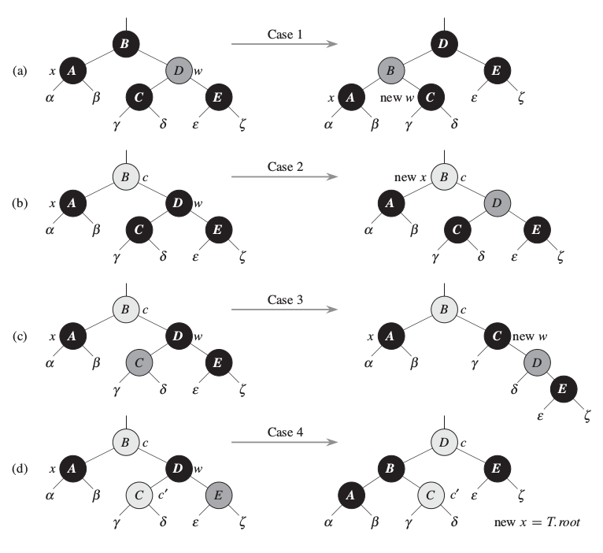

1. **x的兄弟节点是红色的**
这种情况可以改变w和x.p的颜色，然后对x.p做一个左旋变成情况2, 3, 4来处理。这种情况下x.p肯定是黑色的，因为w是红色。

2. **x的兄弟结点是黑色的，且w的两个子结点都是黑色的**
因为x和w都是黑色的，那么利用之前的思想将x和w去掉一重黑色，使得x只有一重黑色而w变成红色，然后在原来红色或者是黑色的x.p结点上新增一重额外的黑色(具体做法就是将x.p作为新的x重复while循环)。注意到如果是情况1进入情况2时，新的x是红黑色的，因为原来的x.p是红色的。这种红黑色的情况可以使循环终止。

3. **x的兄弟结点w是黑色的，w的左孩子是红色的，右孩子是黑色的**
改变w和其左孩子w.left的颜色，然后对w进行右旋。这样就将情况3转换成情况4了

4. **x的兄弟结点w是黑色的，w的右孩子是红色的**
w的颜色变成x.p的颜色，x.p变成黑色，w的右孩子变成黑色，将x.p左旋，将x设置成T.root。通过这样的操作可以去除x的一重黑色而不改变红黑树的性质。

总结一下上面的四种情况，2，4是终止的情况。2，3，4的区别就是w的子结点的颜色。那么分析一下时间复杂度，一次循环中，x最多是1-3-4的情况做2次旋转，或者是2的情况向上移动。所以总的时间复杂度是$O(lgn)$
