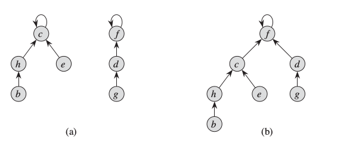
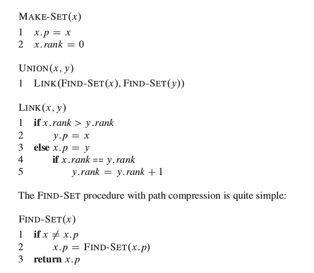
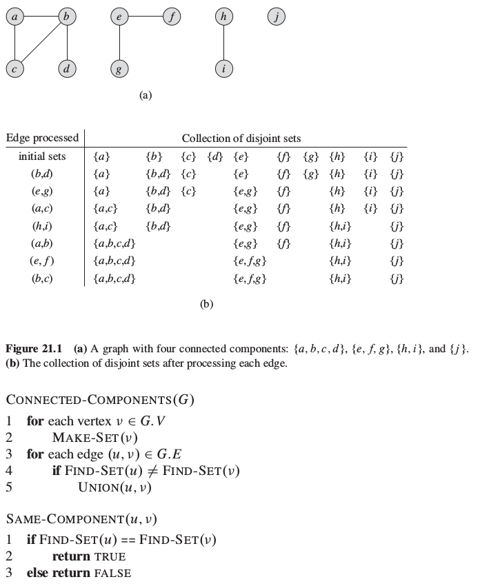
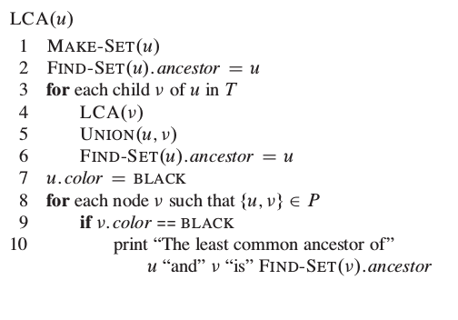
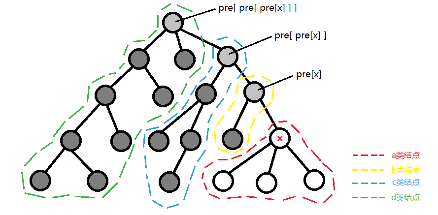

本文的主要内容是算法导论B树，用于不相交集合的操作。

###B树
B树定义：

1. 每个结点x有下面属性：
a. x.n 当前存储在结点x中关键字的个数
b. x.n个关键字本身$x.key_1,\ x.key_2,\ ..., x.key_{x.n}$，以非降序存放，使得$x.key_1 \le x.key_2 \le ... \le x.key_n$
c. x.leaf，一个bool值，如果x是叶结点，则为TRUE；如果x是内部结点，则为FALSE

2. 每个内部结点x还包括x.n + 1个指向其他孩子的指针$x.c_1,\ x.c_2, \ ...,\ x.c_{x.n+1}$。叶结点没有孩子，所以它们的这些指针属于未定义
3. 关键字$x.key_i$对存储在各个子树中的关键字进行分割：如果$k_i$为任意一个存存储在以$x.c_i$为根的子树中的关键字，那么：
$
k_1 \le x.key_1 \le k_2 \le x.key_2 \le ... \le x.key_{x.n} \le k_{x.n+1}
$
4. 每个叶结点具有相同的深度，即树的高度h
5. 每个结点包含的关键字个数有上界和下界。用一个被成为B树的最小度（minimum degree）的固定整数t>=2来表示这些界：
a. 除了根结点以外每个结点至少有t-1个关键字。因此，除了根结点以外的每个内部结点至少有t个孩子。如果树非空，根节点至少有一个关键字。
b. 每个结点至多包含2t-1个关键字。因此一个内部结点至多包含2t个孩子。当一个结点恰好有2t-1关键字时，称该结点是满的(full)

当t=2时B树是最简单的，每个内部结点有2，3，4个孩子。

B树是为磁盘和其他直接存取的辅助存储设备而设计的一种平衡搜索树。B树类似于红黑树，但是在降低磁盘I/O操作树方面要更好一些。许多数据库都使用B树或者B树的变种来存储信息。B树与红黑树的不同之处在于B树结点可以有很多孩子，从数个到数千个。

**为什么需要这么大的分支因子？**
因为B树存储的结点很多，一般无法全部加载到内存。在这种情况下，各种搜索树的基本操作就需要考虑：磁盘的存取速度和CPU计算时间两个因素。在大多数的情况下，一个B树的结点设计为一个完整的磁盘页大小（不清楚为什么要这么设计）。因此在任何时候内存中只有少数的部分结点，所以大的分枝因子能够有效降低磁盘的读取次数。

####B树的插入删除
插入删除操作感觉能比红黑树好点。主要思想就是一个，保证插入或者删除过程遍历结点的关键字是不等于上界或者是下界值，如果不满足该条件需要通过一定的策略调整。这样保证插入或者删除实际执行之后不会破坏B树的性质。有兴趣的同学可以自己看算法导论，过程有点复杂，还是不重复了。

###并查集(disjoint-set data structure)
算法导论书上的翻译是叫做不相交集合的操作。这个翻译虽然直接，但不是很常见，相比之下并查集更为常见。这个数据结构维护了一个不相交的动态集合的集合$S =  \{S_1, S_2, ..., S_k\}$，如果没有特别的要求，我们选取集合中的某个元素代表这个集合(在这种情况下，表示两个元素属于同一个集合只要看这两个元素在集合中的代表是否相同)。提供三种操作：

1. MAKE-SET(x)：建立一个新的集合，它的唯一成员是x。因为各个集合是不相交的，故x不会出现在别的某个集合中。
2. UNION(x, y)：将包含x，y的两个动态集合（表示为$S_x$，$S_y$）合并成一个新的集合。$S_x \cup S_y$的代表元素可以是这两个集合中的任何一个元素。因为S表示的动态集合的集合是不相交的，所以$S_x, S_y$进行UNION操作之后就会删除(实际上我们的做法是将一个集合的元素合并到另外一个集合中，来代替删除操作)
3. FIND-SET(x)：返回一个指针，这个指针指向包含x的（唯一）集合的代表。

简单实现上面的功能，书上提出了一个用循环链表实现的方法。一个链表表示一个集合。这样MAKE-SET和FIND-SET操作都是常数的时间复杂度，但是UNION操作耗时较高(需要跟新另外一个集合的所有元素的指针，指向新的代表元素，一般是链表头)。

为了提高算法的效率，书上又给出了改进的方法。利用树形结构，在执行UNION操作时采用两种启发式的策略。一种是按秩合并（union by rank），还有一种是路径压缩（path compression）。先看一个图解：

左图代表两个集合{c, h, e, b}，{f, d, g}。集合中每个元素指向父元素，代表元素指向自己。执行UNION(e, g)之后就变成图b了。这样的做法和普通的循环链表的方案没有性能上的提高。关键就是在合并的过程中使用策略：

1. 按秩合并。每个结点维护一个秩，表示结点高度的一个上界。合并的过程中总是将rank小的树接到rank大的树上。这样有利于减小树的高度。
2. 路径压缩。在FIND-SET操作过程中，在查找路径中的结点都让它直接指向根结点。

使用上面两种策略能够让时间复杂度达到$O(m\alpha(n))$，m表示MAKE-SET，UNION，FIND-SET操作的总次数，n表示MAKE-SET操作的次数。

从表达式中可以看出来三种基本操作的均摊代价是接近$O(1)$的时间复杂度。$\alpha$这个函数基本当成常数，对于$n = 2^{2048}*2048-1$时，$\alpha(n) = 4$。

下面给出并查集的伪代码描述，还是比较简单的：

使用的例子：

使用并查集预处理之后能够快速地判断无向图的两个结点是否在同一个连通分量中。

Tarjan的脱机最小公共祖先算法。这个算法能够解决lca问题(least-common-ancestors problem)，并且它能够高效地查询多个结点对--两个结点u，v的最小公共祖先w是u，v的共同祖先，且w具有最大的深度。

算法的伪代码描述（假设在执行遍历之前，每个结点被着色为白色）：

递归的代码就是这样，短短数行，理解起来还是有点难度的。可以参看**[夜深人静写算法（六） - 最近公共祖先](http://www.cppblog.com/menjitianya/archive/2015/12/10/212447.html)**，这位兄弟的解释写得挺好，下面的解释图片均是来自这个地方。

第一行：创建一个集合，集合中只有一个元素u，即{u}
第二行：因为u所在的集合只有一个元素，所以也可以写成u.ancestor = u
第五行：回溯时进行集合合并，以v为根的子树和u所在的集合合并
第六行：对合并完成的集合公共祖先为当前结点u，find(u)为该集合的代表元
第七行：u为根的子树访问完毕，标记为已经访问。
第八行：枚举所有和u相关的询问(u, v)，如果v为根的子树已经访问过。那么find-set(v).ancestor必定是树的根结点

上图就是tarjan算法运行时间的一个图解。pre[x]表示x的父节点。深灰色节点表示(以该结点为根结的子树，后面的也省略)已经访问过，浅灰色的表示正在访问。白色结点表示还没有开始访问。tarjan算法实际上将结点进行分类。从图中很容易就能看出，x和所有绿色结点的LCA都为pre[pre[pre[x]]]，即x的曾祖父结点；和所有蓝色结点的LCA都为pre[pre[x]]，即x的祖父结点；和所有黄色结点的LCA都为pre[x]，即x的父结点。

分类是：
a.以结点x为根的子树作为a类结点；
b.以pre[x]为根的子树去掉a类结点，为b类结点；
c.以pre[pre[x]]为根的子树并且去掉a、b两类，为c类结点；依此类推...