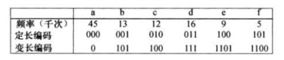
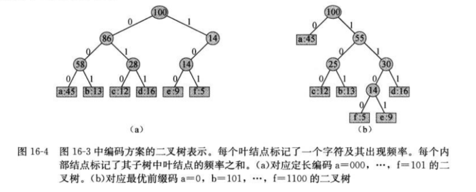
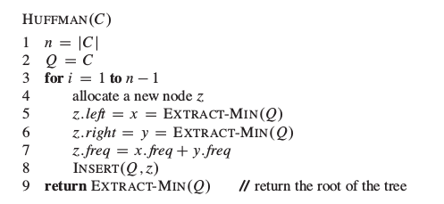
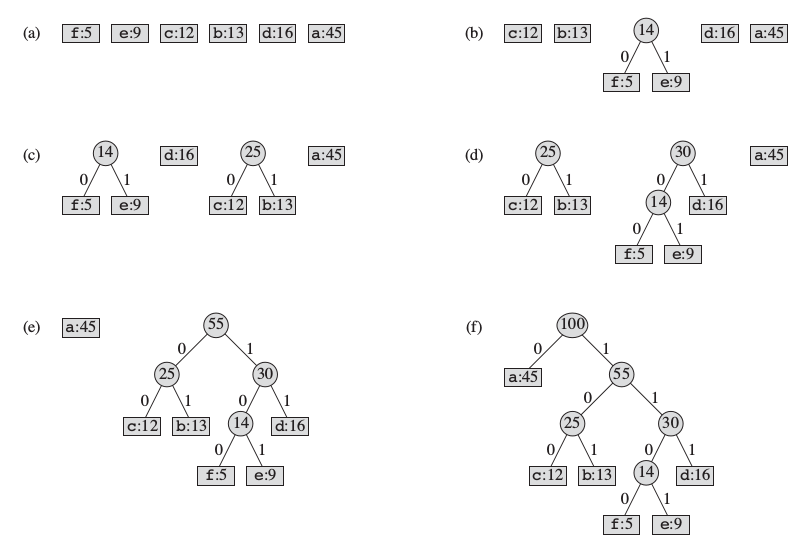

这篇文章主要内容是《算法导论》上动态规划和贪心算法的一个总结。

####赫夫曼编码
使用赫夫曼编码（Huffman code）可以很有效地压缩数据，通常可以节省20%～90%的空间，具体的压缩率依赖于数据的特性。我们可以将待压缩的数据看成是字符序列。根据每个字符的出现频率，Huffman算法构造出字符的最优二进制表示。

例如下面一个例子，假设文件中只出现a～f一共6个字符

对比表中的定长编码和变长编码（variable-length code），定长编码需要(45+13+12+16+9+5)*3*1000=300000 bit的长度。而使用变长编码需要(45*1 + 13*3 + 12*3 + 16*3 + 9*4 + 5*4)*1000 = 224000 bit的长度。与定长编码相比节省了25%的空间。

我们考虑的编码只考虑前缀码（prefix code），即没有任何码字是其他码字的前缀（保证了解码的过程是唯一的，没有歧义）。而Huffman编码就是一种前缀码，它能够达到最高的数据压缩效率。

任何二进制字符的编码过程很简单，只需要将字符文件作为输入，将每个字符替换为对应的编码输出。例如abc，对应上面的变长编码为0 101 100

解码的过程需要一种方便的数据结构，以便我们能够容易截取开始的码字。一种二叉树表示可以满足这种需求。二叉树的叶子节点就是原文件中字符，而从根节点到叶子节点的路径就是二进制码字。其中0表示向左孩子移动，1表示向右孩子移动。001011101可以唯一地表示为0 0 101 1101，解码为aabe

对于图b来说，最优编码树肯定是一颗满二叉树，即每个非页节点都有两个孩子节点。

编码解码的过程都很容易得到，关键是怎么生成Huffman编码的二叉树。生成这个算法思想利用的就是贪心原则。下面的伪代码中，假设C是n个字符的集合，C集合中的每个元素c都有一个属性c.freq表示c的出现频率。算法自底向上地构造出对应最优编码的二叉树。算法使用一个属性freq为关键字的最小优先队列，每次将两个频率最低的对象合并。新对象插入优先队列中，并且频率为原来两个对象频率之和。

对于前面表格中给出的频率和上面的伪代码，给出Huffman算法的执行流程：

