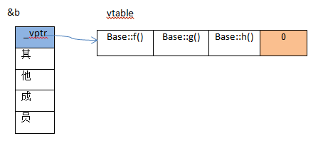
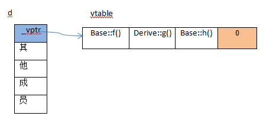

c++中虚函数是实现多态的方法。通过定义虚函数，子类覆盖父类的虚函数，然后定义一个父类的指针，在运行时绑定不同的对象来实现多态。为了实现这个机制，语言采用了虚函数表的机制。

包含虚函数的类才有虚函数表，同属一个类的对象共享虚函数表。在包含虚函数类的对象中都有一个vptr的指针指向虚函数表的开始地址。虚函数表实质是一个指针数组，里面存放的是需函数的函数指针。

> 对于一个空的类，sizeof(class name)时应该是返回0的，但是因为标准不允许对象和类的大小为0造成两个不同的对象会有相同的大小。空类的大小实际上是1B。对于有虚函数的类，它会包含一个vptr的指针，所以会比没有虚函数的类要大一个指针字段的长度。在使用sizeof计算类大小时要注意字节对齐和静态成员和普通的成员函数是不占据类的存储空间的。


```
#include <iostream>

using namespace std;

class Base {
public:
    virtual void f() {cout<<"base::f"<<endl;}
    virtual void g() {cout<<"base::g"<<endl;}
    virtual void h() {cout<<"base::h"<<endl;}
};

class Derive : public Base{
public:
    void g() {cout<<"derive::g"<<endl;}
};

//可以稍后再看
int main () {
    cout<<"size of Base: "<<sizeof(Base)<<endl;

    typedef void(*Func)(void);
    Base b;
    Base *d = new Derive();

    long *pvptr = (long *)d;//使用long类型的指针指向Derive对象
    long *vptr = (long *)*pvptr;//*pvptr访问pvptr，因为pvptr为long类型，所以在64位系统下表示取前8个字节
    Func f = (Func)vptr[0];
    Func g = (Func)vptr[1];
    Func h = (Func)vptr[2];

    f();
    g();
    h();

    return 0;
}
```

上面代码的输出结果：
size of Base: 8
base::f
derive::g
base::h


对于上面的Base类，虚函数表的结构是



对于Derive类，虚函数表的结构是




最后看一个包含虚函数的类和虚函数表位置图解


内容来自

[](https://www.cnblogs.com/hushpa/p/5707475.html)