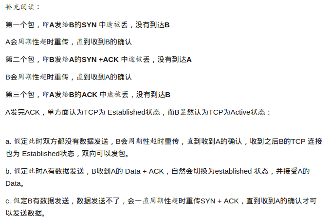
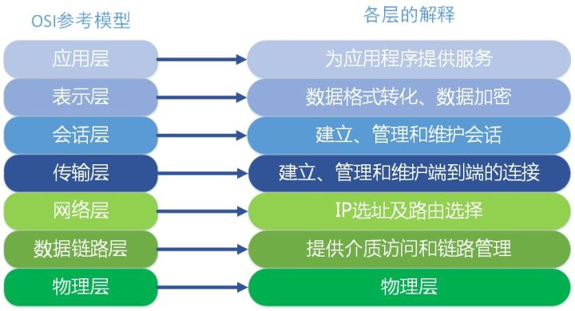
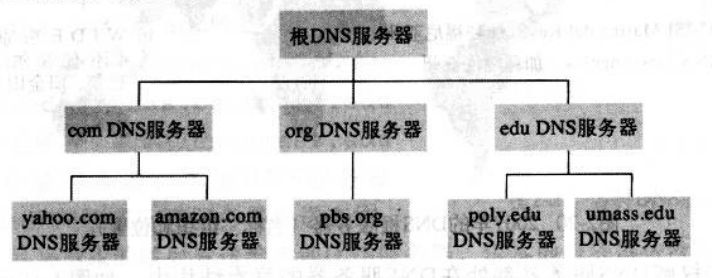
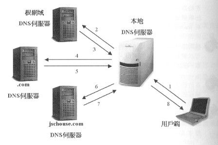
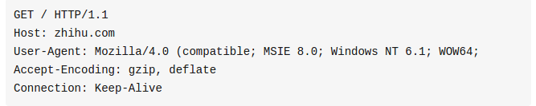

####TCP三次握手和四次挥手，为什么不是两次或者四次
看图即可：

因为为了保证可靠传输和提高传输效率，三次握手可以达到上面的要求。TCP建立可靠传输的精髓：双方动态随机选取32位长的序列号。

如果是四次握手的场景（通信双方为A，B）：
1. A发送SYN + A's Initial sequence number
2. B确认A的同步信号，并记录A的ISN到本地，命名B's ACK sequence number
3. B发送SYN + B's Initial sequence number
4. A确认B的同步信号,....

很明显2，3过程可以合并在一起发送，只需要三次握手，提高传输效率。

如果是二次握手的场景：
1. A发送SYN + A's Initial sequence number
2. B发送SYN + B's Initial sequence number + B's ACK sequence number

如果信道是可靠的，这样双方的初始序列号达成一致，是没有问题。如果B的同步信号丢失，A，B双方序列号无法达成一致。于是TCP的设计者将SYN这个同步标志位设计成占用一个字节编号（FIN标志位也一样），既然是一个字节数据，按照TCP对所有数据的TCP segment必须确认的原则，所以A必须给B一个确认，以确认A已经收到B的同步信号

内容来自：[车小胖](https://www.zhihu.com/question/24853633)

####OSI七层模型，每层的协议

应用层协议：HTTP（超文本传输协议），FTP（文件传输协议），SMTP（简单邮件传输协议）
表示层协议：LPP（轻量级表示协议）
会话层协议：SSL（安全套接字层协议），RPC（远程过程调用协议）
传输层协议：TCP，UDP
网络层协议：IP，ICMP
数据链路层：ARP，RARP
物理层：

####从输入url到页面展现过程中都发生了什么？
1）进行DNS查询，将URL转换成IP地址。

DNS是一个分层的DNS实现的分布式数据库。它分为三层，根DNS服务器，顶级DNS服务器，权威DNS服务器。三层如下图所示：

一般的查询过程如下，首先浏览器向本地的DNS服务器发送一个域名的查询报文，例如www.baidu.com。本地的DNS服务器向根服务器发送查询报文，根服务器根据.com后缀返回顶级服务器.com的IP地址。本地服务器再次向.com的顶级服务器发送DNS查询报文。这样通过三次迭代找到了www.baidu.com对应的IP地址，将IP地址返回给用户端。方式1，8是通过递归的方式查询的，方式2，3等其他方式是通过迭代查询的

2）封装HTTP请求

3）建立连接
浏览器进程使用套接字和远端服务器进程进行交换数据，它会调用系统库函数 socket ，请求一个 TCP流套接字，对应的参数是 AF_INET 和SOCK_STREAM。而TCP的套接字是通过一个四元组（源IP，源端口，目的IP，目的端口）唯一标志的。TCP是面向连接的。在实际交换数据之前要通过三次握手建立连接。

4）发送数据
被封装的HTTP请求依次通过网络协议栈，加上TCP头部（包含端口），IP头（包括IP地址），数据链路层帧头（MAC地址）。对大部分家庭网络和小型企业网络来说，封包从本地计算机出发，经过本地网络，在通过调制解调器将数字信号转换成模拟信号，使其适于在电话线路，电视光缆上传输，线路的另一端，是另外一个调制解调器转换回来，交由下一个网络节点处理。大型企业和比较新的住宅通常使用光纤或直接以太网连接，这种情况下信号一直是数字的，会被直接传到下一个网络节点进行处理。在到达最终的目的地址之前都要通过一系列的路由器进行转发。

5）服务器接收数据
在进入真正的应用服务器之前还需要经过负载均衡的服务器，负载均衡有很多，最常用的是使用Nginx的反向代理（7层代理，将请求均匀地发送到应用服务器）。

####HTTP和HTTPS有何区别？
HTTP协议是默认工作在TCP协议80端口的，HTTP所封装的信息都是明文的，通过抓包工具可以分析其信息内容，如果信息中包含银行卡帐号，密码这些信息，那么会产生很多的安全问题。

HTTPS默认工作在TCP协议的443端口，工作的流程是：
1） 完成TCP三次握手
2） 客户端验证服务器的数字证书，通过进入步骤3
3） DH算法协商对称加密算法的密钥，hash算法的密钥
4） SSL安全加密隧道协商完成
5） 网页以加密的方式传输，用协商的对称加密算法和密钥加密，保证数据机密性。用协商的hash算法保证数据的完整性不被篡改。

数字证书：CA，是由权威机构给某网站颁发的一种认可凭证，浏览器能够对证书进行检验，确定网站身份。起到防止中间用户冒充需要访问的网站。其他详细的过程可以看第二个链接

内容来自：
[http 和 https 有何区别？如何灵活使用？](https://www.zhihu.com/question/19577317)

[HTTPS详解](https://segmentfault.com/a/1190000011675421)

####GET和POST的区别

GET在HTTP协议中语意上是获取查询资源，POST是更新资源。

1. GET提交的数据会包含在URL中，POST提交的数据包括在HTTP请求的包体当中
2. 携带的数据量的大小不同。HTTP协议对传输数据和URL长度没有限制。GET，特定的服务器和浏览器对URL长度有限制，因此使用GET就会限制传输的数据大小。POST不是通过URL，理论上没有限制，但是web服务器会对传输的数据长度限制。

####在TCP四次挥手过程中，主动终止连接的一方在TIME-WAIT状态等待2MSL的时间，这是为什么？

MSL是最长报文寿命，应该就是从A到B报文能够生存的最长时间。假设主动终止的一方为A，被动终止的一方为B。

1. A发送的最后一个ack能够到达B。A发送完ack之后会启动2MSL计时器，如果ack经过MSL的时间没有到达B，那么ack已经丢失，B会重传FIN，FIN到达的时间最多是MSL，所以一共2MSL的时间能够达到这个目的
2. 防止已经失效的报文出现在下一次连接中。

###URL短地址的原理和算法？

###HTTP 1.0和HTTP 1.1协议的区别？

1. 缓存处理。在HTTP1.0中主要使用header里的if-Modified-Since,Expires来作为缓存判断的标准，HTTP1.1则引入了更多的缓存管理策略例如Entity tag，If-Unmodified-Since, If-Match， If-None-Match等更多可供选择的缓存头来控制缓存策略。
2. 带宽优化及网络连接的使用，HTTP1.0中，存在一些浪费带宽的现象。例如客户端只要某个对象的一部分，而服务器将整个对象送过来了，并且不支持断点续传功能，HTTP1.1则在请求头引入了range头域，并允许只请求资源的某个部分，即返回码是206（Partial Content），这样就方便了开发者自由的选择以便于充分利用带宽和连接。
3. 错误通知的管理。在HTTP1.1中新增了24个错误状态响应码，如409（Conflict）表示请求的资源与资源的当前状态发生冲突。410（Gone）表示服务器上的某个资源被永久删除
4. Host头处理。在HTTP1.0中认为每台服务器都绑定一个唯一的IP地址，因此，请求消息中的URL并没有传递主机名（hostname）。但随着虚拟主机技术的发展，在一台物理服务器上可以存在多个虚拟主机（Multi-homed Web Servers），并且它们共享一个IP地址。HTTP1.1的请求消息和响应消息都应支持Host头域，且请求消息中如果没有Host头域会报告一个错误（400 Bad Request）。
5. 长连接，HTTP 1.1支持长连接（PersistentConnection）和请求的流水线（Pipelining）处理，在一个TCP连接上可以传送多个HTTP请求和响应，减少了建立和关闭连接的消耗和延迟，在HTTP1.1中默认开启Connection： keep-alive，一定程度上弥补了HTTP1.0每次请求都要创建连接的缺点。

内容来自：

[HTTP1.0、HTTP1.1 和 HTTP2.0 的区别](https://juejin.im/entry/5981c5df518825359a2b9476)