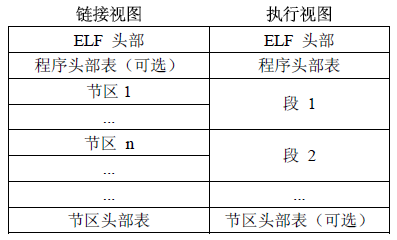

#### 指针和引用的区别？
1. 引用必须被初始化，指针不必。
2. 引用初始化之后不能被改变，指针可以改变所指对象。
3. 不存在指向空值的引用，但是存在指向空值的指针。


#### C程序的内存空间分布？
如下图：


+ 正文段。由CPU执行的机器指令部分。通常正文段是可共享的（在存储器中只有一个副本），只读的。
+ 初始化数据。它包含程序中需要明确地赋初始值的变量。例如C程序中任何函数之外的声明：int maxcount = 100
+ 未初始化数据段。通常称为bss段（block started by symbol）。在程序开始执行前，内核将次段中的数据初始化为0。例如在函数外的声明：long sum[1000];
+ 堆。通常在堆中进行动态存储分配
+ 栈。自动变量以及每次函数调用时所需保存的信息都存放在此段中

这是一种典型的安排方式。这是程序的逻辑布局。


#### ELF是什么？其大小和全局变量的是否初始化有什么关系？

前面已经介绍过了`__bss段`在ELF文件中使用来存放未初始化的全局变量和局部静态变量。`_data`段保存的是已初始化的全局变量和局部静态变量的值（一些常量的值）。而对于bss段，编译器可以像__data段那样在相应位置写一些初始值进去占位，执行文件装载时直接映射就好了。但是编译器没有这么做，不给bss在可执行文件中占位，在装载时直接在内存中开辟空间。这样做的好处就是减小了可执行文件的体积，比如一个长度为10000的未初始化int数组，采用这种方法可以减小可执行文件大小40KB。

**因此问题的答案ELF的大小和全局变量是否初始化有关，如果初始化那么data段增大，文件体积变大**

**ELF（可链接执行格式，Executable and Linking Format）是一种文件格式。这种文件格式定义了三种类型的文件：**

1. 可重定位的对象文件(Relocatable file)
这是由汇编器汇编生成的 .o 文件。链接器(link editor)拿一个或一些 Relocatable object files 作为输入，经链接处理后，生成一个可执行的对象文件 (Executable file) 或者一个可被共享的对象文件(Shared object file)。我们可以使用 ar 工具将众多的 .o Relocatable object files 归档(archive)成 .a 静态库文件。

2. 可执行的对象文件(Executable file)
这我们见的多了。文本编辑器vi、调式用的工具gdb、播放mp3歌曲的软件mplayer等等都是Executable object file。你应该已经知道，在我们的 Linux 系统里面，存在两种可执行的东西。除了这里说的 Executable object file，另外一种就是可执行的脚本(如shell脚本)。注意这些脚本不是 Executable object file，它们只是文本文件，但是执行这些脚本所用的解释器就是 Executable object file，比如 bash shell 程序。

3. 可被共享的对象文件(Shared object file)
这些就是所谓的动态库文件，也即 .so 文件。如果拿前面的静态库来生成可执行程序，那每个生成的可执行程序中都会有一份库代码的拷贝。如果在磁盘中存储这些可执行程序，那就会占用额外的磁盘空间；另外如果拿它们放到Linux系统上一起运行，也会浪费掉宝贵的物理内存。如果将静态库换成动态库，那么这些问题都不会出现。

>可以使用file命令查看一下这三种文件的输出，例如对于可执行文件的输出：
```
tan@tan:~/Desktop$ file main
main: ELF 64-bit LSB  executable, x86-64, version 1 (SYSV), dynamically linked (uses shared libs), for GNU/Linux 2.6.24, BuildID[sha1]=3d3962f7e82e638de90b61a7ae870eda3023f785, not stripped
```




为什么上面的图中有两种不同格式的ELF文件呢？这是因为ELF文件需要应用在两种不同的场合：

+ 构成可重定位文件，可以被链接器使用构成可执行或者可共享对象文件
+ 构成可执行或者可共享对象文件，可以用于运行时内存中进程的映像的构建

section（节区）是在ELF文件里头，用以装载内容数据的最小容器。在ELF文件里面，每一个section内都装载了性质属性都一样的内容。比方：

1. text section 里装载了可执行代码；
2. data section 里面装载了被初始化的数据；
3. bss section 里面装载了未被初始化的数据；
4. 以 .rec 打头的 sections 里面装载了重定位条目；
5. symtab 或者 .dynsym section 里面装载了符号信息；
6. strtab 或者 .dynstr section 里面装载了字符串信息；
7. 其他还有为满足不同目的所设置的section，比方满足调试的目的、满足动态链接与加载的目的等等。

一个ELF文件中到底有哪些具体的 sections，由包含在这个ELF文件中的 section head table(SHT)决定。在可重定位文件里面，section承载了大多数被包含的东西，代码、数据、符号信息、重定位信息等等。可重定位对象文件里面的这些sections是作为输入，给链接器那去做链接用的，所以这些 section也经常被称做输入section

链接器在链接可执行文件或动态库的过程中，它会把来自不同可重定位对象文件中的相同名称的section合并起来构成同名的section。接着又会把带有相同属性（例如都是只读可加载的）section都合并为segment（段）。segments作为链接器的输出，常被称为输出section。我们开发者可以控制哪些不同.o文件的section来最后合并构成不同名称的segment。如何控制呢，就是通过linker script来指定。


内容来自：

[可执行文件（ELF）格式的理解](https://www.cnblogs.com/xmphoenix/archive/2011/10/23/2221879.html)

[ELF文件格式总结](http://blog.csdn.net/flydream0/article/details/8719036)

[C/C++中已初始化/未初始化全局/静态/局部变量/常量在内存中的位置](https://www.polarxiong.com/archives/C-C-%E4%B8%AD%E5%B7%B2%E5%88%9D%E5%A7%8B%E5%8C%96-%E6%9C%AA%E5%88%9D%E5%A7%8B%E5%8C%96%E5%85%A8%E5%B1%80-%E9%9D%99%E6%80%81-%E5%B1%80%E9%83%A8%E5%8F%98%E9%87%8F-%E5%B8%B8%E9%87%8F%E5%9C%A8%E5%86%85%E5%AD%98%E4%B8%AD%E7%9A%84%E4%BD%8D%E7%BD%AE.html)

####exit()和_exit()的区别？
_exit()是系统调用，用户调用之后从用户态转换成内核态。而exit会执行用户使用atexit(),on_exit()注册的函数，然后然后执行标准I/O的清理程序，最后调用_exit()

####inline关键字的作用？什么情况下会展开失败？
类似于宏展开，减少函数调用的开销。在代码过长，inline的递归调用，包含循环，inline虚函数（需运行时才能确定）都会失败

####类的三种权限，分别说明？
public,protected,private。public类内和类外都能访问，protected和private只有在类的内部才能访问。private成员不能被继承，protected可以。

####C++多态有哪几种？
分为静态多态和动态多态。静态多态就是编译期确定，包括运算符重载（就是函数重载）和函数重载。动态多台就是虚函数的方式。

####对象中的vptr指针的初始化时间？

所有基类构造函数之后，但又在自身构造函数或初始化列表之前。vptr初始化是在初始化列表之前还是之后是跟编译器实现有关的。

```
class A
{
public:
    A(int arg):m_a(arg)
    {
        cout << "constructor of A" << endl;
        output();
    }
    virtual void output()
    {
        cout << "output A" << endl;
    }
    virtual void display()
    {
        output();
    }
private:
    int m_a;
};

class B : public A
{
public:
    B(int arg1, int arg2):A(arg1), m_b(arg2)
    {
        cout << "constructor of B" << endl;
    }
    virtual void output()
    {
        cout << "output B" << endl;
    }
private:
    int m_b;
};


int main(int argc, char* argv[])
{
    B b(1, 2);
    b.display();
    return 0;
}
```

上面代码的输出:
constructor of A
output A
constructor of B
output B

在b对象的构造中，在构造B对象的A类部分是vptr初始化为A的虚函数表。构造B部分时初始化为B的虚函数表。这大概就是c++ primer中说的如果在构造函数和析构函数中调用虚函数，使用的是自身类型定义的版本

内容来自

[C++vptr初始化时间](https://blog.csdn.net/passion_wu128/article/details/8580306)

###C语言调用free释放malloc分配的内存为什么不需要指定大小？
网易游戏的面试题目。因为该指针前面有个固定大小的头部，头部里面存有该内存块的大小，使用该指针能够访问这个字段


###C语言转义字符？
常见的转义字符表达方式有三种

+ '\a'。这种形式是反斜杠加上小写的字符。a表示响铃，b表示退格，f表示换页，n回车，r换行，t制表，v垂直制表
+ '\ddd'。ddd表示8进制表示的数
+ '\xhh'。hh表示16进制数。其中x要小写。


###C++中不能定义为内联函数的是？

1. 递归函数
2. 虚函数
3. 函数体过长，包括循环，switch等

###delete和delete[]的区别

简单来说delete和delete []在对动态申请内存释放上是没有区别的。两者的区别在于使用delete [] p会按照p对应的类型大小，每个单元调用p类型的析构函数，而delete p只会调用一个单元的析构函数(可能不同的编译器会有不同的处置方案，gcc在运行时会抛出错误提示)。可以看下面的例子：

```
#include<iostream>
using namespace std;
class Base {
    private:
        int a;
    public:
        virtual ~Base() {
            cout << "Good bye, Base!" << endl;
        }
};

class Derived : public Base {
    private:
        int b;
    public:
        virtual ~Derived() {
            cout << "Good bye, Derived!" << endl;
        }
};

int main()
{
    Base *arr1 = new Base[3], *arr2 = new Base[3], *base = new Derived, *arr3 = new Derived[3];

    delete arr1; //1
    delete [] arr2; //2
    delete base; //3
    delete [] arr3; //4
    return 0;
}
```
注意下面是1, 2, 3, 4处分别运行的结果
```
//1
Good bye, Base!
*** Error in `/home/tan/Documents/code/qt/build-alg-Desktop_Qt_5_9_1_GCC_64bit-Debug/alg': munmap_chunk(): invalid pointer: 0x0000000001a7c018 ***

//2
Good bye, Base!
Good bye, Base!
Good bye, Base!

//3
Good bye, Derived!
Good bye, Base!

//4
Good bye, Derived!
Good bye, Base!
Good bye, Derived!
Good bye, Base!
Good bye, Derived!
Good bye, Base!
```
对结果解释一下，第一种情况已经解释过了。第二种是正常的析构过程，分别调用每个对象的析构函数。第三种是基类的指针指向派生类的情况，由于定义的是虚析构函数，能够正常地先调用子类的析构函数再调用父类的析构函数。第四种和编译器有关，这个版本的gcc编译器没有报错，但是mingw编译器是会产生运行错误的。具体是因为编译器调用Derived类的析构函数时，由于指针是Base类型的，它会按照指针类型计算下一个对象的偏移，然而Base对象的大小和Derived对象大小不同，那么函数地址会计算错误，产生非法的地址访问。


内容来自

[delete 和 delete []](https://www.jianshu.com/p/fbf6cad613e9)

