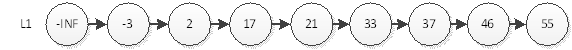
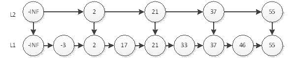
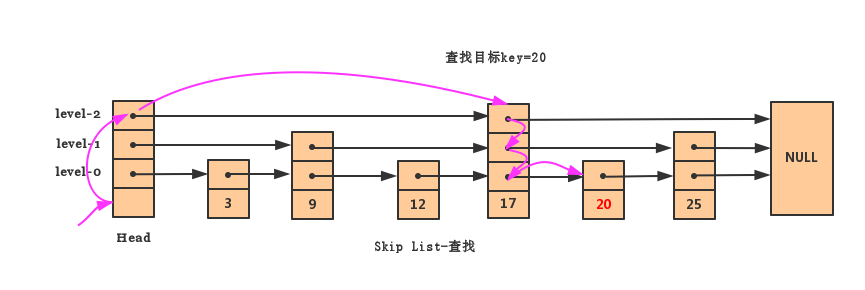
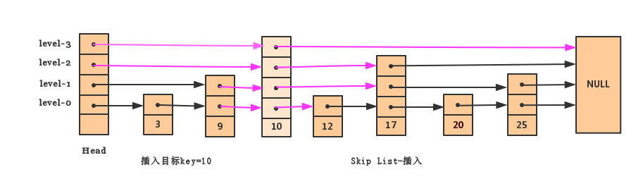
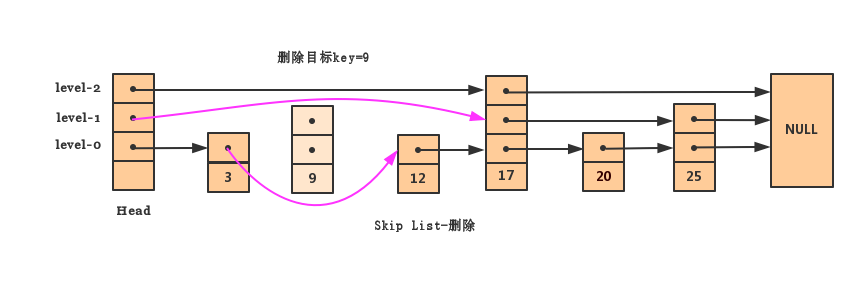

### 跳跃表（Skip List）

跳跃表是一个非常简单实用的数据结构，它是作为平衡树(AVL，红黑树等)的替代方案，它能做到平均O(logN)，最坏O(N)复杂度的节点查找（WilliamPugh《Skip Lists: A Probabilistic Alternative to Balanced Trees》）。虽然在性能上不如平衡树稳定，但是它的实现较为简单。在Redis，LevelDB上都得到了广泛的使用。

###引入
我们知道链表查找的时间复杂度是O(n),即使链表是有序的，我们也不能通过二分查找的方式减小时间复杂度。

从上图中有序链表可以看出来，如果要查询值为55的节点，必须从头结点循环遍历到最后一个结点。为了加速查找，我们可以利用二分查找的思想，选取一部分结点作为代表，代表一个大的范围。结果如下图所示

这样，我们一开始就从L2查找，通过4次查找，就能查找到值为55的结点。那是否还能够提高效率呢？我们可以效仿上面的方法，再加上一层。结果如下图所示：

如果从L3开始查找，找到值为55的结点，只需要2次。有了上面的经验，我们能够得到下面最终的结果

其实从上面的图中我们可以看出来，这个理想的跳跃表（第一层有所有结点，第二层只有1/2的结点，且间隔是均匀的，第三层是1/4的结点，且间隔是均匀的...，那么理想的层数是logN）和平衡树本质上没有什么区别，都是能在查找的时候否决掉一半的结点，带来很高的查找效率。那么问题就来了，如果要保持跳跃表理想的特性，怎样才能确定一个新加入结点的层数（高度）呢？

### 确定结点高度
Pugh在论文中提出很巧妙的方法。根据概率随机为新结点生成一个新的高度，具体算法如下：

1. 给定一个概率p，产生一个[0,1)之间的随机数
2. 如果这个随机数小于p，则高度加1
3. 重复2中的动作，直到随机数大于概率p

虽然随机生成的高度会打破理想的结构，Pugh在论文中证明，这种结构依然有非常高的概率可以使得时间复杂度为 logN。

通常我们还会约束跳跃表的最大层数，公式： \\(maxLevel = log_{1/p}n\\),其中n表示总的结点数。根据Pugh的论文中的结论，p为1/2或者1/4时，整体性能会较好。（当p=1/2时，确定高度的方法称为抛硬币方法）

### skip List的操作

一般的数据结构的操作都是增删改查。首先需要知道的是查找操作。关于查找操作前面已经有了一定的认识。

**查询操作比较简单：**

+ 我们首先获取到头节点，从头检点的最高层开始（节点中的点表示指向节点的指针），下一个节点是17, 很明显20>17所以应该在后面。继续往后结果是NULL那说明后面没有要找的节点了。
+ 跳到下一层继续往后是25且20<25说明后面也没有我们要找的节点了。
+ 再跳到下一层，往后就找到我们要的节点了。如果到最下面一层还找不到，那这个节点就肯定不在表中了（因为最低层包含所有节点）。

**插入操作：**

插入操作首先就是要确定要插入结点的高度，根据上面的查找方法，查找该结点该该层的位置，逐层执行链表的插入。紫色线部分就是在插入结点10,时需要更新的部分。

删除操作跟插入操作类似。删除节点之后，如果最高层没有节点存在，那Skip List的层数相应的需要降下来

**内容出自**

[图解Skip List](http://www.zkt.name/skip-list/)

[跳跃表-原理及java实现](http://www.cnblogs.com/acfox/p/3688607.html)

